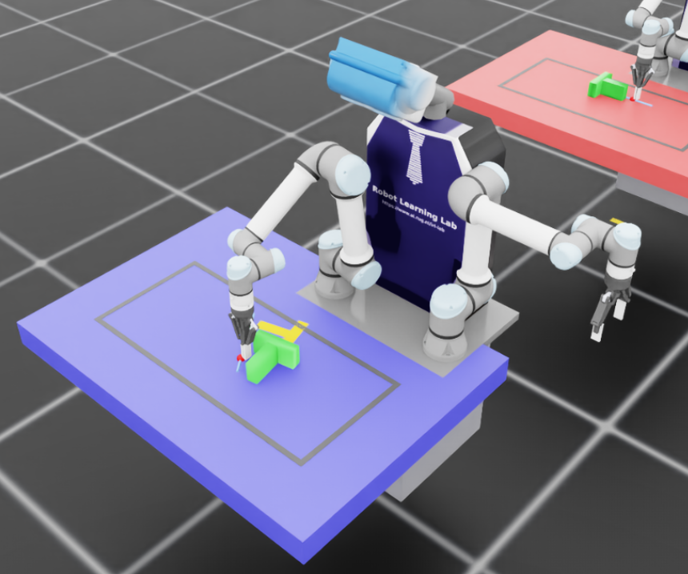
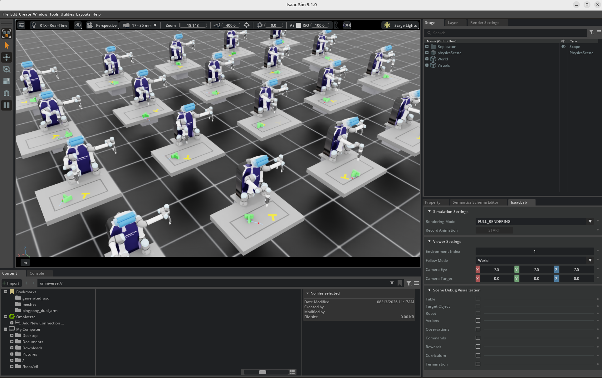
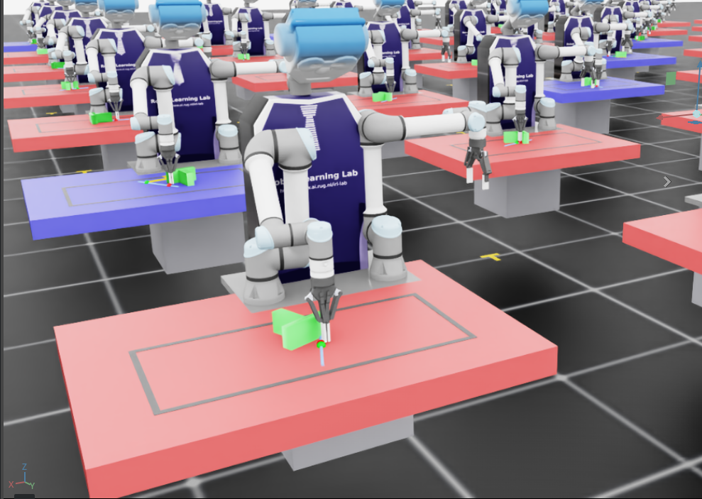
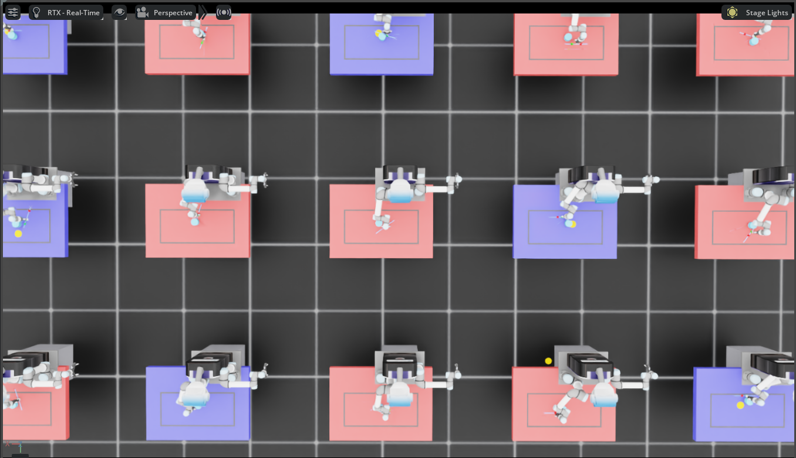
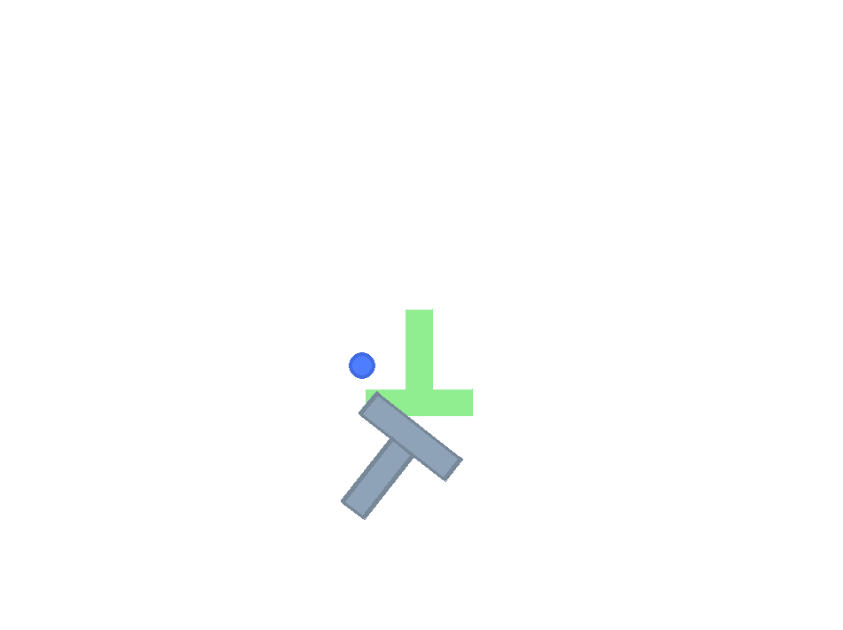
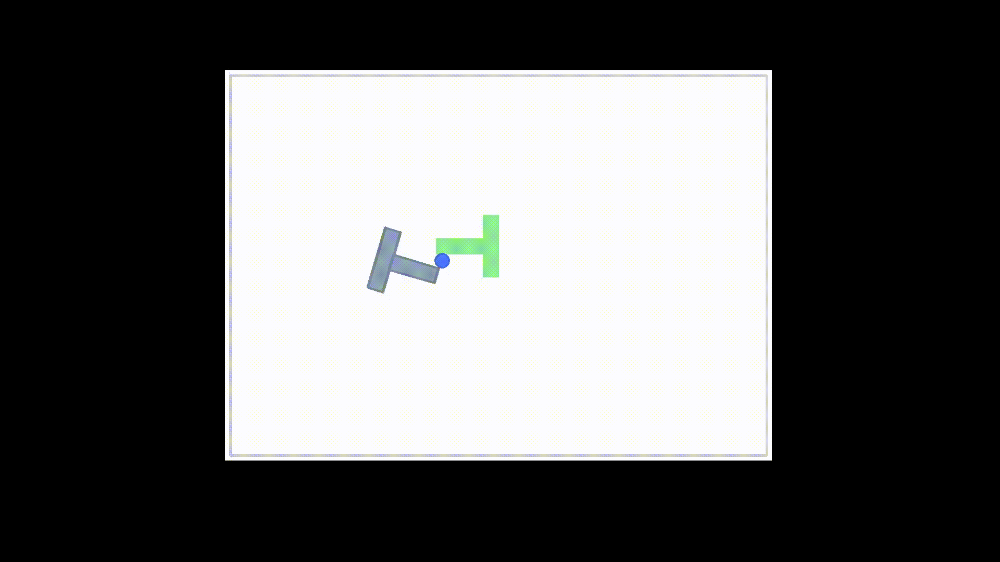
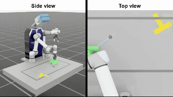

# Asymmetric Self-Play with Goal Encoders and PBRS for Robotic Pushing

Master Thesis implemented by Vlad Iftime, supervised by Hamidreza Mohades Kasaei, PhD, Associate Professor at The University of Groningen.


Tabletop-pushing policies trained in **Isaac Lab / Isaac Sim**, combining
**Asymmetric Self-Play** (Plappert et al. 2021), **Goal Embeddings** (Sukhbaatar
et al. 2018), and **Potential-Based Reward Shaping** (Ng et al. 1999) on a UR5e
arm that acts through a **push-primitive macro-action** solved with **cuRobo IK**.

<p align="center">
  
  
</p>

This README has two parts:

1. **[The project](#1-the-project-idea-and-results)** — what it is, what it
   achieves, and what the trained agents look like in action.
2. **[The codebase](#2-the-codebase-structure-and-how-to-run)** — how it is
   organised, the dependencies, and how to run training, validation, and the HPC
   pipeline.

---

## 1. The project: idea and results

### 1.1 What this is about

Pushing is a foundational pre-grasp skill: before a robot can pick an object out
of clutter, it often has to nudge it into a reachable pose. Teaching such a skill
by hand is tedious because the space of useful goals is large, and good goal
distributions are hard to design. This project asks a more automatic question:

> Can a robot *discover its own goals* through asymmetric self-play, and can a
> shaped dense reward make it learn the underlying pushing skill efficiently?

Two ideas are combined. **Asymmetric self-play (ASP)** lets one policy (the
*goal proposer*, "Alice") invent goals for a second policy (the *goal solver*,
"Bob") to reproduce, so the curriculum grows by itself. **Potential-based reward
shaping (PBRS)** replaces a sparse or noisy reward with a dense, provably
policy-invariant signal, so the solver gets a useful learning signal on every
push. A learned **goal encoder** compresses the goal into a compact latent that
the solver conditions on, instead of feeding it raw goal coordinates.

### 1.2 How it works in one paragraph

Alice sees the robot and the object (but no goal) and performs a few pushes. The
pose she leaves the object in becomes the goal. Bob is reset to the starting
pose, sees the goal, and must reproduce it within a budget of pushes. A
**push-primitive macro-action** turns one policy decision into a full 72-substep
kinematic push: the policy picks four parameters (contact point, push length,
and direction relative to the object), which are expanded into waypoints and
solved with **cuRobo inverse kinematics** at every substep. Bob is rewarded
densely through PBRS on a potential over the pose error, and Alice is rewarded
only at the end of the phase — by the outcome (success/failure) or, in the
time-based variants, by how long Bob took. When Bob fails on a valid goal, his
policy is additionally trained to imitate Alice via **Alice Behavioural Cloning
(ABC)**. A pool of historical policies keeps the two agents from over-specialising
against each other.

### 1.3 The environment

A single UR5e arm (with a Robotiq gripper, kept closed) pushes a T-shaped block
across a tabletop into a target pose (shown as a translucent "goal ghost").

<p align="center">
  
</p>

Training runs hundreds of such scenes in parallel on one GPU. The render below
shows 20 illustrative environments; experiments train with 256 to 2,048.

<p align="center">
  
</p>

### 1.4 The self-play loop

In the self-play scenes the two roles are colour-coded: **Alice (red)** proposes
the goal, **Bob (blue)** reproduces it. The disc variant (right) isolates one
regime dimension — it removes the orientation gate so the goal is a position-only
target.

<p align="center">
  
  
</p>

A fast, CPU-only 2D port of the same task (the `gym-pusht` environment) is used
as a cross-environment check of every finding, at a fraction of the cost.

<p align="center">
  
  
</p>

### 1.5 Trained agents in action

The recordings below are single-agent PBRS policies completing the push task in
three held-out validation scenes. They show the full macro-action cycle —
approach, descend, push, retract, return — and the object converging onto the
goal ghost.

<p align="center">
  
  
  
</p>

Additional demonstrations of trained agents completing the task:

<p align="center">
  
  
  
</p>

### 1.6 What it achieves

The single-agent models are the anchor that proves the task is solvable, and the
self-play models are the subject of the investigation. Held-out scene success
rates (mean over seeds; the full protocol and confidence intervals are in the
thesis):

| Model | Type | Held-out scene SR |
|---|---|---|
| PBRS (A) | single-agent | **79.3%** |
| Curriculum (B) | single-agent | **80.0%** |
| ASP-disc (F) | self-play, position-only goal | 7.3% |
| TASP-disc (H) | self-play, time-based, disc | 6.7% |
| ASP-dPose (E) | self-play, coupled pose goal | 0.0% |
| TASP-dPose (G) | self-play, time-based | 0.0% |
| Bob-penalty (I) | self-play, symmetric reward | 0.0% |

The contrast is the finding. The self-play agents *learn to propose and solve
goals inside their own training distribution* — the disc variant reaches 61.4%
(and the T-block variant 11.7%) on the proposer's own goals — but that competence
does not transfer to held-out scenes. Two effects compound: the strict
position-**and**-rotation gate bounds what the goal solver can learn, and the
narrow self-play goal distribution prevents generalisation. The single-agent
anchor shows this is a property of the regime, not of the task: a well-shaped
dense reward is the first and most effective investment for contact-rich pushing.

### 1.7 Theoretical background

The method rests on three ideas from prior work:

- **Asymmetric self-play** — *Asymmetric self-play for automatic goal discovery
  in robotic manipulation* (Plappert et al. 2021) and *Learning Goal Embeddings
  via Self-Play for Hierarchical RL* (Sukhbaatar et al. 2018). One agent proposes
  goals for another to solve, yielding an automatic curriculum.
- **Potential-based reward shaping** — *Policy invariance under reward
  transformations* (Ng, Harada & Russell, 1999). A reward of the form
  `F = Φ(s′) − Φ(s)` provably preserves the optimal policy while providing dense
  learning signal.
- **Goal embeddings** — compressing the goal into a learned latent rather than
  feeding raw coordinates, following Sukhbaatar et al. (2018).

The thesis extends this line of work with a regime analysis of *why* self-play
fails in this contact-rich, IK-gated, multi-objective pushing setting. See
[`implementations.md`](implementations.md) for the full build history and
[`net.md`](net.md) for the network/pipeline details.

---

## 2. The codebase: structure and how to run

### 2.1 Dependencies

The project runs inside **Isaac Sim** with **Isaac Lab**. The key versions are:

- Isaac Sim `5.1.0` · Isaac Lab `2.3.0` · cuRobo `0.7.5`
- PyTorch `2.7.0+cu128` · Python `3.11.5`
- gymnasium, stable-baselines3 (for the SAC/HER baseline)

`asyncDualPlayPPO/requirements.txt` is a fully pinned dump of the complete
environment (including the editable IsaacLab installs and CUDA 12.8 wheels).
For HPC the code runs under **Apptainer** in the NVIDIA `isaac-lab:2.3.0`
container on an RTX Pro 6000 (96 GB).

### 2.2 Repository layout

```
asyncDualPlayPPO/
├── train_a_pbrs_simple.py … train_i_tasp_dpose_bobpen.py   # Models A–I
├── train_push.py / train_push_asp.py / train_push_sac_her.py / train_curobo.py  # baselines
├── cfg/{ppo,task}/                                          # hyperparameters
├── algorithms/
│   ├── goal_encoder.py                                      # GoalEncoder (φ-MLP → latent)
│   └── rl/ppo/                                              # PPO, PPOABC, ActorCritic, storage
├── tasks/
│   ├── push_task_curobo*.py, async_dual_play*.py, push_direct_env*.py  # env configs
│   └── utils/                                               # action_push*, reward_pbrs, wrapper_push_asp, …
├── utils/                                                   # episode_manager, goal_validator, historical_pool, profiler
├── hpc/                                                     # SLURM templates, campaign arrays, submit_all.sh
├── tests/ · extras/ · data_analysis/                        # validation · log analysis · thesis figures
├── assets/ · meshes/ · urdf/                                # blocks, robot meshes, UR5e / dual-arm URDF+USD
├── docs/                                                    # design notes, cluster guide, thesis write-ups
└── archive/                                                 # legacy controllers (RMPFlow, DiffIK, SAC)
```

The main entry points are the `train_*.py` scripts, one per model. Each is
self-contained (own `main()`), parses its CLI flags, boots Isaac Sim through
`AppLauncher`, loads the PPO config from `cfg/ppo/ppo_continuous.yaml`, builds
the environment, the cuRobo IK solver, and the agents, and runs the training loop.

### 2.3 The models

All models share the push action (4D × 21 bins → object-relative
`(r, φ, length, θ)`, expanded into ~72 IK substeps per push) and cuRobo IK. They
differ in reward, curriculum, object, and whether self-play is used.

| Model | Script | Description |
|---|---|---|
| A | `train_a_pbrs_simple.py` | Single-agent PPO, PBRS, no curriculum |
| B | `train_b_pbrs_curriculum.py` | A + position→rotation curriculum |
| C | `train_c_pbrs_asp.py` | PBRS + ASP (Alice/Bob) + GoalEncoder |
| D | `train_d_pbrs_asp_noge.py` | C with GoalEncoder ablated |
| E | `train_e_pbrs_asp_dpose.py` | C with SE(2) `d_pose` potential (T-block) |
| F | `train_f_pbrs_asp_disc.py` | E with a rotationally-symmetric disc |
| G | `train_g_tasp_dpose.py` | E + time-based Alice reward (T-block) |
| H | `train_h_tasp_disc.py` | F + time-based Alice reward (disc) |
| I | `train_i_tasp_dpose_bobpen.py` | G + Bob time penalty (symmetric game) |

Baselines: `train_push.py` (Push-PPO, fractional-improvement dense reward),
`train_push_asp.py` (Push-ASP, sparse rewards), `train_push_sac_her.py`
(SAC + HER), `train_curobo.py` (cuRobo-IK per-step EE-delta ASP). Each model has
a matching `hpc/single_slurm/<script>.slurm` launcher.

### 2.4 Method in detail

- **ASP**: Alice builds a goal; Bob reproduces it from a reset. Optional **ABC**
  (Bob clones Alice on failure, `β = 0.5`) and a **historical-policy pool** to
  stabilise the game.
- **GoalEncoder**: a `φ`-MLP compresses each object's `(goal, current)` poses
  into an 8D latent injected into Bob's actor trunk (difference variant,
  max-pooled across objects). Model D ablates it.
- **PBRS**: dense reward `F = Φ(s′) − Φ(s)` with `Φ(s) = exp(−k·d²)` and
  `γ_shaping = 1.0`. Models A–D use separate position/rotation potentials; E–I
  use a single SE(2) `d_pose = √(dx² + dy² + L²·dθ²)` (`L = 0.07 m` for the
  T-block, `0` for the disc).
- **Time-based Alice** (G/H/I): `R_A = γ_sp · max(0, t_B − t_A)`, `γ_sp = 0.5`.
- **Push primitive**: the policy picks the push parameters once per step; the
  environment expands them into a 5-phase trajectory (approach → descend → push →
  retract → return) and solves IK for each waypoint with cuRobo. One PPO step
  equals one complete push.

### 2.5 Key hyperparameters

`num_envs 528`, `max_iterations 3000`, `k_p 30`, `k_r 5`, `w_pos = w_rot 10`,
`gamma_shaping 1.0`, success `d_pose < 0.055` (E/G) / `0.05` (F/H),
`ent_coef 0.005`, `gamma 0.998`, `lam 0.95`, `abc_coef 0.5`. Full configs live
in `cfg/ppo/ppo_continuous.yaml` and `cfg/task/AsyncDualPlay.yaml`.

### 2.6 Running it

```bash
source .venv/bin/activate

# Local smoke test (Model C)
python -m asyncDualPlayPPO.train_c_pbrs_asp \
    --num_envs 16 --max_iterations 50 --exp_name pbrs_c_smoke --headless

# HPC (auto-resumes via SIGUSR1 chaining)
sbatch asyncDualPlayPPO/hpc/single_slurm/train_e_pbrs_asp_dpose.slurm
```

Runs write `latest_checkpoint.pt`, `latest_iter.txt`, and `model_best.pt` under
`runs/<exp_name>/` (Alice and Bob each get their own directory). Resume:

```bash
python -m asyncDualPlayPPO.train_c_pbrs_asp --exp_name <name> \
    --chkpt runs/<name>/bob/latest_checkpoint.pt \
    --resume_iteration $(cat runs/<name>/bob/latest_iter.txt) --headless
```

For the full HPC campaign flow (job arrays, throttling, preemption/reconcile),
see `asyncDualPlayPPO/hpc/submit_all.sh` and `asyncDualPlayPPO/docs/cluster_training.md`.

### 2.7 Validation and recording

Validation runs a policy over the shared scene suite (`tests/validation_configs.py`)
and plots the results:

```bash
python -m asyncDualPlayPPO.tests.validate_push     --chkpt runs/<name>/agent/model_best.pt --headless  # A, B, baselines
python -m asyncDualPlayPPO.tests.validate_push_asp --chkpt runs/<name>/bob/model_best.pt   --headless  # C–I
```

To record MP4/GIF/keyframe demos of a trained agent (as shown in Section 1.5):

```bash
python -m asyncDualPlayPPO.tests.record_push_video --chkpt runs/<name>/agent/model_best.pt --headless
```
