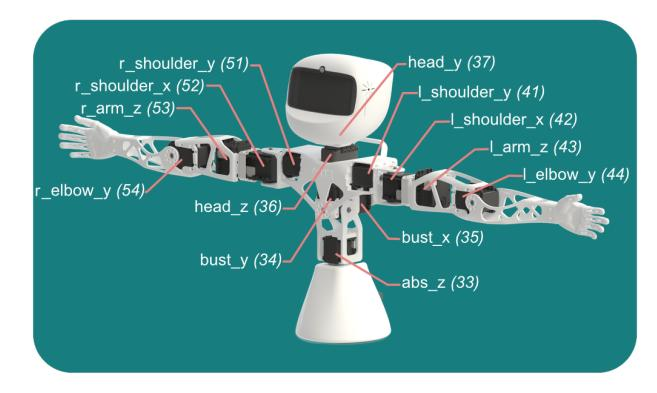
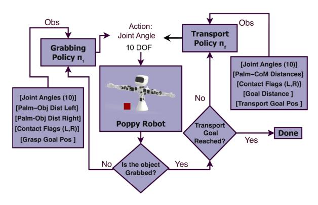
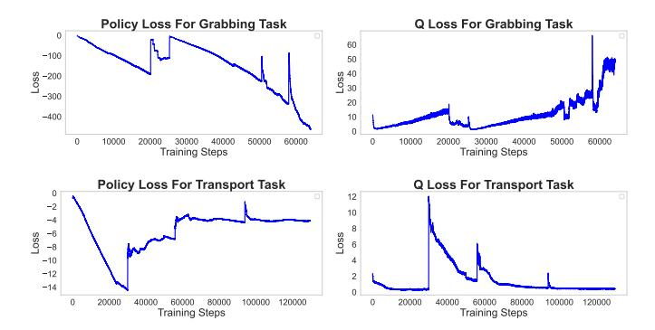
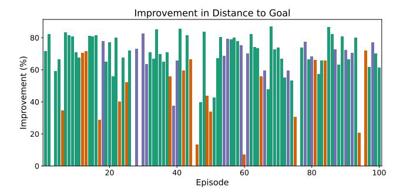
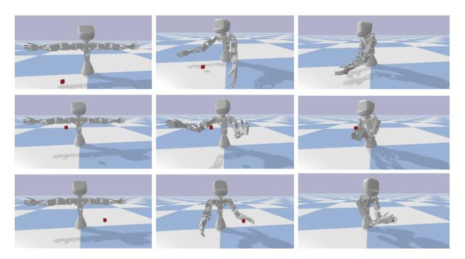
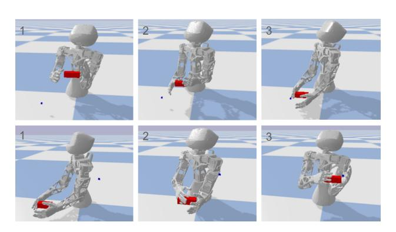
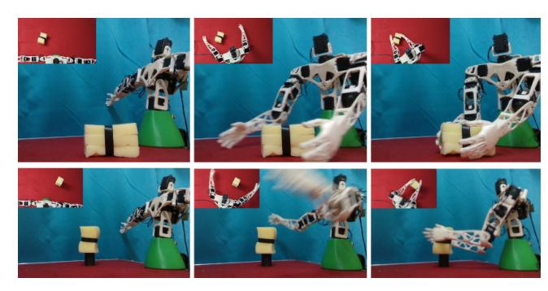

# Coordinated Dual-Arm Manipulation using Reinforcement Learning: A Soft Actor-Critic Approach on the Poppy Humanoid

Allen Jacob George *Dept. of Electrical & Electronics Engg. BITS Pilani* Hyderabad, India 20212730@hyderabad.bits-pilani.ac.in

Abhishek Sarkar *Dept. of Mechanical Engg. BITS Pilani* Hyderabad, India

abhisheks@hyderabad.bits-pilani.ac.in

Joyjit Mukherjee *Dept. of Electrical & Electronics Engg. BITS Pilani* Hyderabad, India j.mukherjee@hyderabad.bits-pilani.ac.in

*Abstract*—In this work, we present a reinforcement learningbased framework for dual-arm object manipulation using the Poppy humanoid robot platform. Our approach addresses the challenges of coordinated grasping and object transport by decomposing the task into two sequential stages. In the first stage, a single policy is trained using the Soft Actor-Critic (SAC) algorithm to simultaneously control both arms and the torso to perform object grasping. In the second stage, a separate SAC policy is trained to move the grasped object to a specified target location. To improve learning efficiency, we incorporate human demonstration data during training. This integration of expert guidance with sample efficient deep reinforcement learning enables the system to achieve robust, coordinated manipulation behavior. Further validation of the simulation results were tested by putting the Poppy robot joint trajectories generated from the simulation results. Both simulation and experimental results are shown to demonstrate that our method can successfully perform dual-arm object grasping and relocation with stable and synchronized motion.

*Index Terms*—Poppy Robot, Humanoid, Dual Arm Manipulator, Reinforcement Learning, Soft Actor-Critic, Human Demonstrations

# I. INTRODUCTION

Robotic manipulators have become indispensable tools in industry and service for their ability to interact physically with the environment such as grasping, moving, or assembling objects. Single arm robots are inherently limited when it comes to tasks that involve complex object interactions or tasks that require stabilization through multi-point contact. These limitations have driven growing interest in dual-arm robotic manipulators, which more closely mimic the human capability of coordinated bimanual manipulation.

Dual-arm systems offer several advantages, including increased dexterity, redundancy, and the ability to perform cooperative manipulation of objects. However, these benefits come with significantly increased control complexity [1]. Recently, neural networks, known for their high-speed, parallel distributed processing capabilities have emerged as a powerful tool for real-time applications and have been widely adopted in various control systems [2].

Building on this foundation, reinforcement learning (RL) has emerged as a powerful approach that leverages neural networks to learn control policies directly from interaction data [3]. By optimizing a reward signal over time, RL agents can autonomously discover control strategies that handle uncertainty, adapt to dynamic changes, and generalize across tasks. This makes RL particularly well suited for dual-arm systems, where coordination and adaptability are critical.

Recent advances in deep reinforcement learning (DRL), particularly actor-critic algorithms such as Soft Actor-Critic (SAC), have demonstrated strong performance in continuous control tasks [4]. Using DRL, researchers have started to tackle the complex control problem of dual-arm coordination, enabling behaviors such as cooperative object transport, trajectory tracking, and collision avoidance often without requiring explicit modeling of the robot or environment [5].

In this work, our aim is to develop a learning-based control strategy using SAC, that allows two robotic arms to cooperatively grasp and transport objects under varying conditions. The paper is organized as follows: Section II review of existing approaches to robot manipulation and the use of RL in manipulators is presented. In Section III details of our methodology, including the Poppy robot setup, environment design, observation and action spaces, reward formulation, and training procedure using SAC is discussed. Section IV presents the evaluation of the trained policies for dual-arm grasping and movement. Finally, Section V concludes the paper and discusses potential directions for future work.

# II. RELATED WORKS

Dual-arm robotic manipulation demands precise coordination, robust control, and adaptability, especially in unstructured environments. Early approaches focused on model based control, such as integral sliding mode controllers for trajectory synchronization under uncertainties [6], and six DOF impedance control frameworks enabling compliant interaction through centralized or decentralized strategies [7]. While effective, these methods rely on accurate dynamic models and struggle with adaptability.

To improve robustness, hybrid techniques emerged, combining self-tuning control with radial basis function (RBF) networks for space robots under uncertain dynamics [8], and composite learning adaptive control using historical data to improve convergence [9].

Recently, DRL has enabled data driven adaptability. Taskadaptive DRL frameworks use actor-critic models for closed chain manipulation, pairing a learned leader policy with an inverse kinematics based follower [10]. Additionally, decentralized dual-agent SAC approaches have demonstrated effective motion planning with self collision, joint-limit, and singularity avoidance, even without external coordination [11]. Extending SAC based learning to more generalized settings, researchers have proposed multi task RL approaches that enable efficient policy learning across various manipulation tasks. For instance, one study addressed multi task robotic control by introducing an adjudicate reconfiguration network within the SAC framework, dynamically adjusting shared parameters to avoid gradient conflicts and improve learning efficiency [12]. Similarly, task independent joint control learning using curriculum learning and RL demonstrated the feasibility of learning generalizable motor skills across tasks, further emphasizing the role of curriculum in progressive skill acquisition [13].

The COHER algorithm [14], which co-adapts hindsight experience replay with environment shifts, represents a significant advancement. By automatically adjusting task difficulty based on the agent's success rate, COHER enables robots to learn complex manipulation behaviors such as obstacle avoidance without explicit object location data. Its successful deployment on a real world Franka robot further validates its Sim2Real potential. In a related vein, reset-free RL via multi-task learning tackles the challenge of requiring human intervention in episodic resets. By structuring learning tasks in a mutually beneficial sequence, the method eliminates the need for manual resets and supports autonomous acquisition of dexterous manipulation skills directly in the real world [15]. This line of work has demonstrated success in complex in hand manipulation tasks without explicit supervision, reinforcing the practicality of RL in scalable robotic learning. Additional advancements have focused on integrating impedance control with RL. The DA-VIL framework combined policy learning with gradient based optimization to adapt impedance gains dynamically, leading to stable dual-arm manipulation across objects with varying dynamics [16]. Similarly, model based actor-critic learning for impedance control enabled safe and automatic training in complex interactive environments, such as human-robot collaboration and machining, without prior system knowledge [17]. Finally, coordinated compliance approaches such as master-slave and shared force control continue to offer complementary strategies for dual-arm payload manipulation, ensuring synchronized motion and effective force distribution in dynamic tasks [18].

In summary, the evolution from traditional model based control to RL and more recently to curriculum and multi-task learning strategies demonstrates a clear trend towards scalable,

Fig. 1: Poppy humanoid robot with all 13 actuated joints labeled along with their corresponding digital IDs [19].

adaptive, and generalizable dual-arm robotic manipulation. Among these, SAC based frameworks, reset-free learning, and curriculum guided RL emerge as particularly promising tools for enabling intelligent object capture and coordination in unstructured environments.

## III. METHODOLOGY

We propose a RL framework to enable dual-arm coordination in a Poppy humanoid robot for a two stage object manipulation task: (1) grasping an object, and (2) transporting it to a target location. The system uses SAC for training and benefits from human demonstrations to accelerate learning. A custom Gym-compatible environment was developed to simulate, train and test both behaviors. Simulation is done using PyBullet.

## *A. Robot Setup*

As shown in Fig. 1 the Poppy humanoid robot used in this study is equipped with 13 actuated joints: 4 in each arm, 3 in the torso, and 2 in the head. out of which total of 10 joints are controlled in this work, including four in each arm and two in the torso. The controlled torso joints include abs z, which enables yaw rotation of the upper body, and bust y , which allows the torso to tilt forward and backward. These 10 degrees of freedom are used to achieve coordinated dual-arm manipulation for grasping and transporting objects.

## *B. Policy Architecture and Environment Setup*

A custom simulation environment was developed using the OpenAI Gym framework to accurately replicate the Poppy humanoid robot's physical structure, kinematic constraints, and interaction dynamics.

We decompose the manipulation task into two distinct subtasks, each handled by a separate policy:

- Grabbing Policy π1 : Responsible for coordinating both arms and the torso to approach and securely grasp the object
- Transport Policy π2 : Coordinates the arms and torso to transport the grasped object to a target position while maintaining a stable grip.

Fig. 2: Flowchart illustrating task based policy switching. The grasping policy π1 is activated when the object is not grasped, while the transport policy π2 is triggered following a successful grasp.

Each policy is trained independently using the SAC algorithm [20], chosen for its robustness, sample efficiency, and effectiveness in high-dimensional continuous action spaces. Although both policies operate within the same environment, they employ distinct observation spaces and reward functions tailored to the unique demands of grasping and transport.

- *a) Action Space:* The action space is continuous and 10 dimensional, corresponding to the set of actuated joints used during manipulation 4 degrees of freedom in each arm and 2 in the torso. The agent outputs delta joint angle commands at each timestep, with each component clipped to the range ±0.3 radians. This bounded delta control formulation ensures smooth and stable joint updates.
- *b) Observation Space:* Each policy receives an observation vector tailored to its specific task, as illustrated in Fig. 2.

The *grasping policy* (π1) uses an observation vector that includes the current angles of all 10 controllable joints providing full awareness of the robot's configuration. It also incorporates the distances from the object to each palm, boolean indicators specifying whether the left and right palms are in contact with the object, and the 3D coordinates of the grasping goal.

The *transport policy* (π2) builds on a similar observation structure but focuses on maintaining a stable grasp during movement. Its observation vector includes joint angles of all 10 actuated joints, distances from each palm to the center of mass of the palms, referred to as pcom, binary contact indicators, the Euclidean distance from pcom to the transport goal, and the 3D coordinates of the goal itself. During transport, we assume that the object remains at pcom after grasping, since simulating a physically held object using only palm contacts is challenging in the simulation environment. These structured inputs enable the policy to reason about spatial relationships and alignment with the goal.

## *C. Human Demonstrations*

Human demonstrations were collected in simulation for both the grasping and transport tasks separately using joystick teleoperation. These expert trajectories serve as initial guidance for policy learning. During the early stages of training, actions were sampled from the demonstration data with a high probability (p = 0.7), and this probability was gradually annealed to 0 as the policy improved. This strategy ensures a smooth transition from imitation learning to pure RL, balancing exploration with informed guidance.

## *D. Reward Design*

Distinct reward functions were crafted for each subtask to encourage desired behaviors during training.

*1) Grasping Policy (*π1*):* The reward is based on the distance between the palms and their respective target positions. At each timestep, the agent receives a negative reward proportional to the Euclidean distance from each palm to its corresponding goal position:

$$r = -\|p_{\text{left}} - p_{\text{target\_left}}\|_2 - \|p_{\text{right}} - p_{\text{target\_right}}\|_2$$
 (1)

Additional reward shaping terms are introduced to promote early contact and successful coordination. If either palm reaches within a defined proximity threshold of the object, a bonus reward is given. If both palms are simultaneously within the threshold (i.e., making a successful grasp), a larger reward bonus is provided, and the episode is terminated successfully. Further small positive rewards are granted if either palm is within a tighter reach margin, incentivizing fine alignment before contact.

*2) Transport Policy (*π2*):* The reward function for the transport policy is designed to promote stable, coordinated movement of the object toward the goal while maintaining appropriate hand spacing. At each timestep, the reward includes a negative term proportional to the Euclidean distance between the goal and pcom (used as the effective object position), along with penalties for deviation of palm from this center denoted as r1. An additional penalty, r2 is applied based on the absolute difference in the z-coordinates of the two palms to encourage planar alignment during transport.

The transport policy's reward function is composed of several components that guide the robot toward the goal while maintaining stable and safe arm configurations. The total reward at each timestep is given by:

$$r = r_1 + r_2$$

$$r_1 = -2 \cdot ||p_{\text{com}} - p_{\text{goal}}||_2 - ||p_{\text{left}} - p_{\text{com}}||_2$$

$$r_2 = -1.5 \cdot |z_{\text{left}} - z_{\text{right}}|.$$
(2)

Where pcom = 2 (pleft + pright) denotes the center point between the two palms, and pgoal represents the desired goal position. The vectors pleft and pright correspond to the 3D positions of the left and right palms, respectively, while zleft and zright are their vertical (z-axis) components. The inter-palm distance is defined as dpalm = ∥pleft − pright∥2.

A penalty of −2 is applied if dpalm < 5 cm, −4 if it exceeds 8 cm, and −8 if it goes beyond 10 cm. In the latter two cases when dpalm < 5 cm or > 10 cm the episode is terminated and the environment is reset.

A success reward is granted when the following conditions are met: the Euclidean distance between pcom and the goal,

Fig. 3: Loss vs Training step graph.

 $\|p_{\rm com}-p_{\rm goal}\|_2$ , is less than 0.03; both palms are within a threshold distance of 0.4 from  $p_{\rm com}$ ; and the inter-palm distance,  $d_{\rm palm}$ , is greater than 0.05. Under these conditions, a bonus reward of +10 is assigned, and the episode is marked as successful.

#### E. Training Procedure

A staged reward modification strategy was employed during training of the transport policy. Initially, the reward function consisted of the distance from the palm to  $p_{\rm com}$  and the distance from  $p_{\rm com}$  to the transport goal location. A constraint on palm separation was later introduced, penalizing configurations where the palms were closer than 5 cm or farther apart than 10 cm. In the final phase, an additional penalty was added for vertical misalignment by introducing a term based on the difference in the Z-axis positions of the palms.

Each policy was trained independently using SAC with human demonstrations. The replay buffer was initialized with expert trajectories, while online experience was gathered through environment rollouts. Policies were trained using the SAC algorithm with mini-batch stochastic gradient descent and entropy regularization. Training continued until consistent task success was achieved in simulation.

#### IV. RESULTS

The grabbing policy was evaluated across 102 test episodes to assess. A total of 42 episodes were classified as successful,

Fig. 4: Percentage Improvement in distance to goal for the grabbed object across episodes. Colour is based on final distance to goal. Green: < 3 cm; Blue:3-6 cm; Red:>6 cm.

Fig. 5: Snapshots of poppy robot performing object grabbing task. Red dot is the object position.

with both the height of each palm relative to the goal and the inter palm height difference remaining within a 5 cm threshold. At episode completion, the average distance between the palms was 6.51 cm. The average Z-axis errors were 1.61 cm for the right palm, 1.88 cm for the left palm, and 1.62 cm between the palms. In 87 episodes, the center of mass ( $p_{\rm com}$ ) of both palms was within 5 cm of the desired goal, and in 100 episodes,  $p_{\rm com}$  was within 8 cm, indicating consistent proximity to the goal. In 61 episodes, the goal lay within a 2D circle (XY plane) defined by the palms with a Z-offset of less than 5 cm, and in 55 of these, the Z-offset was below 3 cm. These results highlight the policy's overall effectiveness in grabbing task.

Out of 100 test episodes the Transport policy was evaluated, the robot successfully transported the object within 3 cm of the goal in 60 episodes. Expanding the tolerance, 79 episodes ended with the object positioned within 6 cm of the goal, and 89 episodes within 8 cm, indicating consistent near-goal performance. The task was designed to end if the distance between the robot's palms was either less than 5 cm or greater than 8 cm during transport, ensuring proper grip and safety. In 23 episodes, the task was stopped because the palm distance crossed below the 5 cm threshold, and in 17 episodes, the task ended due to the palms being more than 8 cm apart. Overall, 94 episodes showed an improvement in distance to the goal compared to their starting point, while in 5 episodes, the randomly generated goals were already within 3 cm of

Fig. 6: Snapshots of poppy robot performing object transport task for two different cases. Blue dot is the goal position.

Fig. 7: Snapshots of practical Poppy robot performing a grabbing task.

the object, leaving little room for measurable improvement. Loss versus training step graphs are presented in Fig. 3. These results reflect strong performance across the majority of trials, with opportunities to better handle palm separation constraints.

Fig. 4 shows percentage improvement in distance to goal across test episodes for the transport task. Green bars indicate episodes where the final distance to the transport goal was within 3 cm, blue bars represent episodes with final distance less than 6 cm but not within 3 cm, and red bars correspond to attempts with final distance greater than 6 cm. Only episodes that showed a reduction in distance to the goal compared to their starting point are included.

Fig. 5 illustrates three representative test cases of the Poppy robot attempting to grasp an object. For each case, a sequence of three images is presented to highlight the progression of the grasping motion. Similarly, Fig. 6 displays two test cases of the robot performing the object transport task toward a designated goal. Each case includes a sequence of three snapshots that demonstrate the various stages of the transport behavior.

For hardware experiments with the Poppy robot (Fig. 7), palm positions were estimated using forward kinematics derived from simulation. Each episode was initially tested in simulation, and upon a successful outcome, the corresponding joint trajectory was replicated on the physical robot. The hardware trials demonstrated the robot's ability to successfully grasp and manipulate the object.

## V. CONCLUSIONS

This work presents a dual-policy RL framework for coordinated dual-arm manipulation with the Poppy robot. Using human demonstrations and training using SAC in a custom simulation environment, we developed two task-specific policies: one for grasping and one for transporting objects using both arms and the torso. The trained policies were successfully deployed in both simulation and on the physical robot, demonstrating robust and effective manipulation capabilities.

Future work will explore integrating the two policies into a unified hierarchical controller, enabling smoother transitions between phases and reducing reliance on external task segmentation. Additionally, extending the approach to handle varied object shapes, dynamic goals, or more unstructured environments would further improve the robustness and applicability of the system.

## REFERENCES

- [1] C. Smith, Y. Karayiannidis, L. Nalpantidis, X. Gratal, P. Qi, D. V. Dimarogonas, and D. Kragic, "Dual arm manipulation—a survey," *Robotics and Autonomous systems*, vol. 60, no. 10, pp. 1340–1353, 2012.
- [2] L. Jin, S. Li, J. Yu, and J. He, "Robot manipulator control using neural networks: A survey," *Neurocomputing*, vol. 285, pp. 23–34, 2018.
- [3] D. Han, B. Mulyana, V. Stankovic, and S. Cheng, "A survey on deep reinforcement learning algorithms for robotic manipulation," *Sensors*, vol. 23, no. 7, p. 3762, 2023.
- [4] T. Haarnoja, A. Zhou, K. Hartikainen, G. Tucker, S. Ha, J. Tan, V. Kumar, H. Zhu, A. Gupta, P. Abbeel, *et al.*, "Soft actor-critic algorithms and applications," *arXiv preprint arXiv:1812.05905*, 2018.
- [5] D. Zhou, R. Jia, and H. Yao, "Robotic arm motion planning based on curriculum reinforcement learning," in *2021 6th International Conference on Control and Robotics Engineering (ICCRE)*, pp. 44–49, IEEE, 2021.
- [6] S. Phukan and C. Mahanta, "A position synchronization controller for co-ordinated links (cool) dual robot arm based on integral sliding mode: Design and experimental validation," *International Journal of Automation and Computing*, vol. 18, pp. 110–123, 2021.
- [7] F. Caccavale, P. Chiacchio, A. Marino, and L. Villani, "Six-dof impedance control of dual-arm cooperative manipulators," *IEEE/ASME Transactions On Mechatronics*, vol. 13, no. 5, pp. 576–586, 2008.
- [8] X. Yan, M. Shan, and L. Shi, "Adaptive and intelligent control of a dualarm space robot for target manipulation during the post-capture phase," *Aerospace Science and Technology*, vol. 142, p. 108688, 2023.
- [9] Y. Jiang, Y. Wang, Z. Miao, J. Na, Z. Zhao, and C. Yang, "Compositelearning-based adaptive neural control for dual-arm robots with relative motion," *IEEE Transactions on Neural Networks and Learning Systems*, vol. 33, no. 3, pp. 1010–1021, 2020.
- [10] Y. Cui, Z. Xu, L. Zhong, P. Xu, Y. Shen, and Q. Tang, "A taskadaptive deep reinforcement learning framework for dual-arm robot manipulation," *IEEE Transactions on Automation Science and Engineering*, vol. 22, pp. 466–479, 2024.
- [11] C.-C. Wong, S.-Y. Chien, H.-M. Feng, and H. Aoyama, "Motion planning for dual-arm robot based on soft actor-critic," *IEEE Access*, vol. 9, pp. 26871–26885, 2021.
- [12] T. Wang, Z. Ruan, Y. Wang, and C. Chen, "Control strategy of robotic manipulator based on multi-task reinforcement learning," *Complex & Intelligent Systems*, vol. 11, no. 3, p. 175, 2025.
- [13] L. Væhrens, D. D. Alvarez, U. Berger, and S. Bøgh, "Learning task- ´ independent joint control for robotic manipulators with reinforcement learning and curriculum learning," in *2022 21st IEEE International Conference on Machine Learning and Applications (ICMLA)*, pp. 1250– 1257, IEEE, 2022.
- [14] E. Sayar, G. Iacca, and A. Knoll, "Curriculum learning for robot manipulation tasks with sparse reward through environment shifts," *IEEE Access*, 2024.
- [15] A. Gupta, J. Yu, T. Z. Zhao, V. Kumar, A. Rovinsky, K. Xu, T. Devlin, and S. Levine, "Reset-free reinforcement learning via multi-task learning: Learning dexterous manipulation behaviors without human intervention," in *2021 IEEE International Conference on Robotics and Automation (ICRA)*, pp. 6664–6671, IEEE, 2021.
- [16] M. F. Karim, S. Bollimuntha, M. S. Hashmi, A. Das, G. Singh, S. Sridhar, A. K. Singh, N. Govindan, and K. M. Krishna, "Davil: Adaptive dual-arm manipulation with reinforcement learning and variable impedance control," *arXiv preprint arXiv:2410.19712*, 2024.
- [17] X. Zhao, S. Han, B. Tao, Z. Yin, and H. Ding, "Model-based actorcritic learning of robotic impedance control in complex interactive environment," *IEEE Transactions on Industrial Electronics*, vol. 69, no. 12, pp. 13225–13235, 2021.
- [18] L. Yan, Z. Mu, W. Xu, and B. Yang, "Coordinated compliance control of dual-arm robot for payload manipulation: Master-slave and shared force control," in *2016 IEEE/RSJ International Conference on Intelligent Robots and Systems (IROS)*, pp. 2697–2702, IEEE, 2016.
- [19] "Poppy project humanoid." https://www.poppy-project.org/en/robots/ poppy-humanoid/. Accessed: 2025-05-31.
- [20] T. Haarnoja, A. Zhou, P. Abbeel, and S. Levine, "Soft actor-critic: Offpolicy maximum entropy deep reinforcement learning with a stochastic actor," in *International conference on machine learning*, pp. 1861–1870, Pmlr, 2018.