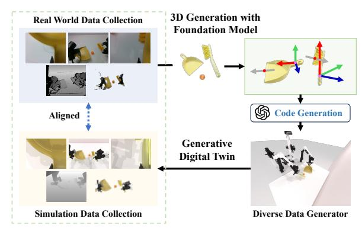
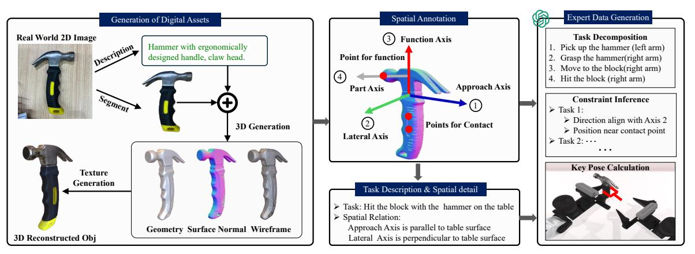
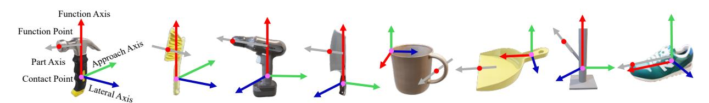
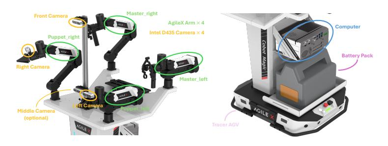
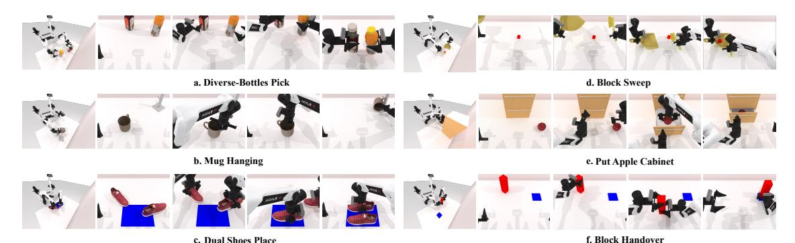
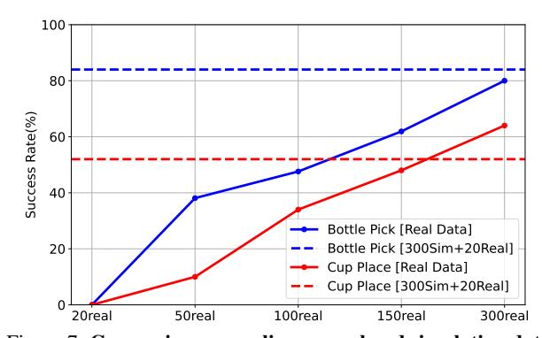
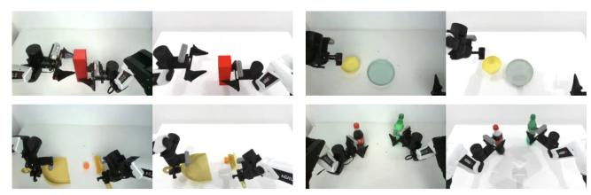

# RoboTwin: Dual-Arm Robot Benchmark with Generative Digital Twins

Yao Mu1,3∗† Tianxing Chen1,3,4∗ Zanxin Chen2,4∗ Shijia Peng2,4∗ Zhiqian Lan1 Zeyu Gao5 Zhixuan Liang1 Qiaojun Yu9 Yude Zou4 Mingkun Xu7 Lunkai Lin2 Zhiqiang Xie2 Mingyu Ding6 Ping Luo1,8†

1HKU 2Agilex Robotics 3Shanghai AI Laboratory 4SZU 5CASIA 6UNC-Chapel Hill 7GDIIST 8HKU-Shanghai ICRC 9SJTU

https://robotwin-benchmark.github.io

## Abstract

*In the rapidly advancing field of robotics, dual-arm coordination and complex object manipulation are essential capabilities for developing advanced autonomous systems. However, the scarcity of diverse, high-quality demonstration data and real-world-aligned evaluation benchmarks severely limits such development. To address this, we introduce RoboTwin, a generative digital twin framework that uses 3D generative foundation models and large language models to produce diverse expert datasets and provide a real-world-aligned evaluation platform for dual-arm robotic tasks. Specifically, RoboTwin creates varied digital twins of objects from single 2D images, generating realistic and interactive scenarios. It also introduces a spatial relation-aware code generation framework that combines object annotations with large language models to break down tasks, determine spatial constraints, and generate precise robotic movement code. Our framework offers a comprehensive benchmark with both simulated and real-world data, enabling standardized evaluation and better alignment between simulated training and real-world performance. We validated our approach using the opensource COBOT Magic Robot platform. Policies pre-trained on RoboTwin-generated data and fine-tuned with limited real-world samples demonstrate significant potential for enhancing dual-arm robotic manipulation systems by improving success rates by over 70% for single-arm tasks and over 40% for dual-arm tasks compared to models trained solely on real-world data.*

## 1. Introduction

Robotic systems with intricate dual-arm coordination and precise dexterity are essential for complex object manipu-

Figure 1. RoboTwin Benchmark. A framework leveraging generative foundational models to generate realistic and interactive training scenarios and diverse expert demonstrations for benchmarking dual-arm robotic manipulation.

lation to unlock advanced capabilities across domains such as healthcare, manufacturing, logistics, and domestic assistance. However, creating robust and versatile robotic systems that meet these demands remains a challenge, with a major bottleneck being the absence of diverse, high-quality training data and comprehensive evaluation benchmarks that are aligned with the real world.

Traditional approaches to data collection, particularly human teleoperation [4, 12, 16, 18, 20, 31], yield highquality demonstrations but face significant practical limitations. While these methods provide reliable training data, they are often prohibitively expensive, time-intensive, and struggle to cover the diverse range of scenarios robots encounter in real-world deployments. To address these limitations, researchers have turned to algorithmic trajectory generators in simulations [15, 23, 34]. These alternatives, however, frequently require task-specific design, hindering their generalizability and scalability. Recent advances such as MimicGen [54] and RoboCaca [59] have demonstrated significant progress in generating large-scale simulated expert data from limited human demonstrations. However, these approaches operate under fixed scenario settings and strug-

∗ Equal contribution. † Corresponding authors.

gle to handle task variants beyond their predefined configurations, limiting their generalizability to novel scenarios.

Another limitation of existing benchmarks is that they predominantly focus on single-arm tasks [23, 55] or bimanual tasks with two separated arms [22], which fail to capture the complexity and coordination requirements inherent in integrated dual-arm systems. While HumanoidBench [64] and BiGym [13] explore benchmarks for humanoid bimanual manipulation, their scalability is limited by fixed environments or reliance on VR teleoperation for demonstration collection. As a result, these gaps highlight the urgent need for a scalable and standardized dual-arm collaboration benchmark with an efficient data collection pipeline.

To address these challenges, as shown in Fig. 1, we propose RoboTwin, a generative digital twin framework empowered by 3D generative foundation models and large language models (LLMs), aiming to produce diverse expert datasets and provide a real-world-aligned evaluation platform for dual-arm robotic tasks. Starting from a single 2D RGB image, we employ generative foundation models for 3D modeling and texture generation, enabling the efficient creation of varied object instances with different shapes, sizes, and appearances. Each object class is incorporated with spatial annotations, which define function axes, approach axes, lateral axes, and contact points and are applicable across various instances within an object class via feature point matching technology. Building upon these spatially-aware digital twins, RoboTwin leverages LLMs to interpret and decompose complex tasks into manageable sub-tasks. For each sub-task, we infer the constraints of the terminal state. For example, in a hammering task, the functional point of the hammer head needs to align with the surface of the target object. RoboTwin then generates executable code that calculates key poses based on these spatial constraints and object properties, interfacing with underlying planning modules to produce complete, feasible trajectories for execution.

Within the above framework, our RoboTwin features diverse dual-arm manipulation tasks that combine simulated expert data with real-world teleoperated datasets under consistent environmental and hardware setups. We then benchmark and evaluate the ability of RoboTwin to improve policy generalization in real-world scenarios. Experimental results demonstrated that policies pre-trained on 300 RoboTwin-generated samples and fine-tuned with 20 realworld samples improve the success rate by 70% in singlearm manipulation tasks like hammer beat, and over 40% in dual-arm coordination tasks, such as ball sweep, compared to those trained exclusively on 20 real-world samples.

We summarize our key contributions as: 1) we establish a convenient real-to-sim pipeline that requires only an RGB image from the real world to generate diverse 3D models of target objects, empowered by a 3D generative foundation model; 2) we create a spatial-aware code generation framework, which automatically creates expert-level demonstration data via a large language model and the spatial annotations of the target objects. 3) we develop a standard benchmark for dual-arm manipulation tasks including both realworld teleoperated data and high-fidelity synthetic data generated for corresponding scenarios. These advancements provide a robust framework for generating diverse, highquality training data and policy evaluation for dual-arm manipulation tasks, significantly contributing to the development of more capable and versatile robotic systems.

## 2. Related Work

#### 2.1. Datasets and Benchmarks for Robotics

To collect effective demonstrations for robotic tasks, human teleoperation is the most common approach, where human manually guides a robot across various tasks [18, 31, 50, 51, 53, 57]. Recent advancements have extended this methodology by employing teams of human operators over prolonged periods to assemble substantial real-world datasets [2, 7, 18, 31]. An alternative method employs algorithmic trajectory generators within simulators [15, 23, 30, 34, 74]. Nevertheless, such approaches typically demand manual, task-specific design for individual tasks. Recent initiatives like MimicGen [54] and RoboCaca [59] generate simulated expert data by adapting actions to new object poses, but remain limited to fixed scenarios and predefined task configurations. Furthermore, their reliance on fixed 3D objects limits the diversity of interacting objects and shapes. Besides, Maniskill [23, 69] provides diverse simulation scenarios but lakes automated data collection mechanism.

In contrast, RoboTwin leverages 3D generative foundation models and LLMs to autonomously create both task variations and corresponding expert demonstrations. From 3D assets, it generates task scenarios and executable code via spatial reasoning, minimizing human intervention and supporting diverse object appearances.

## 2.2. Dual-arm Manipulation

While significant advances have been made in single-arm manipulation, coordinated multi-arm manipulation remains largely unexplored. Peract2 [22] offers benchmarks for bimanual tasks with separated arms, but its setup lacks the complexity of integrated dual-arm systems. Humanoid-Bench [64] evaluates dexterous, whole-body manipulation with a humanoid robot in a fixed reinforcement learning benchmark, while BiGym [13] provides a bimanual benchmark but is constrained by VR teleoperation, limiting their scalability in data collection and evaluation. As a benchmark for dual-arm tasks, RoboTwin enables automatic and large-scale coordinated manipulation data generation with comprehensive policy evaluation.

Figure 2. Real-to-simulation transfer and expert data generation. We first leverage a 3D generative foundation model to create diverse 3D assets from 2D images, complete with geometry, normals, and textures. This process is augmented by vision-language models to generate variations of object descriptions, enabling the creation of visually diverse yet functionally consistent 3D models. We then implement a spatial annotation framework that marks key functional and contact points, along with functional, approach, and lateral axes on these 3D assets. Finally, we employ LLMs to generate expert demonstrations by decomposing tasks into subtasks, inferring spatial constraints, and generating collision-free robot behavior executable code that satisfies kinematic requirements.

### 2.3. Robot Manipulation Learning Methods

The adoption of human demonstrations to instruct robots in manipulation skills is a prevalent method in Robot Manipulation Learning [5, 6, 11, 14, 19, 32, 48, 49, 66, 73]. Among the techniques, Behavioral Cloning stands out for learning policies offline from these demonstrations. It replicates observed actions from a curated dataset [7, 15, 18, 31, 34, 52, 61, 75]. Conversely, Offline Reinforcement Learning enhances policy learning by optimizing actions based on a predefined reward function and exploiting large datasets [8, 24, 36–39, 47]. The Action Chunking with Transformers (ACT) technique integrates a Transformerbased visuomotor policy with a conditional variational autoencoder to structure the learning of action sequences [67, 70, 76]. Diffusion models have been introduced into robot imitation learning and are gradually becoming a mainstream approach due to their excellent generative capabilities [3, 33, 43–45, 60]. Recently, the Diffusion Policy method has gained prominence. It employs a conditional denoising diffusion process for visuomotor policy representation, effectively reducing the accumulative error in trajectory generation that is often observed in Transformerbased visuomotor policies [14]. The 3D Diffusion Policy [73] uses point clouds for environmental observations, enhancing spatial information utilization and managing various robotic tasks in both simulated and real environments with only a small number of demonstrations.

### 2.4. LLM for Robotic Code Generation.

With their remarkable ability in natural language understanding and code generation, Large Language Models (LLMs) have revolutionized numerous domains in artificial intelligence. In robotics, these models have shown exceptional capabilities in bridging the gap between natural language commands and executable robot actions [9, 10, 17, 21, 25–29, 42, 46, 58, 65, 71]. Code as Policies [41] and RoboCodeX [10, 56] established that LLMs can effectively translate high-level task descriptions into functional robot control programs. While Rekep [29] advances spatial reasoning between key points, it has limitations in handling functional axis constraints and fails to account for spatial relationships between object functional axes and the table surface during code generation. Furthermore, existing code generation approaches predominantly focus on single-arm robots, overlooking crucial aspects of dual-arm collaboration and active collision avoidance strategies.

## 3. Bridging Physical and Digital Worlds for Diverse Robot Behavior Generation

#### 3.1. Generation of Diverse Digital Assets

Our approach utilizes Deemos's Rodin platform§ to create 3D models from simple 2D RGB images. This method significantly reduces the need for expensive sensors while achieving realistic visual effects and supporting physical simulations. The process begins with capturing photographs of real-world objects. As shown in Fig. 2, we use GPT-4V [1] to analyze these images to generate corresponding descriptions, which are then autonomously modified via language model to create similar yet visually distinct object descriptions. We use these descriptions with SDXL-Turbo [63] to generate a diverse set of 2D images representing various appearances of the same object class. An image-conditioned 3D generation model then processes this

§We use Deemos's 3D digital asset Generation Model (from text or image) Rodin: https://hyperhuman.deemos.com/rodin

Figure 3. Examples of spatial annotations. Function and contact points with principal axes for functional parts and approach directions are extracted semi-automatically within RoboTwin for spatial- and geometry-aware manipulation and code generation.

collection of images, producing a wide range of 3D models for a single object type. The final output transforms a 2D image into a comprehensive 3D model, featuring detailed geometry, surface normals, wireframes, and textures. We validate asset quality using two complementary approaches: quantitative evaluation via UCLIP-I [40] similarity metrics and qualitative assessment through GPT-4V visual validation. Assets falling below quality thresholds are automatically flagged for regeneration. This dual validation approach ensures both visual and geometry consistency for effective sim-to-real transfer. To ensure physical fidelity, our pipeline leverages GPT-4V to classify object materials and assign appropriate physics parameters with ±5% random variations to enhance robustness.

#### 3.2. Spatial Annotation Framework for 3D Assets

To enhance the structural integrity and universal applicability of generated assets, we implement a systematic approach for annotating key points and axes on tools. This methodology aims to render the data more comprehensible and accessible to large language models for complex task code generation. As shown in Fig. 3, the annotation process focuses on two primary elements: key points and axes.

Key Points. Key points represent specific locations on tools directly associated with their functional operations or user interaction points. We distinguish between these two types: (1) Point for Function: This key point designates the primary functional component of the tool, such as the striking surface of a hammer. It defines the tool's functional origin or point of action, directly correlating to the tool's primary purpose in a given task. (2) Point for Contact: This key point indicates the area of interaction between the tool and its user or other objects. It represents the gripping point or contact area, serving as a crucial human-machine interface point. Annotating this point facilitates understanding of tool's operational posture.

Axes. Axes are used to describe the spatial directionality of tools during task execution, encompassing the direction of functional execution and the tool's approach towards objects. We identify three principal axes: (1) Function Axis: This axis represents the direction in which the tool executes its primary function. It typically aligns with the tool's main operational vector, guiding the understanding of the tool's intended use and movement during task performance. (2) Approach Axis: The approach axis delineates the direction in which the tool approaches or is applied to the target object. This axis is crucial for comprehending the spatial relationship between the tool and its subject of operation. (3) Lateral Axis: This axis is perpendicular to both the function and approach axes, completing a three-dimensional coordinate system for the tool. The lateral axis aids in defining the tool's orientation and potential rotational movements during use.

By systematically annotating these key points and axes, we create a comprehensive spatial framework for each tool. This framework enables a more precise and context-aware understanding of tool functionalities, facilitating improved task planning and execution by large language models. We do not need to repeatedly annotate different 3D models from the same class. Instead, to streamline the annotation process for various 3D models of similar objects, we employ a feature point matching approach leveraging the Stable Diffusion [62] encoder. This method enables the transfer of key points across various 3D models within the same object class. Our approach utilizes feature point matching to determine the target point. Specifically, under the table top view, given a source image Is, a target image It, and a source point ps, we aim to locate the corresponding point pt in the target image. Following the methodology outlined in [35, 68], we extract diffusion features from both Is and It. Since these diffusion features correspond to individual pixels in the target image, we can identify the pixel in It with the highest similarity to ps by analyzing the extracted features. This technique allows for efficient key point migration across different 3D models of similar objects, eliminating the need for redundant annotations and enhancing the overall efficiency of the 3D modeling process.

#### 3.3. Expert Data Generation

Building upon our spatial annotation framework and expert data generation pipeline, we present a systematic approach to generating robot behaviors that satisfy spatial constraints while ensuring collision-free execution. At the core of our framework lies a comprehensive dual-arm manipulation system with three key capabilities. First, it enables synchronized arm movements through screw motion interpolation coupled with coordinated gripper actions, ensuring stable object handling. Second, it supports independent arm operations for scenarios requiring asymmetric movements. Third, it implements dynamic collision avoidance through continuous adjustment of safe intermediate positions between arms. Our motion generation implements a three-stage approach: (1) spatial constraint inference that analyzes object annotations to establish geometric relationships, (2) LLM-based code generation translating constraints into executable code using the MPlib trajectory optimization library, and (3) execution validation ensuring task completion. We incorporate a self-correction mechanism where execution errors are fed back to the language model, with minimal human oversight for complex cases. Leveraging these integrated capabilities, we employ large language models (LLMs) with predefined APIs to systematically generate expert demonstrations across diverse robotic tasks. The process consists of the following detailed steps:

- 1. Scene Initialization: The task environment is set up with relevant objects and their initial poses. For instance, a hammering task would involve placing the hammer and target objects in their starting positions.
- 2. Task Decomposition: Based on human input describing the task, we use LLM to break it down into subtasks. For example, a "hammer a nail" task might be decomposed into: a) grasping the hammer, b) positioning the hammer over the nail, c) striking the nail, and d) returning the hammer to its original position.
- 3. Constraint Inference: For each sub-task, we use LLM to systematically infer spatial and temporal constraints through a hierarchical constraint analysis process. This analysis begins with identifying the functional relationships between objects' key points and axes. For grasping sub-tasks, we derive constraints between the endeffector's pose and the object's annotated contact points and approach axis, ensuring stable and effective grasps. For manipulation sub-tasks, we establish geometric constraints between the tool's functional points and the target object. These constraints encompass both positional alignments and directional requirements.
- 4. Robot Behavior Generation: Based on the derived spatial constraints, the LLM proceeds to generate corresponding behavioral code for each sub-task by calling relevant APIs (See prompts and examples in Appendix D). During execution, the system performs precise calculations of end-effector poses based on these spatial constraints. The process begins by identifying functional points on the object within the world coordinate system, which serves as the fundamental reference frame for all subsequent pose calculations. Building upon this foundation, our system implements a dual approach to determine optimal target poses. The first approach leverages pre-labeled contact points on the object to generate grasp poses. This method takes into account both the object's geometric properties and the robot's kinematic limitations. For more complex manipulation tasks, the second approach comes into play, comput-

ing target poses by aligning the object's functional point with a designated target point while adhering to specific directional constraints. To illustrate this, consider a hammering task: the system would align the hammer's head with the nail while calculating the proper orientation for an effective strike. The core of behavior generation for each sub-task is an optimization problem that seeks optimal joint trajectories θ(t). Using a screw motion planner, the system minimizes a cost function J(θ(t)) while satisfying all task-specific constraints. This optimization is formulated as:

$$\begin{aligned} & \min_{\theta(t)} \quad J(\theta(t)) \\ & \text{s.t.} \quad \begin{cases} \mathbf{T}_{\text{ee}} = f_{\text{FK}}(\theta(t)) & \text{(Kinematic constraint)} \\ \mathbf{P}_{\text{ee}} = \mathbf{P}_o - d \cdot \vec{a}_o & \text{(Position alignment)} \\ \vec{n}_{\text{ee}} = \vec{a}_o & \text{(Orientation alignment)} \\ \theta(t) \in \mathcal{C}, \forall t \in [t_0, t_f] & \text{(Collision avoidance)} \end{cases}$$

where, J(θ(t)) represents a cost function that may incorporate factors such as energy efficiency, execution time, and motion smoothness. The constraints ensure that the robot's end-effector pose Tee matches the desired pose calculated through the forward kinematics function fFK(θ(t)), aligning with the object's contact point Po and approach axis ⃗ao (position and orientation alignment). Finally, the trajectory θ(t) must remain within the collision-free configuration space C throughout the time interval [t0, tf ], ensuring collision avoidance. This comprehensive optimization framework enables the generation of robot behaviors that are efficient, satisfy spatial constraints, and guarantee safe, collision-free execution of complex tasks like hammering.

- 5. Success Evaluation: We implement criteria to assess successful task completion. For the hammering task, this might include verifying that the nail has been driven to the correct depth.
- 6. Iterative Refinement: The system gathers error data from multiple sources: runtime error messages, failed trajectory planning steps, and deviations between the final object states and their target configurations. To regenerate improved code, the system takes a comprehensive set of inputs including the collected error information, original task description, object annotations, and the previous version of code. The newly generated code is then tested, and if issues persist, the cycle continues until the desired performance is achieved.

## 4. Benchmark

Based on the methods introduced in Sec. 3, we design a comprehensive benchmark called RoboTwin[57] to assess dual-arm robots, which includes 15 tasks in total. The underlying physics engine is ManiSkill3[69]. We employ the

¶Platform Introduction: https://global.agilex.ai/products/cobot-magic

age so 40 200 20 20 20 20 20 20 20 20 20 20 20 2

Figure 4. Illustration of our robot platform, with the capabilities for teleoperation and data acquisition.

Figure 5. Success rate of the generated code for RoboTwin benchmark.

open-source Cobot Magic¶ platform as depicted in Fig. 4, which is equipped with four robot arms and four Intel RealSense D-435 RGBD cameras and is built on the Tracer chassis. These cameras are strategically positioned: one on the high part of the stand for an expansive field of view, two on the wrists of the robot's arms, and one on the low part of the stand which is optional for use. The front, left, and right cameras capture data simultaneously at a frequency of 30Hz. We utilize ManiSkill [69], an open-source simulation platform with GPU-accelerated data collection built on SAPIEN [72]. The details of each task in RoboTwin can be found in Appendix A.

In RoboTwin benchmark, the agent needs to choose the appropriate collaboration method to successfully complete the task according to the distance of the target object from the left arm and the right arm. It involves the handover of the two arms, such as the handover task and putting the cup on the coaster, and the avoidance of interference between the two arms, such as the shoe placement task, which requires the two arms to coordinate with each other to place a pair of shoes in the limited space of the shoe box. The initial position and posture of the target objects in all our tasks are random. Before the scene is loaded, the mechanical dynamics accessibility of the randomly initialized scene will be checked to ensure that it is feasible. The task also includes objects of different shapes and appearances. The dual bottle pick task includes different models such as Coke bottles, Sprite bottles, and mineral water bottles, all of which are generated from 2D real pictures. The size of the objects in the environment is also randomized within a certain threshold. For each task, we provide well-designed script files that generate expert data across diverse scenarios, including various object placements and environmental conditions. We also report the success rate of generated code using our proposed method in Fig. 5, as described in Sec. 3.3.

For each task in our benchmark, we have pre-collected 100 sets of simulation data and 20 sets of real-world data. The hardware setup for the real-world experiments strictly matches that of the simulation environment. In both the simulation and real-world datasets, each captured frame consists of three images from the cameras, each provid-

ing an RGB and depth image. We also provide the point cloud data transformed from depth image, and colored point cloud data transformed from RGB and depth image for different types of algorithm evaluation. Additionally, the data includes the poses of the robotic arms' joints and endeffectors for both master and slave configurations, encompassing both left and right arms.

#### 5. Experiment on RoboTwin Benchmark

#### 5.1. Baselines and Experimental Setup

Diffusion Policy is a generative model for robotic imitation learning that models the distribution of potential actions to create diverse and complex action sequences. The approach has evolved into two main variants based on input dimensionality: The 2D Diffusion Policy [14] processes two-dimensional visual information like images and video frames to predict actions for robotic manipulation tasks. While effective for many applications, this approach may have limitations in tasks requiring depth perception and spatial reasoning. The 3D Diffusion Policy (DP3)[73] addresses these limitations by incorporating three-dimensional visual representations through point clouds. By using efficient point encoders to create compact 3D representations, DP3 enhances spatial awareness and demonstrates improved performance in tasks requiring complex spatial understanding.

We evaluated both 3D (DP3, w & w/o color) and 2D (DP) input imitation learning methods across 14 benchmark tasks, as shown in Fig. 6, tailoring our assessment approach to each model's characteristics using 20, 50, 100 expert demonstrations. The success rate is determined by satisfying the target pose constraints after execution completion and achieving collision-free trajectory execution throughout the task.

#### **5.2.** Experimental Results

As shown in Table 1, the experimental results reveal distinct performance patterns across different imitation learning methods. DP3 demonstrates superior few-shot learning capabilities, achieving remarkable performance with

Figure 6. Examples of task execution in the RoboTwin benchmark.

| Number of Demonstrations | 20              | 50              | 100             |                          | 20             | 50              | 100             |
|--------------------------|-----------------|-----------------|-----------------|--------------------------|----------------|-----------------|-----------------|
| Block Hammer Beat        |                 |                 |                 | Block Handover           |                |                 |                 |
| DP3 (XYZ)                | $55.7 \pm 8.5$  | $64.7 \pm 10.1$ | $55.7 \pm 0.6$  | DP3 (XYZ)                | $89.0 \pm 2.6$ | $84.3 \pm 9.1$  | $77.3 \pm 11.6$ |
| DP3 (XYZ+RGB)            | $47.7 \pm 4.0$  | $79.3 \pm 3.8$  | $82.0 \pm 6.6$  | DP3 (XYZ+RGB)            | $86.0 \pm 1.0$ | $94.0 \pm 0.0$  | $85.3 \pm 14.5$ |
| DP                       | $0.0 \pm 0.0$   | $0.0 \pm 0.0$   | $0.0 \pm 0.0$   | DP                       | $0.0 \pm 0.0$  | $12.0\pm5.0$    | $76.0 \pm 16.1$ |
| Bottle Adjust            |                 |                 |                 | Container Place          |                |                 |                 |
| DP3 (XYZ)                | $64.7 \pm 10.8$ | $71.7 \pm 13.8$ | $73.3 \pm 12.5$ | DP3 (XYZ)                | $52.7 \pm 5.0$ | $77.7 \pm 2.5$  | $85.3 \pm 3.2$  |
| DP3 (XYZ+RGB)            | $25.0 \pm 5.0$  | $36.0 \pm 8.5$  | $42.0 \pm 7.0$  | DP3 (XYZ+RGB)            | $37.3 \pm 2.1$ | $51.3 \pm 7.1$  | $62.3 \pm 6.8$  |
| DP                       | $6.3 \pm 5.9$   | $33.7 \pm 9.0$  | $35.7\pm2.9$    | DP                       | $1.7\pm0.6$    | $8.0 \pm 1.7$   | $14.0 \pm 6.9$  |
| Empty Cup Place          |                 |                 |                 | Mug Hanging (Easy)       |                |                 |                 |
| DP3 (XYZ)                | $33.7 \pm 4.2$  | $71.3 \pm 4.0$  | $61.7 \pm 13.1$ | DP3 (XYZ)                | $7.3 \pm 3.2$  | $14.0 \pm 3.6$  | $15.3 \pm 4.0$  |
| DP3 (XYZ+RGB)            | $23.7 \pm 5.5$  | $68.0 \pm 7.5$  | $81.0 \pm 2.6$  | DP3 (XYZ+RGB)            | $4.3 \pm 3.1$  | $1.7 \pm 1.5$   | $3.0 \pm 1.0$   |
| DP                       | $0.0 \pm 0.0$   | $25.0\pm2.6$    | $87.7 \pm 0.6$  | DP                       | $0.0 \pm 0.0$  | $0.0 \pm 0.0$   | $0.0 \pm 0.0$   |
| Mug Hanging (Hard)       |                 |                 |                 | Pick Apple Messy         |                |                 |                 |
| DP3 (XYZ)                | $4.0 \pm 1.7$   | $10.7 \pm 3.1$  | $15.3 \pm 5.5$  | DP3 (XYZ)                | $4.0 \pm 1.7$  | $12.7 \pm 5.5$  | $9.7 \pm 2.1$   |
| DP3 (XYZ+RGB)            | $0.0 \pm 0.0$   | $1.7 \pm 1.2$   | $2.3 \pm 2.5$   | DP3 (XYZ+RGB)            | $6.0 \pm 2.6$  | $31.0 \pm 7.5$  | $54.0 \pm 12.8$ |
| DP                       | $0.0 \pm 0.0$   | $0.0 \pm 0.0$   | $0.0 \pm 0.0$   | DP                       | $5.3\pm2.5$    | $16.7 \pm 1.5$  | $29.3 \pm 5.0$  |
| Put Apple Cabinet        |                 |                 |                 | Dual Bottles Pick (Easy) |                |                 |                 |
| DP3 (XYZ)                | $50.0 \pm 38.2$ | $73.3 \pm 9.2$  | $66.3 \pm 22.3$ | DP3 (XYZ)                | $40.3 \pm 8.0$ | $74.7 \pm 2.9$  | $55.3 \pm 11.5$ |
| DP3 (XYZ+RGB)            | $53.7 \pm 14.2$ | $54.3 \pm 17.4$ | $78.3 \pm 3.8$  | DP3 (XYZ+RGB)            | $36.7 \pm 5.9$ | $74.7 \pm 5.5$  | $75.7 \pm 17$   |
| DP                       | $0.0 \pm 0.0$   | $0.0 \pm 0.0$   | $8.0 \pm 12.2$  | DP                       | $1.7 \pm 0.6$  | $38.3 \pm 6.7$  | $85.7 \pm 6.7$  |
| Dual Bottles Pick (Hard) |                 |                 |                 | Diverse Bottles Pick     |                |                 |                 |
| DP3 (XYZ)                | $31.7 \pm 9.0$  | $48.0 \pm 7.9$  | $58.0 \pm 3.0$  | DP3 (XYZ)                | $11.3 \pm 2.1$ | $32.3 \pm 10.1$ | $37.0 \pm 10.0$ |
| DP3 (XYZ+RGB)            | $28.0 \pm 4.4$  | $47.3 \pm 4.2$  | $55.7 \pm 4.9$  | DP3 (XYZ+RGB)            | $2.0 \pm 1.0$  | $7.7 \pm 4.0$   | $14.7 \pm 4.7$  |
| DP                       | $8.0 \pm 2.0$   | $39.3 \pm 4.0$  | $59.3 \pm 5.5$  | DP                       | $0.7 \pm 0.6$  | $0.3 \pm 0.6$   | $12.0 \pm 5.3$  |
| Shoe Place               |                 |                 |                 | Dual Shoes Place         |                |                 |                 |
| DP3 (XYZ)                | $38.0 \pm 11.5$ | $59.3 \pm 7.4$  | $54.3 \pm 0.6$  | DP3 (XYZ)                | $4.0 \pm 1.0$  | $7.7 \pm 2.1$   | $12.0 \pm 1.7$  |
| DP3 (XYZ+RGB)            | $14.0 \pm 2.6$  | $44.3 \pm 2.9$  | $54.0 \pm 11.5$ | DP3 (XYZ+RGB)            | $1.7 \pm 1.5$  | $3.3 \pm 0.6$   | $6.0 \pm 1.0$   |
| DP                       | $3.0 \pm 1.2$   | $4.3 \pm 3.2$   | $33.0 \pm 15.8$ | DP                       | $0.0 \pm 0.0$  | $1.7\pm1.2$     | $3.0 \pm 1.0$   |

Table 1. **Benchmarking imitation learning algorithms for dual-arm manipulation under D435 camera setting.** We tested on 14 tasks with 20, 50, and 100 expert demonstrations on DP3 (XYZ), DP3 (XYZ+RGB), and DP with 3 seeds and reported the success rate.

Figure 7. Comparison on scaling up real and simulation data. merely 20 demonstrations. However, its performance exhibits limited scalability, with minimal improvements or even decreases as training data expands to 100 samples. Conversely, the DP algorithm shows poor initial perfor-

mance with limited data, likely due to insufficient geometric priors, but demonstrates significant scalability as training samples increase. With 100 demonstrations, DP outperforms DP3 in several tasks, significantly improving from 1. 7% to 85.7% in the Dual Bottles Pick (Easy) task. This indicates superior learning capabilities with larger datasets. The integration of RGB data with point cloud representations yields inconsistent benefits, highlighting a fundamental limitation in current bimanual manipulation approaches. While DP3(XYZ+RGB) shows dramatic improvements in cluttered environments such as Pick Apple Messy, it simultaneously exhibits performance degradation in some other tasks like Container Place. This indicates that better fusion representations of RGB semantic information and point cloud 3D information need to be developed (see more results in Appendix Table 4).

Figure 8. Visualization of Real Scene and Simulation Scene. More details can be found in Appendix Fig. 9.

|                    | Success Rates |               |  |
|--------------------|---------------|---------------|--|
| Task               | 20 real       | 300Sim+20Real |  |
| Bottle Pick (Easy) | 0/50          | 42/50         |  |
| Bottle Pick (Hard) | 0/50          | 16/50         |  |
| Container Place    | 0/50          | 49/50         |  |
| Cup Place          | 1/50          | 39/50         |  |
| Hammer Beat        | 2/50          | 37/50         |  |
| Average            | 1.2%          | 72%           |  |

Table 2. Real world evaluation with a single arm.

Experimental results show significant performance variation based on coordination complexity. Simple operations like Dual Bottles Pick achieved high success rates (85.7% with DP at 100 demonstrations), while tasks requiring complex bimanual coordination, such as Dual Shoes Place, performed poorly (below 15% success across all methods). Notably, tasks demanding complex dual-arm coordination significantly underperformed compared to those where robot arms could operate more independently, with arm selection based primarily on proximity to target objects. This highlights the current limitations in dual-arm coordination within imitation learning algorithms.

#### 5.3. Real World Experiment

To validate the effectiveness of RoboTwin-generated training data in real-world policy deployment, we conducted comprehensive experiments on both single-arm and dualarm manipulation tasks, as shown in Fig. 8. We conducted a comparative experiment between policies trained solely on 20 real-world datasets and those pre-trained on 300 simulation datasets before fine-tuning on 20 real-world datasets (see more details and results in Appendix B).

The selection of 300 simulation datasets as our hyperparameter was based on empirical evidence shown in Fig. 7. Through progressive scaling of real-world data, we found that combining 300 simulation datasets with 20 real-world datasets yielded comparable performance than using 300 real-world datasets alone for both single-arm bottle pick and dual-arm cup placement tasks.

To investigate the performance disparity between baseline algorithms in single-arm versus dual-arm tasks, we conducted sim-to-real transfer experiments for both task categories. Each task underwent 50 test trials with randomized initial configurations, including varying object positions and orientations, as well as robot arm placements

|                         | Success Rates |               |  |  |
|-------------------------|---------------|---------------|--|--|
| Task                    | 20 real       | 300Sim+20Real |  |  |
| Dual bottle Pick (Easy) | 0/50          | 31/50         |  |  |
| Dual bottle Pick (Hard) | 0/50          | 11/50         |  |  |
| Container Place         | 25/50         | 44/50         |  |  |
| Cup Place               | 0/50          | 26/50         |  |  |
| Sweep Ball              | 25/50         | 43/50         |  |  |
| Average                 | 20%           | 62%           |  |  |

Table 3. Real world evaluation with dual arms.

within predetermined boundaries. As shown in Table 2 and Table 3, experimental results revealed that policies trained on the combined dataset achieved markedly superior performance in real-world testing scenarios. Specifically, the integration of simulation data yielded a 72% improvement in success rates for single-arm tasks compared to policies trained exclusively on real-world data. For the more complex dual-arm tasks, we observed a significant improvement of over 40% in success rates. Our findings validate the effectiveness of our benchmark and data generation approach in bridging the sim-to-real gap, suggesting a promising direction for developing more robust and generalizable policies for dual-arm robotic manipulation tasks.

We observed significant disparities between single-arm and dual-arm scenarios. In the bottle rearrangement task, dual-arm operations presented substantially greater challenges, primarily due to the diverse initial states of target bottles (upright or lying down). While the incorporation of simulation data enabled the policy to achieve non-zero success rates, the overall performance remained suboptimal. This underscores the pressing need for developing more effective imitation learning algorithms specifically tailored to dual-arm coordination tasks.

## 6. Conclusion

This work introduces RoboTwin, a comprehensive benchmark integrating real-world and synthetic data for dual-arm robotic manipulation. Building upon the COBOT Magic Robot platform and leveraging 3D generative models for generative digital twins, our framework enables the efficient generation of diverse training data from single RGB images. Furthermore, our spatial-aware code generation framework automatically produces expert demonstrations by combining object annotations with LLMs to decompose complex tasks and generate precise movements. Experiments show that policies trained with RoboTwin-simulated data achieve higher success rates with less real data compared to those trained solely on real-world data. These results confirm our approach effectively bridges the sim-to-real gap while identifying limitations in dual-arm coordination tasks. Future work will focus on developing advanced algorithms for dual-arm coordination and expanding the framework to handle more complex manipulation tasks.

## Acknowledgements

We extend our profound gratitude to D-robotics for their invaluable support in supplying the necessary cloud computing resources that facilitated the execution of this research. Furthermore, we extend sincere appreciation to Deeoms for their contribution in providing essential model support, which was pivotal to the successful completion of this study. This paper is partially supported by the National Key R&D Program of China No.2022ZD0161000 and the General Research Fund of Hong Kong No.17200622 and 17209324.

## References

- [1] Gpt-4v(ision) system card. 2023. 3
- [2] Michael Ahn, Anthony Brohan, Noah Brown, Yevgen Chebotar, Omar Cortes, Byron David, Chelsea Finn, Keerthana Gopalakrishnan, Karol Hausman, Alex Herzog, et al. Do as i can, not as i say: Grounding language in robotic affordances. *arXiv preprint arXiv:2204.01691*, 2022. 2
- [3] Anurag Ajay, Yilun Du, Abhi Gupta, Joshua B Tenenbaum, Tommi S Jaakkola, and Pulkit Agrawal. Is conditional generative modeling all you need for decision making? In *The Eleventh International Conference on Learning Representations*, 2023. 3
- [4] Jorge Aldaco, Travis Armstrong, Robert Baruch, Jeff Bingham, Sanky Chan, Kenneth Draper, Debidatta Dwibedi, Chelsea Finn, Pete Florence, Spencer Goodrich, et al. Aloha 2: An enhanced low-cost hardware for bimanual teleoperation. *arXiv preprint arXiv:2405.02292*, 2024. 1
- [5] Shikhar Bahl, Russell Mendonca, Lili Chen, Unnat Jain, and Deepak Pathak. Affordances from human videos as a versatile representation for robotics. In *Proceedings of the IEEE/CVF Conference on Computer Vision and Pattern Recognition*, pages 13778–13790, 2023. 3
- [6] Anthony Brohan, Noah Brown, Justice Carbajal, Yevgen Chebotar, Joseph Dabis, Chelsea Finn, Keerthana Gopalakrishnan, Karol Hausman, Alex Herzog, Jasmine Hsu, et al. Rt-1: Robotics transformer for real-world control at scale. *arXiv preprint arXiv:2212.06817*, 2022. 3
- [7] Anthony Brohan, Noah Brown, Justice Carbajal, Yevgen Chebotar, Joseph Dabis, Chelsea Finn, Keerthana Gopalakrishnan, Karol Hausman, Alex Herzog, Jasmine Hsu, et al. RT-1: Robotics transformer for real-world control at scale. In *arXiv preprint arXiv:2212.06817*, 2022. 2, 3
- [8] Yevgen Chebotar, Quan Vuong, Karol Hausman, Fei Xia, Yao Lu, Alex Irpan, Aviral Kumar, Tianhe Yu, Alexander Herzog, Karl Pertsch, et al. Q-transformer: Scalable offline reinforcement learning via autoregressive q-functions. In *Conference on Robot Learning*, pages 3909–3928. PMLR, 2023. 3
- [9] Guanyan Chen, Meiling Wang, Yao Mu Te Cui, Haoyang Lu, Tianxing Zhou, Zicai Peng, Mengxiao Hu, Haizhou Li, Yuan Li, Yi Yang, et al. Vlmimic: Vision language models are visual imitation learner for fine-grained actions. *arXiv preprint arXiv:2410.20927*, 2024. 3
- [10] Junting Chen, Yao Mu, Qiaojun Yu, Tianming Wei, Silang Wu, Zhecheng Yuan, Zhixuan Liang, Chao Yang, Kaipeng

- Zhang, Wenqi Shao, et al. Roboscript: Code generation for free-form manipulation tasks across real and simulation. *arXiv preprint arXiv:2402.14623*, 2024. 3
- [11] Tianxing Chen, Yao Mu, Zhixuan Liang, Zanxin Chen, Shijia Peng, Qiangyu Chen, Mingkun Xu, Ruizhen Hu, Hongyuan Zhang, Xuelong Li, et al. G3flow: Generative 3d semantic flow for pose-aware and generalizable object manipulation. *arXiv preprint arXiv:2411.18369*, 2024. 3
- [12] Xuxin Cheng, Jialong Li, Shiqi Yang, Ge Yang, and Xiaolong Wang. Open-television: Teleoperation with immersive active visual feedback. *arXiv preprint arXiv:2407.01512*, 2024. 1
- [13] Nikita Chernyadev, Nicholas Backshall, Xiao Ma, Yunfan Lu, Younggyo Seo, and Stephen James. Bigym: A demodriven mobile bi-manual manipulation benchmark. *arXiv preprint arXiv:2407.07788*, 2024. 2
- [14] Cheng Chi, Siyuan Feng, Yilun Du, Zhenjia Xu, Eric Cousineau, Benjamin Burchfiel, and Shuran Song. Diffusion policy: Visuomotor policy learning via action diffusion. *arXiv preprint arXiv:2303.04137*, 2023. 3, 6, 1, 4
- [15] Murtaza Dalal, Ajay Mandlekar, Caelan Garrett, Ankur Handa, Ruslan Salakhutdinov, and Dieter Fox. Imitating task and motion planning with visuomotor transformers. *arXiv preprint arXiv:2305.16309*, 2023. 1, 2, 3
- [16] Runyu Ding, Yuzhe Qin, Jiyue Zhu, Chengzhe Jia, Shiqi Yang, Ruihan Yang, Xiaojuan Qi, and Xiaolong Wang. Bunny-visionpro: Real-time bimanual dexterous teleoperation for imitation learning. *arXiv preprint arXiv:2407.03162*, 2024. 1
- [17] Danny Driess, Fei Xia, Mehdi SM Sajjadi, Corey Lynch, Aakanksha Chowdhery, Brian Ichter, Ayzaan Wahid, Jonathan Tompson, Quan Vuong, Tianhe Yu, et al. Palm-e: An embodied multimodal language model. In *International Conference on Machine Learning*, pages 8469–8488. PMLR, 2023. 3
- [18] Frederik Ebert, Yanlai Yang, Karl Schmeckpeper, Bernadette Bucher, Georgios Georgakis, Kostas Daniilidis, Chelsea Finn, and Sergey Levine. Bridge data: Boosting generalization of robotic skills with cross-domain datasets. *arXiv preprint arXiv:2109.13396*, 2021. 1, 2, 3
- [19] Yankai Fu, Qiuxuan Feng, Ning Chen, Zichen Zhou, Mengzhen Liu, Mingdong Wu, Tianxing Chen, Shanyu Rong, Jiaming Liu, Hao Dong, and Shanghang Zhang. Cordvip: Correspondence-based visuomotor policy for dexterous manipulation in real-world, 2025. 3
- [20] Zipeng Fu, Tony Z Zhao, and Chelsea Finn. Mobile aloha: Learning bimanual mobile manipulation with low-cost whole-body teleoperation. *arXiv preprint arXiv:2401.02117*, 2024. 1
- [21] Zeyu Gao, Yao Mu, Jinye Qu, Mengkang Hu, Lingyue Guo, Ping Luo, and Yanfeng Lu. Dag-plan: Generating directed acyclic dependency graphs for dual-arm cooperative planning. *arXiv preprint arXiv:2406.09953*, 2024. 3
- [22] Markus Grotz, Mohit Shridhar, Tamim Asfour, and Dieter Fox. Peract2: Benchmarking and learning for robotic bimanual manipulation tasks, 2024. 2
- [23] Jiayuan Gu, Fanbo Xiang, Xuanlin Li, Zhan Ling, Xiqiang Liu, Tongzhou Mu, Yihe Tang, Stone Tao, Xinyue Wei,

- Yunchao Yao, et al. Maniskill2: A unified benchmark for generalizable manipulation skills. *arXiv preprint arXiv:2302.04659*, 2023. 1, 2
- [24] Nico Gurtler, Sebastian Blaes, Pavel Kolev, Felix Wid- ¨ maier, Manuel Wuthrich, Stefan Bauer, Bernhard Sch ¨ olkopf, ¨ and Georg Martius. Benchmarking offline reinforcement learning on real-robot hardware. *arXiv preprint arXiv:2307.15690*, 2023. 3
- [25] Mengkang Hu, Yao Mu, Xinmiao Yu, Mingyu Ding, Shiguang Wu, Wenqi Shao, Qiguang Chen, Bin Wang, Yu Qiao, and Ping Luo. Tree-planner: Efficient close-loop task planning with large language models. *arXiv preprint arXiv:2310.08582*, 2023. 3
- [26] Yingdong Hu, Fanqi Lin, Tong Zhang, Li Yi, and Yang Gao. Look before you leap: Unveiling the power of gpt-4v in robotic vision-language planning. *arXiv preprint arXiv:2311.17842*, 2023.
- [27] Haoxu Huang, Fanqi Lin, Yingdong Hu, Shengjie Wang, and Yang Gao. Copa: General robotic manipulation through spatial constraints of parts with foundation models. *arXiv preprint arXiv:2403.08248*, 2024.
- [28] Wenlong Huang, Chen Wang, Ruohan Zhang, Yunzhu Li, Jiajun Wu, and Li Fei-Fei. Voxposer: Composable 3d value maps for robotic manipulation with language models. *arXiv preprint arXiv:2307.05973*, 2023.
- [29] Wenlong Huang, Chen Wang, Yunzhu Li, Ruohan Zhang, and Li Fei-Fei. Rekep: Spatio-temporal reasoning of relational keypoint constraints for robotic manipulation. *arXiv preprint arXiv:2409.01652*, 2024. 3
- [30] Stephen James, Zicong Ma, David Rovick Arrojo, and Andrew J Davison. Rlbench: The robot learning benchmark & learning environment. *IEEE Robotics and Automation Letters*, 5(2):3019–3026, 2020. 2
- [31] Eric Jang, Alex Irpan, Mohi Khansari, Daniel Kappler, Frederik Ebert, Corey Lynch, Sergey Levine, and Chelsea Finn. Bc-z: Zero-shot task generalization with robotic imitation learning. In *Conference on Robot Learning*, 2021. 1, 2, 3
- [32] Eric Jang, Alex Irpan, Mohi Khansari, Daniel Kappler, Frederik Ebert, Corey Lynch, Sergey Levine, and Chelsea Finn. Bc-z: Zero-shot task generalization with robotic imitation learning. In *Conference on Robot Learning*, pages 991– 1002. PMLR, 2022. 3
- [33] Michael Janner, Yilun Du, Joshua B Tenenbaum, and Sergey Levine. Planning with diffusion for flexible behavior synthesis. *arXiv preprint arXiv:2205.09991*, 2022. 3
- [34] Yunfan Jiang, Agrim Gupta, Zichen Zhang, Guanzhi Wang, Yongqiang Dou, Yanjun Chen, Li Fei-Fei, Anima Anandkumar, Yuke Zhu, and Linxi Fan. Vima: General robot manipulation with multimodal prompts. In *International Conference on Machine Learning*, 2023. 1, 2, 3
- [35] Yuanchen Ju, Kaizhe Hu, Guowei Zhang, Gu Zhang, Mingrun Jiang, and Huazhe Xu. Robo-abc: Affordance generalization beyond categories via semantic correspondence for robot manipulation. *arXiv preprint arXiv:2401.07487*, 2024. 4
- [36] Dmitry Kalashnikov, Jacob Varley, Yevgen Chebotar, Benjamin Swanson, Rico Jonschkowski, Chelsea Finn, Sergey

- Levine, and Karol Hausman. Mt-opt: Continuous multitask robotic reinforcement learning at scale. *arXiv preprint arXiv:2104.08212*, 2021. 3
- [37] Aviral Kumar, Anikait Singh, Stephen Tian, Chelsea Finn, and Sergey Levine. A workflow for offline model-free robotic reinforcement learning. *arXiv preprint arXiv:2109.10813*, 2021.
- [38] Aviral Kumar, Anikait Singh, Frederik Ebert, Mitsuhiko Nakamoto, Yanlai Yang, Chelsea Finn, and Sergey Levine. Pre-training for robots: Offline rl enables learning new tasks from a handful of trials. *arXiv preprint arXiv:2210.05178*, 2022.
- [39] Sergey Levine, Aviral Kumar, George Tucker, and Justin Fu. Offline reinforcement learning: Tutorial, review, and perspectives on open problems. *arXiv preprint arXiv:2005.01643*, 2020. 3
- [40] Gang Li, Gilles Baechler, Manuel Tragut, and Yang Li. Learning to denoise raw mobile ui layouts for improving datasets at scale. In *Proceedings of the 2022 CHI Conference on Human Factors in Computing Systems*, pages 1–13, 2022. 4
- [41] Jacky Liang, Wenlong Huang, Fei Xia, Peng Xu, Karol Hausman, Brian Ichter, Pete Florence, and Andy Zeng. Code as policies: Language model programs for embodied control. In *2023 IEEE International Conference on Robotics and Automation (ICRA)*, pages 9493–9500. IEEE, 2023. 3
- [42] Zhixuan Liang, Yao Mu, Yixiao Wang, Tianxing Chen, Wenqi Shao, Wei Zhan, Masayoshi Tomizuka, Ping Luo, and Mingyu Ding. Dexhanddiff: Interaction-aware diffusion planning for adaptive dexterous manipulation. 3
- [43] Zhixuan Liang, Yao Mu, Mingyu Ding, Fei Ni, Masayoshi Tomizuka, and Ping Luo. Adaptdiffuser: Diffusion models as adaptive self-evolving planners. In *International Conference on Machine Learning*, pages 20725–20745. PMLR, 2023. 3
- [44] Zhixuan Liang, Yao Mu, Hengbo Ma, Masayoshi Tomizuka, Mingyu Ding, and Ping Luo. Skilldiffuser: Interpretable hierarchical planning via skill abstractions in diffusion-based task execution. In *Proceedings of the IEEE/CVF Conference on Computer Vision and Pattern Recognition*, pages 16467– 16476, 2024.
- [45] Zhixuan Liang, Yao Mu, Yixiao Wang, Fei Ni, Tianxing Chen, Wenqi Shao, Wei Zhan, Masayoshi Tomizuka, Ping Luo, and Mingyu Ding. Dexdiffuser: Interaction-aware diffusion planning for adaptive dexterous manipulation. *arXiv preprint arXiv:2411.18562*, 2024. 3
- [46] Fangchen Liu, Kuan Fang, Pieter Abbeel, and Sergey Levine. Moka: Open-vocabulary robotic manipulation through mark-based visual prompting. In *First Workshop on Vision-Language Models for Navigation and Manipulation at ICRA 2024*, 2024. 3
- [47] Yushan Liu, Shilong Mu, Xintao Chao, Zizhen Li, Yao Mu, Tianxing Chen, Shoujie Li, Chuqiao Lyu, Xiao ping Zhang, and Wenbo Ding. Avr: Active vision-driven robotic precision manipulation with viewpoint and focal length optimization, 2025. 3
- [48] Guanxing Lu, Zifeng Gao, Tianxing Chen, Wenxun Dai, Ziwei Wang, and Yansong Tang. Manicm: Real-time 3d diffu-

- sion policy via consistency model for robotic manipulation, 2024. 3
- [49] Corey Lynch, Ayzaan Wahid, Jonathan Tompson, Tianli Ding, James Betker, Robert Baruch, Travis Armstrong, and Pete Florence. Interactive language: Talking to robots in real time. *IEEE Robotics and Automation Letters*, 2023. 3
- [50] Ajay Mandlekar, Yuke Zhu, Animesh Garg, Jonathan Booher, Max Spero, Albert Tung, Julian Gao, John Emmons, Anchit Gupta, Emre Orbay, Silvio Savarese, and Li Fei-Fei. Roboturk: A crowdsourcing platform for robotic skill learning through imitation. In *Conference on Robot Learning*, 2018. 2
- [51] Ajay Mandlekar, Jonathan Booher, Max Spero, Albert Tung, Anchit Gupta, Yuke Zhu, Animesh Garg, Silvio Savarese, and Li Fei-Fei. Scaling robot supervision to hundreds of hours with roboturk: Robotic manipulation dataset through human reasoning and dexterity. *arXiv preprint arXiv:1911.04052*, 2019. 2
- [52] Ajay Mandlekar, Danfei Xu, Roberto Mart´ın-Mart´ın, Silvio Savarese, and Li Fei-Fei. Learning to generalize across longhorizon tasks from human demonstrations. In *Robotics: Science and Systems (RSS)*, 2020. 3
- [53] Ajay Mandlekar, Danfei Xu, Roberto Mart´ın-Mart´ın, Yuke Zhu, Li Fei-Fei, and Silvio Savarese. Human-in-the-loop imitation learning using remote teleoperation, 2020. 2
- [54] Ajay Mandlekar, Soroush Nasiriany, Bowen Wen, Iretiayo Akinola, Yashraj Narang, Linxi Fan, Yuke Zhu, and Dieter Fox. Mimicgen: A data generation system for scalable robot learning using human demonstrations. *arXiv preprint arXiv:2310.17596*, 2023. 1, 2
- [55] Oier Mees, Lukas Hermann, Erick Rosete-Beas, and Wolfram Burgard. Calvin: A benchmark for languageconditioned policy learning for long-horizon robot manipulation tasks. *IEEE Robotics and Automation Letters*, 7(3): 7327–7334, 2022. 2
- [56] Yao Mu, Junting Chen, Qing-Long Zhang, Shoufa Chen, Qiaojun Yu, GE Chongjian, Runjian Chen, Zhixuan Liang, Mengkang Hu, Chaofan Tao, et al. Robocodex: Multimodal code generation for robotic behavior synthesis. In *Forty-first International Conference on Machine Learning*, 2024. 3
- [57] Yao Mu, Tianxing Chen, Shijia Peng, Zanxin Chen, Zeyu Gao, Yude Zou, Lunkai Lin, Zhiqiang Xie, and Ping Luo. Robotwin: Dual-arm robot benchmark with generative digital twins (early version). *arXiv preprint arXiv:2409.02920*, 2024. 2, 5
- [58] Yao Mu, Qinglong Zhang, Mengkang Hu, Wenhai Wang, Mingyu Ding, Jun Jin, Bin Wang, Jifeng Dai, Yu Qiao, and Ping Luo. Embodiedgpt: Vision-language pre-training via embodied chain of thought. *Advances in Neural Information Processing Systems*, 36, 2024. 3
- [59] Soroush Nasiriany, Abhiram Maddukuri, Lance Zhang, Adeet Parikh, Aaron Lo, Abhishek Joshi, Ajay Mandlekar, and Yuke Zhu. Robocasa: Large-scale simulation of everyday tasks for generalist robots. *arXiv preprint arXiv:2406.02523*, 2024. 1, 2
- [60] Fei Ni, Jianye Hao, Yao Mu, Yifu Yuan, Yan Zheng, Bin Wang, and Zhixuan Liang. Metadiffuser: Diffusion model as

- conditional planner for offline meta-rl. In *International Conference on Machine Learning*, pages 26087–26105. PMLR, 2023. 3
- [61] Dean A Pomerleau. Alvinn: An autonomous land vehicle in a neural network. In *Advances in neural information processing systems*, pages 305–313, 1989. 3
- [62] Robin Rombach, Andreas Blattmann, Dominik Lorenz, Patrick Esser, and Bjorn Ommer. High-resolution image ¨ synthesis with latent diffusion models. In *Proceedings of the IEEE/CVF conference on computer vision and pattern recognition*, pages 10684–10695, 2022. 4
- [63] Axel Sauer, Dominik Lorenz, Andreas Blattmann, and Robin Rombach. Adversarial diffusion distillation. In *European Conference on Computer Vision*, pages 87–103. Springer, 2024. 3
- [64] Carmelo Sferrazza, Dun-Ming Huang, Xingyu Lin, Youngwoon Lee, and Pieter Abbeel. Humanoidbench: Simulated humanoid benchmark for whole-body locomotion and manipulation. *arXiv preprint arXiv:2403.10506*, 2024. 2
- [65] Hao Sha, Yao Mu, Yuxuan Jiang, Li Chen, Chenfeng Xu, Ping Luo, Shengbo Eben Li, Masayoshi Tomizuka, Wei Zhan, and Mingyu Ding. Languagempc: Large language models as decision makers for autonomous driving. *arXiv preprint arXiv:2310.03026*, 2023. 3
- [66] Pratyusha Sharma, Lekha Mohan, Lerrel Pinto, and Abhinav Gupta. Multiple interactions made easy (mime): Large scale demonstrations data for imitation. In *Conference on robot learning*, pages 906–915. PMLR, 2018. 3
- [67] Kihyuk Sohn, Honglak Lee, and Xinchen Yan. Learning structured output representation using deep conditional generative models. *Advances in neural information processing systems*, 28, 2015. 3
- [68] Luming Tang, Menglin Jia, Qianqian Wang, Cheng Perng Phoo, and Bharath Hariharan. Emergent correspondence from image diffusion. In *Thirty-seventh Conference on Neural Information Processing Systems*, 2023. 4
- [69] Stone Tao, Fanbo Xiang, Arth Shukla, Yuzhe Qin, Xander Hinrichsen, Xiaodi Yuan, Chen Bao, Xinsong Lin, Yulin Liu, Tse kai Chan, Yuan Gao, Xuanlin Li, Tongzhou Mu, Nan Xiao, Arnav Gurha, Zhiao Huang, Roberto Calandra, Rui Chen, Shan Luo, and Hao Su. Maniskill3: Gpu parallelized robotics simulation and rendering for generalizable embodied ai. *arXiv preprint arXiv:2410.00425*, 2024. 2, 5, 6
- [70] Ashish Vaswani, Noam Shazeer, Niki Parmar, Jakob Uszkoreit, Llion Jones, Aidan N. Gomez, Lukasz Kaiser, and Illia Polosukhin. Attention is all you need. In *Advances in Neural Information Processing Systems*, 2017. 3
- [71] Chengyue Wu, Yixiao Ge, Qiushan Guo, Jiahao Wang, Zhixuan Liang, Zeyu Lu, Ying Shan, and Ping Luo. Plot2code: A comprehensive benchmark for evaluating multi-modal large language models in code generation from scientific plots. *arXiv preprint arXiv:2405.07990*, 2024. 3
- [72] Fanbo Xiang, He Wang, Yuzhe Qin, Austin Wang, Hejia Zhang, Yikuan Xia, Binbin Lin, Yuzhe Wu, Chengcheng Tang, Yixin Zhu, Li Yi, Leonidas J. Guibas, and Hao Su. Sapien: A simulated part-based interactive environment. *Proceedings of the IEEE/CVF Conference on Computer Vision and Pattern Recognition (CVPR)*, 2020. 6

- [73] Yanjie Ze, Gu Zhang, Kangning Zhang, Chenyuan Hu, Muhan Wang, and Huazhe Xu. 3d diffusion policy. *arXiv preprint arXiv:2403.03954*, 2024. 3, 6, 1, 4
- [74] Andy Zeng, Pete Florence, Jonathan Tompson, Stefan Welker, Jonathan Chien, Maria Attarian, Travis Armstrong, Ivan Krasin, Dan Duong, Vikas Sindhwani, and Johnny Lee. Transporter networks: Rearranging the visual world for robotic manipulation. In *Conference on Robot Learning*, 2020. 2
- [75] Tianhao Zhang, Zoe McCarthy, Owen Jow, Dennis Lee, Xi Chen, Ken Goldberg, and Pieter Abbeel. Deep imitation learning for complex manipulation tasks from virtual reality teleoperation. In *IEEE International Conference on Robotics and Automation (ICRA)*, 2018. 3
- [76] Tony Z Zhao, Vikash Kumar, Sergey Levine, and Chelsea Finn. Learning fine-grained bimanual manipulation with low-cost hardware. *arXiv preprint arXiv:2304.13705*, 2023. 3