# **Equivariant Transporter Network**

Haojie Huang Dian Wang Robin Walters Robert Platt
Khoury College of Computer Science
Northeastern University
Boston, MA 02115

{huang.haoj; wang.dian; r.walters} @northeastern.edu; rplatt@ccs.neu.edu

Abstract—Transporter Net is a recently proposed framework for pick and place that is able to learn good manipulation policies from a very few expert demonstrations [35]. A key reason why Transporter Net is so sample efficient is that the model incorporates rotational equivariance into the pick-conditioned place module, i.e. the model immediately generalizes learned pick-place knowledge to objects presented in different pick orientations. This paper proposes a novel version of Transporter Net that is equivariant to both pick and place orientation. As a result, our model immediately generalizes pick-place knowledge to different place orientations in addition to generalizing the pick orientation as before. Ultimately, our new model is more sample efficient and achieves better pick and place success rates than the baseline Transporter Net model.

#### I. INTRODUCTION

Many challenging robotic manipulation problems can be viewed through the lens of a single pick and place operation. This is the approach taken in the Transporter Network framework [35] where the model first detects a task-appropriate pick position and then detects a task-appropriate place position and orientation. Since the choices of pick and place pose are conditioned on the current manipulation scene, this model can be used to express multi-step pick-place policies that solve complex tasks. An important part of the Transporter Net model is the cross convolutional layer that matches an image patch around the picked object with an appropriate place position. By performing the cross correlation between an encoding of the scene and an encoding of a stack of differently rotated image patches around the pick, this model detects the task-appropriate place pose.

From the rotation-equivariance perspective that is not shown in their work, Transporter Net is equivariant with respect to pick orientation. That is, if the model can pick and place an object correctly when the object is presented in one orientation, it is automatically able to pick and place the same object when it is presented in a different orientation. This is illustrated in Figure 1. The left side of Figure 1 shows a pick/place

Fig. 1. If Transporter Network [35] learns to pick and place an object when it is presented in one orientation, the model is immediately able to generalize to new object orientations. We view this as  $C_n$ -equivariace of the model.

problem where the robot must pick the pink object and place it inside the green outline. Because the model is equivariant, the ability to solve the pick/place task on the left side of Figure 1 immediately implies an ability to solve the task on the right side of Figure 1 where the object to be picked has been rotated. This symmetry over object orientation enables Transporter Net to generalize well and it is fundamentally linked to the sample efficiency of the model. Assuming that pick orientation is discretized into n possible gripper rotations, we will refer to this as a  $C_n$  pick symmetry, where  $C_n$  is the finite cyclic subgroup of  $\mathrm{SO}(2)$  that denotes a set of n rotations.

Although Transporter Net is  $C_n$ -equivariant with regard to pick, the model does not have a similar equivariance with regard to place. That is, if the model learns how to place an object in one orientation, that knowledge does not generalize immediately to different place orientations. This paper seeks to add this type of equivariance to the Transporter Network model by incorporating  $C_n$ -equivarant convolutional layers into both the pick and place models. Our resulting model is equivariant both to changes in pick object orientation and changes in place orientation. This symmetry is illustrated in Figure 2 and can be viewed as a direct product of two cyclic groups,  $C_n \times C_n$ . Enforcing equivariance with respect to a larger symmetry group than Transporter Net leads to even greater sample efficiency since equivariant neural networks learn effectively on a lower dimensional action space, the equivalence classes of samples under the group action.

Our specific contributions are as follows. 1) We propose a novel version of Transporter Net that is equivariant over  $C_n \times C_n$  rather than just  $C_n$  and evaluate it on the Raven-10 benchmark proposed in [35]. 2) We augment our Equivariant Transporter Net model with the ability to grasp using a gripper rather than just a suction cup and demonstrate it on gripper-augmented versions of five of the Ravens-10 tasks. 3) We demonstrate the approach on real-robot versions of three of the gripper-augmented tasks. Our results indicate that our

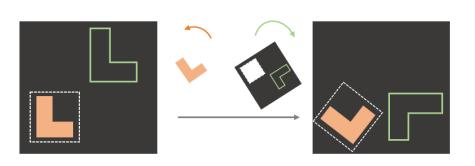

Fig. 2. Our proposed Equivariant Transporter Network is able to generalize over both pick and place orientation. We view this as  $C_n \times C_n$ -equivariace of the model.

approach is more sample efficient than the baseline version of Transporter Net and therefore learns better policies from a small number of demonstrations. Video and code is available at https://haojhuang.github.io/etp\_page/.

#### II. RELATED WORK

Pick and Place. Pick and place is an important topic in manipulation due to its value in industry. Many fundamental skills like packing, kitting, and stacking require inferring both the pick and the place action in the same time. Traditional assembly methods in factories use customized workstations so that fixed pick and place actions can be manually predefined. Recently, considerable research has focused on vision-based manipulation. Some work [22, 4, 10] assumes that object mesh models are available in order to run ICP [2] and align the object model with segmented observations or completions [31, 13]. Other work learns a category-level pose estimator [30, 8] or key-point detector [20, 18] from training on a large dataset. However, these methods often require expensive object-specific labels, making them difficult to use widely. Recent advances in deep learning have provided other ways to rearrange objects from perceptual data. Qureshi et al. [23] represents the scene as a graph over segmented objects to do goal-conditioned planning; Curtis et al. [7] proposes a general system consisting of perception module, grasp module, and robot control module to solve multi-step manipulation tasks. These approaches often require a good segmentation module ahead. End-to-end models [32, 15, 9, 1] that directly map input observations to actions can learn quickly and generalize well, but most methods need to be trained on large datasets. For example, Khansari et al. [15] collects a dataset with 7.2 million samples. Devin et al. [9] collects 40K grasps and places per task. Zakka et al. [32] collects 500 disassembly sequences for each kit. Instead, our proposed method improves the sample efficiency of end-to-end models on various manipulation tasks.

Equivariance Learning in Manipulation. Fully Convolutional Networks (FCN) are translationally equivariant, and have been shown to improve learning efficiency in many manipulation tasks [34, 19]. The idea of encoding SE(2) symmetries in the structure of neural networks is first introduced in G-Convolution [5]. The extension work proposes an alternative architecture, Steerable CNN [6]. Weiler and Cesa [29] proposes a general framework for implementing E(2)-Steerable CNNs. In the context of robotics learning, Wang et al. [28] uses SE(2) equivariance in Q learning to solve multi-step sequential manipulation tasks; Wang et al. [27] extends it to SO(2)-equivairant reinforcement learning. Our work tackles manipulation rearrangement tasks by extracting inherent SE(2) equivariance through the imitation learning approach [14, 12, 26].

# III. BACKGROUND ON SYMMETRY GROUPS

# A. The Groups SO(2) and $C_n$

We are primarily interested in rotations expressed by the group SO(2) and its cyclic subgroup  $C_n \leq SO(2)$ . SO(2) contains the continuous planar rotations  $\{\text{Rot}_{\theta}: 0 \leq \theta < 2\pi\}$ .

The discrete subgroup  $C_n = \{ \text{Rot}_{\theta} : \theta \in \{ \frac{2\pi i}{n} | 0 \le i < n \} \}$  contains only rotations by angles which are multiples of  $2\pi/n$ . The special Euclidean group  $\text{SE}(2) = \text{SO}(2) \times \mathbb{R}^2$  describes all translations and rotations of  $\mathbb{R}^2$ .

# B. Representation of a Group

A d-dimensional representation  $\rho \colon G \to \operatorname{GL}_d$  of a group G assigns to each element  $g \in G$  an invertible  $d \times d$ -matrix  $\rho(g)$ . Different representations of  $\operatorname{SO}(2)$  or  $C_n$  help to describe how different signals are transformed under rotations. For example, the trivial representation  $\rho_0 \colon \operatorname{SO}(2) \to \operatorname{GL}_1$  assigns  $\rho_0(g) = 1$  for all  $g \in G$ , i.e. no transformation under rotation. The standard representation

$$\rho_1(\mathrm{Rot}_\theta) = \begin{pmatrix} \cos\theta & -\sin\theta\\ \sin\theta & \cos\theta \end{pmatrix}$$

represents each group element by its standard rotation matrix. Notice that  $\rho_0$  and  $\rho_1$  can be used to represent elements from either  $\mathrm{SO}(2)$  or  $C_n$ . The regular representation  $\rho_{\mathrm{reg}}$  of  $C_n$  acts on a vector in  $\mathbb{R}^n$  by cyclically permuting its coordinates  $\rho_{\mathrm{reg}}(\mathrm{Rot}_{2\pi/n})(x_0,x_1,...,x_{n-2},x_{n-1})=(x_{n-1},x_0,x_1,...,x_{n-2}).$  We can rotate by multiples of  $2\pi/n$  by  $\rho_{\mathrm{reg}}(\mathrm{Rot}_{2\pi i/n})=\rho_{\mathrm{reg}}(\mathrm{Rot}_{2\pi/n})^i.$  The regular representation for elements of the quotient group is denoted  $\rho_{\mathrm{quot}}^{C_n/C_k}$  and acts on  $\mathbb{R}^{n/k}$  by permuting  $|C_n|/|C_k|$  channels. This gives a quotient representation of  $C_n$  defined  $\rho_{\mathrm{quot}}^{C_n/C_k}(\mathrm{Rot}_{2\pi i/n})(\mathbf{x})_j=(\mathbf{x})_{j+i \bmod (n/k)}$ , which implies features that are invariant under the action of  $C_k$ . For more details, we refer the reader to Serre [25], Weiler and Cesa [29].

# C. Feature Map Transformations

We formalize images and feature maps as feature vector fields, i.e. functions  $f \colon \mathbb{R}^2 \to \mathbb{R}^c$ , which assign a feature vector  $f(\mathbf{x}) \in \mathbb{R}^c$  to each position  $\mathbf{x} \in \mathbb{R}^2$ . While in practice we discretize and truncate the domain of  $f\{(i,j):1\leq i\leq W,1\leq j\leq W\}$ , here we will consider it to be continuous for the purpose of analysis. The action of a rotation  $g\in \mathrm{SO}(2)$  on f is a combination of a rotation in the domain of f via  $\rho_1$  (this rotates the pixel positions)

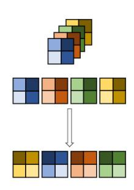

Fig. 3. Illustration of the action of  $T_g^{\rm reg}$  on a  $2\times 2$  image.

and a rotation in the channel space  $\mathbb{R}^c$  by  $\rho \in \{\rho_0, \rho_{\text{reg}}\}$ . If  $\rho = \rho_{\text{reg}}$ , then the channels cyclically permute according to the rotation. If  $\rho = \rho_0$ , the channels do not change. We denote this action (the action of g on f via  $\rho$ ) by  $T_{\rho}^{\rho}(f)$ :

$$[T_g^{\rho}(f)](\mathbf{x}) = \rho(g) \cdot f(\rho_1(g)^{-1}\mathbf{x}). \tag{1}$$

For example, the action of  $T_g^{\rho_{\rm reg}}(f)$  is illustrated in Figure 3 for a rotation of  $g=\pi/2$  on a  $2\times 2$  image f that uses  $\rho_{\rm reg}$ . The expression  $\rho_1(g)^{-1}\mathbf{x}$  rotates the pixels via the standard representation. Multiplication by  $\rho(g)=\rho_{\rm reg}(g)$  permutes the channels. For brevity, we will denote  $T_g^{\rm reg}=T_g^{\rho_{\rm reg}}$  and  $T_g^0=T_g^{\rho_0}$ .

#### D. Equivariant Mappings

A function F is equivariant if it commutes with the action of the group,

$$T_q^{\text{out}}[F(f)] = F(T_q^{\text{in}}[f]) \tag{2}$$

where  $T_g^{\rm in}$  transforms the input to F by the group element g while  $T_g^{\rm out}$  transforms the output of F by g. For example, if f is an image, then  ${\rm SO}(2)$ -equivariance of F implies that it acts on f in the same way regardless of the orientation in which f is presented. That is, if F takes an image f rotated by g (RHS of Equation 2), then it is possible to recover the same output by evaluating F for the un-rotated image f and rotating its output (LHS of Equation 2).

#### IV. TRANSPORTER NETWORK

Before describing our variation on Transporter Net, we summarize the pick-and-place problem and analyze the original Transporter Net architecture from a novel view that is not clearly illustrated in their work [35].

#### A. Problem Statement

We define the *Planar Pick and Place* problem as follows. Given a visual observation  $o_t$ , the problem is to learn a probability distribution  $p(a_{\text{pick}}|o_t)$  over picking actions  $a_{\text{pick}} \in \text{SE}(2)$  and a distribution  $p(a_{\text{place}}|o_t, a_{\text{pick}})$  over placing actions  $a_{\text{place}} \in \text{SE}(2)$  conditioned on  $a_{pick}$  that accomplishes some task of interest. The visual observation  $o_t$  is typically a projection of the scene (e.g., top-down RGB-D images) and the pose of the end effector is expressed as  $(u, v, \theta)$  where u, v denote the pixel coordinates of the gripper position and  $\theta$  denotes gripper orientation. (Since [35] uses suction cups to pick, that work ignores pick orientation.)

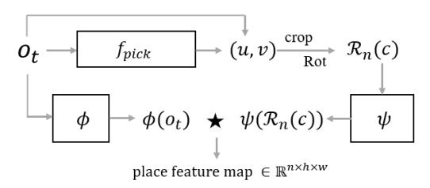

Fig. 4. The Architecture of Transporter Net.

## B. Description of Transporter Net

Transporter Network [35] solves the planar pick and place problem using the architecture shown in Figure 4. The pick network  $f_{\text{pick}} \colon o_t \mapsto p(u,v)$  maps  $o_t$  onto a probability distribution p(u,v) over pick position  $(u,v) \in \mathbb{R}^2$ . The output pick position  $a_{\text{pick}}^*$  is calculated by maximizing  $f_{\text{pick}}(o_t)$  over (u,v). The place position and orientation is calculated as follows. First, an image patch c centered on  $a_{\text{pick}}^*$  is cropped from  $o_t$  to represent the pick action as well as the object. Then, the crop c is rotated c times to produce a stack of c rotated crops. Using the notation of Section III, we will denote this stack of crops as

$$\mathcal{R}_n(c) = (T_{2\pi i/n}^0(c))_{i=0}^{n-1}, \tag{3}$$

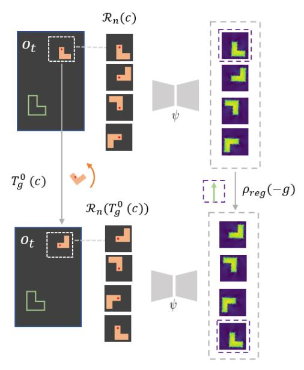

Fig. 5. Illustration of the main part of the proof of Proposition 1. Rotating the crop c induces a cyclic shift in the channels of the output  $\psi(\mathcal{R}_n(T_g^0c)) = \rho_{\text{reg}}(-g)\psi(\mathcal{R}_n(c))$ .

where we refer to  $\mathcal{R}_n$  as the "lifting" operator. Then,  $\mathcal{R}_n(c)$  is encoded using a neural network  $\psi$ . The original image,  $o_t$ , is encoded by a separate neural network  $\phi$ . The distribution over place location is evaluated by taking the cross correlation between  $\psi$  and  $\phi$ ,

$$f_{\text{place}}(o_t, c) = \psi(\mathcal{R}_n(c)) \star \phi(o_t),$$
 (4)

where  $\psi$  is applied independently to each of the rotated channels in  $\mathcal{R}_n(c)$ . Place position and orientation is calculated by maximizing  $f_{\text{place}}$  over the pixel position (for position) and the orientation channel (for orientation).

## C. Equivariance of Transporter Net

The model architecture described above gives Transporter Network the following equivariance property.

Proposition 1: The Transporter Net place network  $f_{\text{place}}$  is  $C_n$ -equivariant. That is, given  $g \in C_n$ , object image crop c and scene image  $o_t$ ,

$$f_{\text{place}}(o_t, T_q^0(c)) = \rho_{\text{reg}}(-g) f_{\text{place}}(o_t, c).$$
 (5)

Proposition 1 expresses the following intuition. A rotation of g applied to the orientation of the object to be picked results in a -g change in the placing angle, which is represented by a permutation along the channel axis of the placing feature maps. This is a symmetry over the cyclic group  $C_n \leq \mathrm{SO}(2)$  which is encoded directly into the model. It enables it to immediately generalize over different orientations of the object to be picked and thereby improves sample efficiency.

The main idea of the proof is shown in Figure 5. Namely  $\psi(\mathcal{R}_n(\cdot))$  is equivariant in the sense that rotating the crop c induces a cyclic shift in the channels of the output. Formally,  $\psi(\mathcal{R}_n(T_g^0c)) = \rho_{\rm reg}(-g)\psi(\mathcal{R}_n(c))$ . Noting that a permutation of the filters K in the convolution  $K \star \phi(o_t)$  induces the

same permutation in the output feature maps completes the proof. The full proof is given in Appendix VIII-B. Note that here  $\psi$  is a simple CNN with no rotational equivariance. The equivariance results from the lifting  $\mathcal{R}_n$ .

However, only the place network of Transporter Net has the  $C_n$ -equivariance. Instead, our proposed method incorporates the rotational equivariance in the pick network and  $C_n \times C_n$ equivariance in the place network.

# V. EQUIVARIANT TRANSPORTER

## A. Equivariant Pick

Our approach to the pick network is similar to that in Transporter Net [35] except that: 1) we explicitly encode equivariance constraints into the pick networks, thereby making pick learning more sample efficient; 2) we infer pick orientation so that we can use parallel jaw grippers rather than just suction grippers.

1) Model: We propose a  $C_n$ -equivariant model for detecting the planar pose for the pick operation. First, we decompose the learning process of  $a_{\text{pick}} \in$ SE(2) into two parts,

$$p(a_{\text{pick}}) = p(u, v)p(\theta|(u, v)),$$
(6)
where  $p(u, v)$  denotes the

where p(u, v) denotes the probability that a pick exists at pixel coordinates u, v and  $p(\theta|(u, v))$  is the probability that the pick at u, v should be executed with a gripper orientation

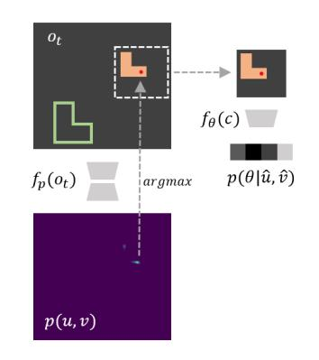

Fig. 6. Equivariant Transporter Pick model. First, we find the pick position  $a_{pick}^*$  by evaluating the argmax over  $f_p(o_t)$ . Then, we evaluate  $f_{\theta}$  for the image patch centered on  $a_{pick}^*$ .

of  $\theta$ . The distributions p(u,v) and  $p(\theta|(u,v))$  are modeled as two neural networks:

$$f_p(o_t) \mapsto p(u, v),$$
 (7)

$$f_{\theta}(o_t, (u, v)) \mapsto p(\theta|(u, v)). \tag{8}$$

Given this factorization, we can query the maximum of  $p(a_{\text{pick}})$  by evaluating  $(\hat{u}, \hat{v}) = \arg \max_{(u,v)} [p(u,v)]$  and then  $\hat{\theta} = \arg \max_{\theta} [p(\theta|\hat{u}, \hat{v})]$ . This is illustrated in Figure 6. The left side of Figure 6 shows the maximization of  $f_p$  at  $a_{pick}^*$ The right side shows evaluation of  $f_{\theta}$  for the image patch centered at  $a_{pick}^*$ .

2) Equivariance Relationships: There are two equivariance relationships that we would expect to be satisfied for planar picking:

$$f_p(T_q^0(o_t)) = T_q^0(f_p(o_t))$$
(9)

$$f_{\theta}(T_g^0(o_t), T_g^0(u, v)) = \rho_{reg}(g)(f_{\theta}(o_t, (u, v))). \tag{10}$$

Equation 9 states that the grasp points found in an image rotated by  $q \in SO(2)$ , (LHS of Equation 9), should correspond to the grasp points found in the original image subsequently rotated by g, (RHS of Equation 9). Equation 10 says that the grasp orientation at the rotated grasp point  $T_q^0(u,v)$  in the rotated image  $T_a^0(o_t)$  (LHS of Equation 10) should be shifted by  $g = 2\pi i$  relative to the grasp orientation at the original grasp points in the original image (RHS of Equation 10). We encode both  $f_p$  and  $f_\theta$  using equivariant convolutional layers [29] which constrain the models to represent only those functions which satisfy Equations 9 and 10.

3) Gripper Orientation Using the Quotient Group: A key observation in planar picking is that, for many robots, the gripper is bilaterally symmetric, i.e. grasp outcome is invariant when the gripper is rotated by  $\pi$ . We can encode this additional symmetry to reduce redundancy and save computational cost using the regular representation of the quotient group  $C_n/C_2$ which identifies orientations that are  $\pi$  apart. When using this quotient group for gripper orientation,  $\rho_{reg}$  in Equation 10 is replaced with  $\rho_{\text{reg}}^{C_n/C_2}$ .

# B. Equivariant Place

Given the picked object represented by the image patch c centered on  $a_{\rm pick}$ , the place network models the distribution of  $a_{\text{place}} = (u_{\text{place}}, v_{\text{place}}, \theta_{\text{place}})$  by:

$$f_{\text{place}}(o_t, c) \mapsto p(a_{\text{place}}|o_t, a_{\text{pick}}),$$
 (11)

where  $p(a_{\text{place}}|o_t, a_{\text{pick}})$  denotes the probability that the object at  $a_{\text{pick}}$  in scene  $o_t$  should be placed at  $a_{\text{place}}$ . Our place model architecture closely follows that of Transporter Net [35]. The main difference is that we explicitly encode equivariance constraints on both  $\phi$  and  $\psi$  networks. As a result of this change: 1) we are able to simplify the model by transposing the lifting operation  $\mathcal{R}_n$  and the processing by  $\phi$ ; 2) our new model is equivariant with respect to a larger symmetry group  $C_n \times C_n$ , compared to Transporter Net which is only equivariant over  $C_n$ .

1) Equivariant  $\phi$  and  $\psi$ : We explicitly encode both  $\phi$  and  $\psi$ as  $C_n$ -equivariant models that satisfy the following constraints:

$$\psi(T_a^0(c)) = T_a^0(\psi(c)) \tag{12}$$

$$\phi(T_a^0(o_t)) = T_a^0(\phi(o_t)), \tag{13}$$

for  $q \in SO(2)$ . The equivariance constraint of Equation 13 says that when the input image rotates, we would expect the place location to rotate correspondingly. This constraint helps the model generalize across place orientations. The constraint of Equation 12 says that when the picked object rotates (represented by the image patch c), then the place orientation should correspondingly rotate.

2) Place Model: When the equivariance constraint of Equation 12 is satisfied, we can exchange  $\mathcal{R}_n$  (the lifting operation) with  $\psi$ :  $\psi(\mathcal{R}_n(c)) = \mathcal{R}_n(\psi(c))$ . This equality is useful because it means that we only need to evaluate  $\psi$  for one image patch rather than the stack of image patches  $\mathcal{R}_n(c)$  – something that is computationally cheaper. The resulting place model is then:

$$f'_{\text{place}}(o_t, c) = \mathcal{R}_n(\psi(c)) \star \phi(o_t)$$

$$= \Psi(c) \star \phi(o_t),$$
(14)

$$= \Psi(c) \star \phi(o_t), \tag{15}$$

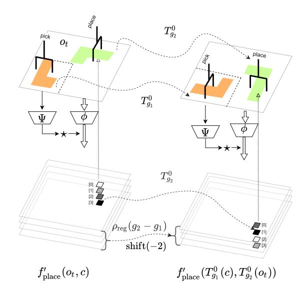

Fig. 7. Equivariance of our placing network under the rotation of the object and the placement. A  $\frac{\pi}{2}$  rotation on c and a  $-\frac{\pi}{2}$  rotation on  $o_t \setminus c$  are equivariant to: i), a  $-\frac{\pi}{2}$  rotation on the placing location, and ii), the shift on the channel of placing rotation angle from  $\frac{3\pi}{2}$  (the last channel) to  $\frac{\pi}{2}$  (the second channel).

where Equation 15 substitutes  $\Psi(c) = \mathcal{R}_n[\psi(c)]$  to simplify the expression. Here, we use  $f'_{\rm place}$  to denote Equivariant Transporter Net defined using equivariant  $\phi$  and  $\psi$  in contrast to the baseline Transporter Net  $f_{\rm place}$  of Equation 4. Note that both  $f_{\rm place}$  and  $f'_{\rm place}$  satisfy Proposition 1. However,  $f_{\rm place}$  accomplishes this by symmetrizing a non-equivariant network (i.e. evaluating  $\psi(\mathcal{R}_n(c))$ ) whereas our model  $f'_{\rm place}$  encodes the symmetry directly into  $\psi$ .

#### C. Equivariance Properties of the Placing Network

As Proposition 1 demonstrates, the baseline Transporter Net model [35] encodes the symmetry that rotations of the object to be picked (represented by c) should result in corresponding rotations of the place orientation for that object. However, pick-conditioned place has a second symmetry that is not encoded in Transporter Net: rotations of the placement (represented by  $o_t$ ) should also result in corresponding rotations of the place orientation. In fact, as we demonstrate in Proposition 2 below, we encode this  $second\ type$  of symmetry by enforcing the constraints of Equations 12 and 13. Essentially, we go from a  $C_n$ -symmetric model to a  $C_n \times C_n$ -symmetric model.

Proposition 2: Equivariant Transporter Net  $f'_{\text{place}}$  is  $C_n \times C_n$ -equivariant. That is, given rotations  $g_1 \in C_n$  of the picked object and  $g_2 \in C_n$  of the scene, we have that:

$$f'_{\text{place}}(T^0_{g_1}(c), T^0_{g_2}(o_t)) = \rho_{\text{reg}}(g_2 - g_1)T^0_{g_2}f'_{\text{place}}(c, o_t).$$
 (16)

Proposition 2 is proven in Appendix VIII-B and illustrated in Figure 7. The top of Figure 7 going left to right shows the rotation of both the object by  $g_1$  (in orange) and the place pose by  $g_2$  (in green). The LHS of Equation 16 evaluates  $f'_{\rm place}$  for these two rotated images. The lower left of Figure 7 shows  $f'_{\rm place}(c,o_t)$ . Going left to right at the bottom of Figure 7 shows the pixel-rotation by  $T^0_{g_2}$  and the channel permutation by  $g_2 - g_1$  (RHS of Equation 16).

Note that in additional to the two rotational symmetries enforced by our model, it also has translational symmetry. Since the rotational symmetry is realized by additional restrictions to the weights of kernels of convolutional networks, the rotational symmetry is in addition to the underlying shift equivariance of the convolutional network. Thus, the full symmetry group enforced is the group generated by  $C_n \times C_n \times (\mathbb{R}^2, +)$ .

Equivariant neural networks learn effectively on a lower dimensional space, the equivalence classes of samples under the group action. Thus a larger group results in an even smaller dimensional sample space and thus better coverage by the training data.

# D. Model Architecture Details

- 1) Pick model  $f_p$  (Equation 7): The input to  $f_p$  is a 4channel RGB-D image  $o_t \in \mathbb{R}^{4 \times H \times W}$ . The output is a feature map  $p(u,v) \in \mathbb{R}^{H \times W}$  which encodes a distribution over pick location.  $f_p$  is implemented as an 18-layer euqivariant residual network with a U-Net [24] as the main block. The U-net has 8 residual blocks (each block contains 2 equivariant convolution layers [29] and one skip connection): 4 residual blocks [11] are used for the encoder and the other 4 residual blocks are used for the decoder. The encoding process trades spatial dimensions for channels with max-pooling in each block; the decoding process upsamples the feature embedding with bilinear-upsampling operations. The first layer maps the trivial representation of  $o_t$  to regular representation and the last equivariant layer transforms the regular representation back to the trivial representation, followed by image-wide softmax. ReLU activations [21] are interleaved inside the network.
- 2) Pick model  $f_{\theta}$  (Equation 8): Given the picking location  $(u^*, v^*)$ , the pick angle network  $f_{\theta}$  takes as input a crop  $c \in \mathbb{R}^{4 \times H_1 \times W_1}$  centered on  $(u^*, v^*)$  and outputs the distribution  $p(\theta|u, v) \in \mathbb{R}^{n/2}$ , where n is the size of the rotation group(i.e.  $n = |C_n|$ ). The first layer maps the trivial representation of c to a quotient regular representation followed by 3 residual blocks containing max-pooling operators. This goes to two equivariant convolution layers and then to an average pooling layer.
- 3) Place models  $\phi$  and  $\psi$ : Our place model has two equivariant convolution networks,  $\phi$  and  $\psi$ , and both have similar architectures to  $f_p$ . The network  $\phi$  takes as input a zero-padded version of  $o_t$ ,  $\operatorname{pad}(o_t) \in \mathbb{R}^{4 \times (H+d) \times (W+d)}$ , and generates a dense feature map,  $\phi(\operatorname{pad}(o_t)) \in \mathbb{R}^{(H+d) \times (W+d)}$ , where d is the padding size. The network  $\psi$  takes as input the image patch  $c \in \mathbb{R}^{4 \times H_2 \times W_2}$  and outputs  $\psi(c) \in \mathbb{R}^{H_2 \times W_2}$ . After applying rotations of  $C_n$  to  $\psi(c)$ , the transformed dense embeddings  $\Psi(c) \in \mathbb{R}^{n \times H_2 \times W_2}$  are cross-correlated with  $\phi(\operatorname{pad}(o_t))$  to generate the placing action distribution  $p(a_{\operatorname{place}}|o_t,a_{\operatorname{pick}}) \in \mathbb{R}^{n \times H \times W}$ , where the channel axis n corresponds to placing angles,  $\frac{2\pi i}{n}$  for  $0 \leq i < n$ .
- 4) Group Types and Sizes: The networks  $f_p$ ,  $\psi$ , and  $\phi$  are all defined using  $C_6$  regular representations. The network  $f_\theta$  is defined using the regular quotient representation  $C_{36}/C_2$ , which corresponds to the number of allowed place orientations.

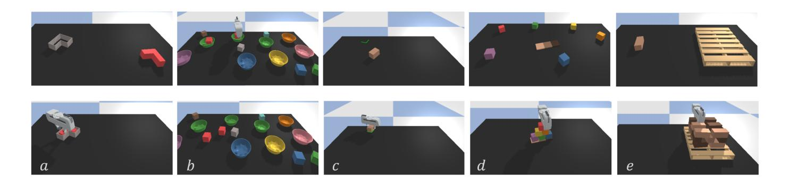

Fig. 8. Simulated environment for parallel-jaw gripper tasks. From left to right: (a) inserting blocks into fixtures, (b) placing red boxes into green bowls, (c) align box corners to green lines, (d) stacking a pyramid of blocks, (e) palletizing boxes.

5) Training Details:: We train Equivariant Transporter Network with the Adam [16] optimizer with a fixed learning rate of 10-4. It takes about 0.8 seconds to complete one SGD step with a batch size of 1 on a NVIDIA Tesla V100 SXM2 GPU. For each task, we evaluate performance every 10k steps on 100 unseen tests. On most tasks, the best performance is achieved in less than 10k SGD steps. Our model converges in a few hours on all tasks.

#### VI. EXPERIMENTS

We evaluate Equivariant Transporter using the Ravens-10 Benchmark [35] and variations thereof.

#### A. Tasks

- 1) Ravens-10 Tasks: Ravens-10 is a behaviour cloning simulation environment for manipulation, where each task owns an oracle that can sample expert demonstrations from the distribution of successful picking and placing actions with the access to the ground-truth pose of each object. The 10 tasks of Ravens can be classified into 3 categories: Single-object manipulation tasks (block-insertion, align-box-corner); Multiple-object manipulation tasks (place-red-in-green, towers-of-hanoi, stack-block-pyramid, palletizing-boxes, assembling-kits, packing-boxes); Deformable-object manipulation task (manipulating-rope, sweeping-piles). Detailed explanations of the tasks can be found in Appendix VIII-C
- 2) Ravens-10 Tasks Modified for the Parallel Jaw Gripper: We selected 5 tasks (block-insertion, align-box-corner, place-red-in-green, tack-block-pyramid, palletizing-boxes) from Ravens-10 and replaced the suction cup with the Franka Emika gripper. Figure 8 illustrates the initial state and completion state for each of these five tasks. For each of these five tasks, we defined an oracle agent. Since the Transporter Net framework assumes that the object does not move during picking, we defined these expert generators such that this was the case.

#### B. Training and Evaluation

1) Training: For each task, we produce a dataset of n expert demonstrations, where each demonstration contains a sequence of one or more observation-action pairs  $(o_t, \bar{a}_t)$ . Each action  $\bar{a}_t$  contains an expert picking action  $\bar{a}_{pick}$  and an expert placing action  $\bar{a}_{place}$ . We use  $\bar{a}_t$  to generate one-hot pixel maps as the

ground-truth labels for our picking model and placing model. The models are trained using a cross-entropy loss.

- 2) Metrics: We measure performance the same way as it was measured in [35] using a metric in the range of 0 (failure) to 100 (success). Partial scores are assigned to multiple-action tasks. For example, in the block-stacking task where the agent needs to construct a 6-block pyramid, each successful rearrangement is credited with a score of 16.667. We report highest validation performance during training, averaged over 100 unseen tests for each task.
- 3) Baselines: We compare our method against Transporter Net [35] as well as the following baselines previously used in the Transporter Net paper [35]. Form2Fit [32] introduces a matching module with the measurement of  $L_2$  distance of high-dimension descriptors of picking and placing locations. Conv-MLP is a common end-to-end model [17] which outputs  $a_{\rm pick}$  and  $a_{\rm place}$  using convolution layers and MLPs (multi-layer perceptrons). GT-State MLP is a regression model composed of an MLP that accepts the ground-truth poses and 3D bounding boxes of objects in the environment. GT-State MLP 2-step outputs the actions sequentially with two MLP networks and feeds  $a_{\rm pick}$  to the second step. All regression baselines learn mixture densities [3] with log likelihood loss.
- 4) Adaptation of Transporter Net for Picking Using a Parallel Jaw Gripper: In order to compare our method against Transporter Net for the five parallel jaw gripper tasks, we must modify Transporter to handle the gripper. We accomplish this by [33] lifting the input scene image over  $C_n$ , producing a stack of differently oriented input images which is provided as input to the pick network  $f_{\rm pick}$ . The results are counterrotated at the output of  $f_{\rm pick}$ .

#### C. Results for the Ravens-10 Benchmark Tasks

1) Task Success Rates: Table I shows the performance of our model on the Raven-10 tasks for different numbers of demonstrations used during training. All tests are evaluated on unseen configurations, i.e., random poses of objects, and three tasks (align-box-corner, assembling-kits, packing-box) use unseen objects. Our proposed Equivariant Transporter Net outperforms all the other baselines in nearly all cases. The amount by which our method outperforms others is largest when the number of demonstrations is smallest, i.e. with only

|                         |                   | block-i | nsertio | n    | p.              | lace-red | l-in-gre | en            |      | towers- | of-hanc           | oi   | ä    | align-bo       | x-corn | er   | stac | k-bloc | k-pyran | nid  |
|-------------------------|-------------------|---------|---------|------|-----------------|----------|----------|---------------|------|---------|-------------------|------|------|----------------|--------|------|------|--------|---------|------|
| Method                  | 1                 | 10      | 100     | 1000 | 1               | 10       | 100      | 1000          | 1    | 10      | 100               | 1000 | 1    | 10             | 100    | 1000 | 1    | 10     | 100     | 1000 |
| Equivariant Transporter | 100               | 100     | 100     | 100  | 98.5            | 100      | 100      | 100           | 88.1 | 95.7    | 100               | 100  | 41.0 | 99.0           | 100    | 100  | 34.6 | 80.0   | 90.8    | 95.1 |
| Transporter Network     | 100               | 100     | 100     | 100  | 84.5            | 100      | 100      | 100           | 73.1 | 83.9    | 97.3              | 98.1 | 35.0 | 85.0           | 97.0   | 98.0 | 13.3 | 42.6   | 56.2    | 78.2 |
| Form2Fit                | 17.0              | 19.0    | 23.0    | 29.0 | 83.4            | 100      | 100      | 100           | 3.6  | 4.4     | 3.7               | 7.0  | 7.0  | 2.0            | 5.0    | 16.0 | 19.7 | 17.5   | 18.5    | 32.5 |
| Conv. MLP               | 0.0               | 5.0     | 6.0     | 8.0  | 0.0             | 3.0      | 25.5     | 31.3          | 0.0  | 1.0     | 1.9               | 2.1  | 0.0  | 2.0            | 1.0    | 1.0  | 0.0  | 1.8    | 1.7     | 1.7  |
| GT-State MLP            | 4.0               | 52.0    | 96.0    | 99.0 | 0.0             | 0.0      | 3.0      | 82.2          | 10.7 | 10.7    | 6.1               | 5.3  | 47.0 | 29.0           | 29.0   | 59.0 | 0.0  | 0.2    | 1.3     | 15.3 |
| GT-State MLP 2-Step     | 6.0               | 38.0    | 95.0    | 100  | 0.0             | 0.0      | 19.0     | 92.8          | 22.0 | 6.4     | 5.6               | 3.1  | 49.0 | 12.0           | 43.0   | 55.0 | 0.0  | 0.8    | 12.2    | 17.5 |
|                         | palletizing-boxes |         |         |      | assembling-kits |          |          | packing-boxes |      |         | manipulating-rope |      |      | sweeping-piles |        |      |      |        |         |      |
|                         | 1                 | 10      | 100     | 1000 | 1               | 10       | 100      | 1000          | 1    | 10      | 100               | 1000 | 1    | 10             | 100    | 1000 | 1    | 10     | 100     | 1000 |
| Equivariant Transporter | 75.3              | 98.9    | 99.6    | 99.6 | 63.8            | 90.6     | 98.6     | 100           | 98.3 | 99.4    | 99.6              | 100  | 31.0 | 85.0           | 92.3   | 98.4 | 97.9 | 99.5   | 100     | 100  |
| Transporter Network     | 63.2              | 77.4    | 91.7    | 97.9 | 28.4            | 78.6     | 90.4     | 94.6          | 56.8 | 58.3    | 72.1              | 81.3 | 21.9 | 73.2           | 85.4   | 92.1 | 52.4 | 74.4   | 71.5    | 96.1 |
| Form2Fit                | 21.6              | 42.0    | 52.1    | 65.3 | 3.4             | 7.6      | 24.2     | 37.6          | 29.9 | 52.5    | 62.3              | 66.8 | 11.9 | 38.8           | 36.7   | 47.7 | 13.2 | 15.6   | 26.7    | 38.4 |
| Conv. MLP               | 31.4              | 37.4    | 34.6    | 32.0 | 0.0             | 0.2      | 0.2      | 0.0           | 0.3  | 9.5     | 12.6              | 16.1 | 3.7  | 6.6            | 3.8    | 10.8 | 28.2 | 48.4   | 44.9    | 45.1 |
| GT-State MLP            | 0.6               | 6.4     | 30.2    | 30.1 | 0.0             | 0.0      | 1.2      | 11.8          | 7.1  | 1.4     | 33.6              | 56.0 | 5.5  | 11.5           | 43.6   | 47.4 | 7.2  | 20.6   | 63.2    | 74.4 |
| GT-State MLP 2-Step     | 0.6               | 9.6     | 32.8    | 37.5 | 0.0             | 0.0      | 1.6      | 4.4           | 4.0  | 3.5     | 43.4              | 57.1 | 6.0  | 8.2            | 41.5   | 58.7 | 9.7  | 21.4   | 66.2    | 73.9 |

TABLE I. Performance comparisons on Ravens-10 benchmark (suction gripper). Success rate (mean%) vs. the number of demonstration episodes (1, 10, 100, or 1000) used in training. Best performances are highlighted in bold.

|                                                | block-insertion    |            | place-red-in-green |                  |                 | palletizing-boxes |                  |                    | align-box-corner |                  |                     | stack-block-pyramid |                  |                  |                  |
|------------------------------------------------|--------------------|------------|--------------------|------------------|-----------------|-------------------|------------------|--------------------|------------------|------------------|---------------------|---------------------|------------------|------------------|------------------|
| Method                                         | 1                  | 10         | 100                | 1                | 10              | 100               | 1                | 10                 | 100              | 1                | 10                  | 100                 | 1                | 10               | 100              |
| Equivariant Transporter Transporter Network | <b>100</b> 98.0 | 100 100 | 100 100         | <b>95.6</b> 82.3 | <b>100</b> 94.8 | 100 100        | <b>96.1</b> 84.2 | <b>100</b> 99.6 | 100 100       | <b>64.0</b> 45.0 | <b>99.0</b> 85.0 | <b>100</b> 99.0  | <b>62.1</b> 16.6 | <b>85.6</b> 63.3 | <b>98.3</b> 75.0 |

TABLE II. Performance comparisons on tasks with a parallel-jaw end effector. Success rate (mean%) vs. the number of demonstration episodes (1, 10, or 100) used in training.

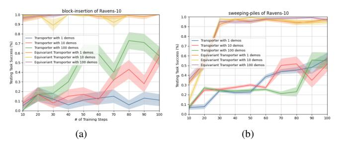

Fig. 9. Equivariant Transporter Network converges faster than Transporter Network. Left: Block-insertion task, Right: sweeping-piles task. On the block insertion task, Equivariant Transporter can hit greater than 90% success rate after 10 training steps and achieve 100% success rate with less than 100 training steps.

1 or 10 demonstrations. With just 10 demonstrations per task, our method can achieve  $\geq 95\%$  success rate on 7/10 tasks.

2) Training Efficiency: Another interesting consequence of our more structured model is that training is much faster. Figure 9 shows task success rates as a function of the number or SGD steps for two tasks (Block Insertion and Sweeping Piles). Our equivariant model converges much faster in both cases.

# D. Results for Parallel Jaw Gripper Tasks

- 1) Task Success Rates: Table II compares the performance of Equivariant Transporter with the baseline Transporter Net for the Parallel Jaw Gripper tasks. Again, our method outperforms the baseline in nearly all cases.
- 2) Comparison with Ravens-10: One interesting observation that can be made by comparing Tables I and II is that both Equivariant Transporter and baseline Transporter do better on the gripper versions of the task compared to the original Ravens-10 versions. This is likely caused by the fact that the

expert demonstrations we developed for the gripper version on the task have less stochastic gripper poses during pick than the case in the original Ravens-10 benchmark.

#### E. Ablation Study

- 1) Ablations: We performed an ablation study to evaluate the relative importance of the equivariant models in pick  $(f_p$  and  $f_\theta)$  and place  $(\psi$  and  $\phi)$ . We compare four versions of model with various levels of equivariance: non-equivariant pick and non-equivariant place (baseline Transporter), equivariant pick and non-equivariant place, non-equivariant pick and equivariant place, and equivariant place (Equivariant Transporter).
- 2) Results: Figure 10 shows the performance of all four ablations as a function of the number of SGD steps for the scenario where the agent is given 10 or 100 expert demonstrations. The results indicate that place equivariance (i.e. equivariance of  $\psi$  and  $\phi$ ) is namely responsible for the gains in performance of Equivariant Transporter versus baseline Transporter. This finding is consistent with the argument that it is the larger  $C_n \times C_n$  symmetry group (only present with equivariant place) that is responsible for our performance gains. Though the non-equivariant and equivariant pick networks result in comparable performance, the equivariant network is far more computationally efficient, taking a single image as input versus 36 for the non-equivariant network.

#### F. Experiments on a Physical Robot

We evaluated Equivariant Transporter on a physical robot in our lab. There was no use of the simulator in this experiment – all demonstrations were performed on the real robot.

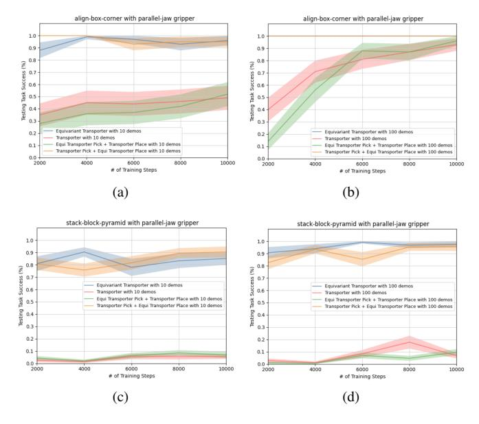

Fig. 10. Ablation study. Performance is evaluated on 100 unseen tests of each task.

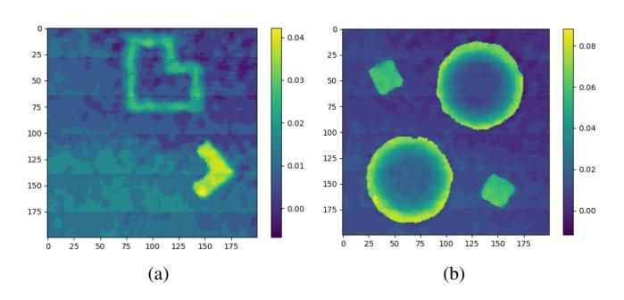

Fig. 11. Real robot experiment: initial observation  $o_t \in \mathbb{R}^{200 \times 200}$  from the depth sensor. The left figure shows the block insertion task; the right figure shows the task of placing boxes in bowls. The depth value (meter) is illustrated in the color bar.

- 1) Setup: We used a UR5 robot with a Robotiq-85 end effector. The workspace was a  $40cm \times 40cm$  region on a table beneath the robot (see Figure 12). The observations o were  $200 \times 200$  depth images obtained using a Occipital Structure Sensor that was mounted pointing directly down at the table (see Figure 11).
- 2) Tasks: We evaluated Equivariant Transporter on three of the Ravens-10 gripper-modified tasks: block insertion, placing boxes in bowls, and stacking a pyramid of blocks. Since our sensor only measures depth (and not RGB), we modified the box-in-bowls task such that box color was irrelevant to

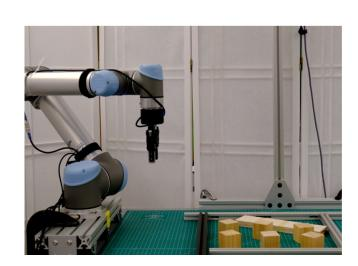

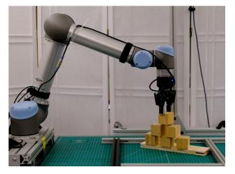

Fig. 12. Stack-block-pyramid task on the real robot. The left figure shows the initial state; the right figure shows the completion state.

success, i.e. the task is simply to put any box into a bowl.

3) Demonstrations: We obtained 10 human demonstrations of each task. These demonstrations were obtained by releasing the UR5 brakes and pushing the arm physically so that the harmonic actuators were back-driven.

| Task                | # demos | # completions / # trials | success rate |
|---------------------|---------|--------------------------|--------------|
| stack-block-pyramid | 10      | 17/20                    | 95.8%        |
| place-box-in-bowl   | 10      | 20/20                    | 100%         |
| block-insertion     | 10      | 20/20                    | 100%         |

TABLE III. Task success rates for physical robot evaluation tasks.

# G. Training and Evaluation

For each task, our model was trained for 10k SGD steps. During testing, objects were randomly placed on the table. A task was considered to have failed when a single incorrect pick or place occurred. We evaluated on 20 unseen configurations of each task.

1) Results: Table III shows results from 20 runs of each of the three tasks. Notice that the success rates here are higher than they were for the corresponding tasks performed in simulation (Table II). This is likely caused by the fact that the criteria for task success in simulation (less than 1 cm translational error and less than  $\frac{\pi}{12}$  rotation error were more conservative than is actually the case in the real world. Videos can be found in supplementary materials.

# VII. CONCLUSION AND LIMITATIONS

This paper explores the symmetries present in the pick and place problem and finds that they can be described by the direct product group  $C_n \times C_n$ , where  $C_n$  denotes the cyclic group of discrete orientations. This corresponds to the group of different pick and place orientations. We evaluate the Transporter Network model proposed in [35] and find that it encodes one of these symmetries (the pick symmetry), but not the other (the place symmetry). We propose a novel version of Transporter Net, Equivariant Transporter Net, which we show encodes both types of symmetries. We evaluate our model on the Ravens-10 Benchmark and evaluate against multiple strong baselines. Finally, we demonstrate that the method can effectively be used to learn manipulation policies on a physical robot. One limitation of our framework as it is presented in this paper is that it relies entirely on behavior cloning. A clear direction for future work is to integrate more on-policy learning which we believe would enable us to handle more complex tasks.

# ACKNOWLEDGEMENT

This work was supported in part by NSF 1724257, NSF 1724191, NSF 1763878, NSF 1750649, NSF 2107256, NSF 2134178, NASA 80NSSC19K1474, the Harold Alfond Foundation, and the Roux Institute.

#### REFERENCES

- [1] Lars Berscheid, Pascal Meißner, and Torsten Kröger. Self-supervised learning for precise pick-and-place without object model. *IEEE Robotics and Automation Letters*, 5(3):4828–4835, 2020.
- [2] Paul J Besl and Neil D McKay. Method for registration of 3-d shapes. In Sensor fusion IV: control paradigms and data structures, volume 1611, pages 586–606. International Society for Optics and Photonics, 1992.
- [3] Christopher M Bishop. Mixture density networks. 1994.
- [4] Xiaotong Chen, Rui Chen, Zhiqiang Sui, Zhefan Ye, Yanqi Liu, R Iris Bahar, and Odest Chadwicke Jenkins. Grip: Generative robust inference and perception for semantic robot manipulation in adversarial environments. In 2019 IEEE/RSJ International Conference on Intelligent Robots and Systems (IROS), pages 3988–3995. IEEE, 2019.
- [5] Taco Cohen and Max Welling. Group equivariant convolutional networks. In *International conference on machine learning*, pages 2990–2999. PMLR, 2016.
- [6] Taco S Cohen and Max Welling. Steerable cnns. *arXiv* preprint arXiv:1612.08498, 2016.
- [7] Aidan Curtis, Xiaolin Fang, Leslie Pack Kaelbling, Tomás Lozano-Pérez, and Caelan Reed Garrett. Longhorizon manipulation of unknown objects via task and motion planning with estimated affordances. arXiv preprint arXiv:2108.04145, 2021.
- [8] Xinke Deng, Yu Xiang, Arsalan Mousavian, Clemens Eppner, Timothy Bretl, and Dieter Fox. Self-supervised 6d object pose estimation for robot manipulation. In 2020 IEEE International Conference on Robotics and Automation (ICRA), pages 3665–3671. IEEE, 2020.
- [9] Coline Devin, Payam Rowghanian, Chris Vigorito, Will Richards, and Khashayar Rohanimanesh. Selfsupervised goal-conditioned pick and place. arXiv preprint arXiv:2008.11466, 2020.
- [10] Marcus Gualtieri and Robert Platt. Robotic pick-andplace with uncertain object instance segmentation and shape completion. *IEEE Robotics and Automation Letters*, 6(2):1753–1760, 2021.
- [11] Kaiming He, Xiangyu Zhang, Shaoqing Ren, and Jian Sun. Deep residual learning for image recognition. In *Proceedings of the IEEE conference on computer vision and pattern recognition*, pages 770–778, 2016.
- [12] Todd Hester, Matej Vecerik, Olivier Pietquin, Marc Lanctot, Tom Schaul, Bilal Piot, Dan Horgan, John Quan, Andrew Sendonaris, Ian Osband, et al. Deep q-learning from demonstrations. In *Thirty-second AAAI conference on artificial intelligence*, 2018.
- [13] Haojie Huang, Ziyi Yang, and Robert Platt. Gascn: Graph attention shape completion network. In 2021 International Conference on 3D Vision (3DV), pages 1269–1278. IEEE, 2021.
- [14] Ahmed Hussein, Mohamed Medhat Gaber, Eyad Elyan, and Chrisina Jayne. Imitation learning: A survey of

- learning methods. *ACM Computing Surveys (CSUR)*, 50 (2):1–35, 2017.
- [15] Mohi Khansari, Daniel Kappler, Jianlan Luo, Jeff Bingham, and Mrinal Kalakrishnan. Action image representation: Learning scalable deep grasping policies with zero real world data. In 2020 IEEE International Conference on Robotics and Automation (ICRA), pages 3597–3603. IEEE, 2020.
- [16] Diederik P Kingma and Jimmy Ba. Adam: A method for stochastic optimization. arXiv preprint arXiv:1412.6980, 2014
- [17] Sergey Levine, Chelsea Finn, Trevor Darrell, and Pieter Abbeel. End-to-end training of deep visuomotor policies. *The Journal of Machine Learning Research*, 17(1):1334–1373, 2016.
- [18] Xingyu Liu, Rico Jonschkowski, Anelia Angelova, and Kurt Konolige. Keypose: Multi-view 3d labeling and keypoint estimation for transparent objects. In *Proceedings of the IEEE/CVF conference on computer vision and* pattern recognition, pages 11602–11610, 2020.
- [19] Douglas Morrison, Peter Corke, and Jürgen Leitner. Closing the loop for robotic grasping: A real-time, generative grasp synthesis approach. *arXiv preprint arXiv:1804.05172*, 2018.
- [20] Anusha Nagabandi, Kurt Konolige, Sergey Levine, and Vikash Kumar. Deep dynamics models for learning dexterous manipulation. In *Conference on Robot Learning*, pages 1101–1112. PMLR, 2020.
- [21] Vinod Nair and Geoffrey E Hinton. Rectified linear units improve restricted boltzmann machines. In *Icml*, 2010.
- [22] Venkatraman Narayanan and Maxim Likhachev. Discriminatively-guided deliberative perception for pose estimation of multiple 3d object instances. In *Robotics: Science and Systems*, 2016.
- [23] Ahmed H Qureshi, Arsalan Mousavian, Chris Paxton, Michael C Yip, and Dieter Fox. Nerp: Neural rearrangement planning for unknown objects. arXiv preprint arXiv:2106.01352, 2021.
- [24] Olaf Ronneberger, Philipp Fischer, and Thomas Brox. U-net: Convolutional networks for biomedical image segmentation. In *International Conference on Medical* image computing and computer-assisted intervention, pages 234–241. Springer, 2015.
- [25] Jean-Pierre Serre. *Linear representations of finite groups*, volume 42. Springer, 1977.
- [26] Mel Vecerik, Todd Hester, Jonathan Scholz, Fumin Wang, Olivier Pietquin, Bilal Piot, Nicolas Heess, Thomas Rothörl, Thomas Lampe, and Martin Riedmiller. Leveraging demonstrations for deep reinforcement learning on robotics problems with sparse rewards. *arXiv* preprint arXiv:1707.08817, 2017.
- [27] Dian Wang, Robin Walters, and Robert Platt. SO(2)-equivariant reinforcement learning. In *The Tenth International Conference on Learning Representations*, 2022.
- [28] Dian Wang, Robin Walters, Xupeng Zhu, and Robert Platt. Equivariant q learning in spatial action spaces.

- In Conference on Robot Learning, pages 1713–1723. PMLR, 2022.
- [29] Maurice Weiler and Gabriele Cesa. General e(2)-equivariant steerable cnns. arXiv preprint arXiv:1911.08251, 2019.
- [30] Youngrock Yoon, Guilherme N DeSouza, and Avinash C Kak. Real-time tracking and pose estimation for industrial objects using geometric features. In 2003 IEEE International Conference on Robotics and Automation (Cat. No. 03CH37422), volume 3, pages 3473–3478. IEEE, 2003.
- [31] Wentao Yuan, Tejas Khot, David Held, Christoph Mertz, and Martial Hebert. Pcn: Point completion network. In 2018 International Conference on 3D Vision (3DV), pages 728–737. IEEE, 2018.
- [32] Kevin Zakka, Andy Zeng, Johnny Lee, and Shuran Song. Form2fit: Learning shape priors for generalizable assembly from disassembly. In 2020 IEEE International Conference on Robotics and Automation (ICRA), pages 9404–9410. IEEE, 2020.
- [33] Andy Zeng, Shuran Song, Stefan Welker, Johnny Lee, Alberto Rodriguez, and Thomas Funkhouser. Learning synergies between pushing and grasping with selfsupervised deep reinforcement learning. In 2018 IEEE/RSJ International Conference on Intelligent Robots and Systems (IROS), pages 4238–4245. IEEE, 2018.
- [34] Andy Zeng, Shuran Song, Kuan-Ting Yu, Elliott Donlon, Francois R Hogan, Maria Bauza, Daolin Ma, Orion Taylor, Melody Liu, Eudald Romo, et al. Robotic pick-and-place of novel objects in clutter with multi-affordance grasping and cross-domain image matching. In 2018 IEEE international conference on robotics and automation (ICRA), pages 3750–3757. IEEE, 2018.
- [35] Andy Zeng, Pete Florence, Jonathan Tompson, Stefan Welker, Jonathan Chien, Maria Attarian, Travis Armstrong, Ivan Krasin, Dan Duong, Vikas Sindhwani, et al. Transporter networks: Rearranging the visual world for robotic manipulation. *arXiv preprint arXiv:2010.14406*, 2020.

#### VIII. APPENDIX

# A. Equivariance under Proposition 2:

We summarize some important properties related to our place network which follow from Proposition 2 or its proof and provide a intuitive explanation for each one. Recall that Proposition 2 states:

$$\Psi(T_{g_1}^0(c)) \star \phi(T_{g_2}^0(o_t))$$
  
=  $\rho_{\text{reg}}(g_2 - g_1)(T_{g_2}^0[\Psi(c) \star \phi(o_t)]).$ 

Then he have the following properties.

a) Equivariance property: Setting  $g_1 = 0$  or  $g_2 = 0$  we get respectively

$$\Psi(T_a^0(c)) \star \phi(o_t) = \rho_{\text{reg}}(-g)(\Psi(c) \star \phi(o_t))$$
 (17)

$$\Psi(c) \star \phi(T_q^0(o_t)) = T_q^{\text{reg}}(\Psi(c) \star \phi(o_t))$$
(18)

These show the equivariance of our network  $f_{\text{place}}$  under either a rotation  $g \in C_n$  of the object or the placement.

b) Invariance property: Setting  $g_1 = g_2$ , we get

$$\Psi(T_g^0(c)) \star \phi(T_g^0(o_t)) = T_g^0(\Psi(c) \star \phi(o_t)).$$

This equation demonstrates that a rotation g on the whole observation  $o_t$  does not change the placing angle but rotates the placing location by g. Although data augmentation could help non-equivariant models learn this property, our networks observe it by construction.

c) Relativity property: Related to Equation 17, we also have

$$\Psi(T_q^0(c)) \star \phi(o_t) = \rho_{reg}(-g) (T_q^0[(\Psi(c) \star \phi((T_{-q}^0(o_t))]).$$

This equation defines the relationship between a rotation on c by g and a inverse rotation -g on  $o_t$ . Intuitively, c could be considered as the L-shaped block and  $o_t$  can be regarded as the L-shaped slot.

## B. Proofs of propositions

We now prove Proposition 1 and Proposition 2. We start with some common lemmas. In order to understand continuous rotations of image data, it is helpful to consider a k-channel image as a mapping  $f\colon \mathbb{R}^2\mapsto \mathbb{R}^k$  where the input  $\mathbb{R}^2$  defines the pixel space. We consider images centered at (0,0) and for non-integer values (x,y) we consider f(x,y) to be the interpolated pixel value. Similarly, let  $K:\mathbb{R}^2\mapsto \mathbb{R}^{l\times k}$  be convolutional kernel where k is the number of the input channels and k is the number of the output channels. Although the input space is  $\mathbb{R}^2$ , we assume the kernel is k0, where k1 is zero outside this set. The convolution can then be expressed by k1, where k2 is k3, where k4.

Lemma 8.1:

$$(T_g^0(K \star f))(\vec{v}) = ((T_g^0K) \star (T_g^0f))(\vec{v}) \tag{19}$$

Proof: We evaluate the left hand side of Equation 19.

$$T_g^0(K\star f)(\vec{v}) = \sum_{\vec{w}\in\mathbb{Z}^2} f(g^{-1}\vec{v} + \vec{w})K(\vec{w}).$$

Re-indexing the sum with  $\vec{y} = g\vec{w}$ ,

$$= \sum_{\vec{y} \in \mathbb{Z}^2} f(g^{-1}\vec{v} + g^{-1}\vec{y})K(g^{-1}\vec{y})$$

is by definition

$$\begin{split} &= \sum_{\vec{y} \in \mathbb{Z}^2} (T_g^0 f) (\vec{v} + \vec{y}) (T_g^0 K) (\vec{y}) \\ &= ((T_a^0 K) \star (T_a^0 f)) (\vec{v}) \end{split}$$

as desired.

Assume input  $f: \mathbb{R}^2 \to \mathbb{R}$ . Consider a diagonal kernel  $\tilde{K}: \mathbb{R}^2 \mapsto \mathbb{R}^{n \times n}$  where  $\tilde{K}(\vec{v})$  is a diagonal  $n \times n$  matrix  $\mathrm{Diag}(K_1,\ldots,K_n)$ . Define  $\tilde{f}: \mathbb{R}^2 \to \mathbb{R}^n$  to be the n-fold duplication of f such that  $\tilde{f}(\vec{v}) = (f(\vec{v}),\ldots,f(\vec{v}))$ . For such inputs and kernels, we have the following permutation equivariance.

Lemma 8.2:

$$(\rho_{\text{reg}}(g)\tilde{K}) \star \tilde{f} = \rho_{\text{reg}}(g)(\tilde{K} \star \tilde{f})$$

*Proof:* By definition  $h_i = (\tilde{K} \star \tilde{f})_i = K_i \star f$ . Clearly permuting the 1x1 kernels  $K_i$  also permutes  $h_i$ , so  $\rho_{\text{reg}}(g)h = (\rho_{\text{reg}}(g)\tilde{K}) \star \tilde{f}$  as desired.

We require one more lemma on the equivariance of  $\mathcal{R}_n$ . *Lemma 8.3*:

$$\mathcal{R}_n(T_q^0 f) = \rho_{\text{reg}}(-g)\mathcal{R}_n(f)$$

*Proof:* First we compute

$$\mathcal{R}_n(f)(\vec{x}) = (f(\vec{x}), f(g^{-1}\vec{x}), \dots, f(g^{-(n-1)}\vec{x})).$$

Then both  $\mathcal{R}_n(T_q^0 f)$  and  $\rho_{\text{reg}}(-g)\mathcal{R}_n(f)$  equal

$$(f(g^{-1}\vec{x}), \dots, f(g^{-(n-1)}\vec{x}), f(\vec{x})).$$

1) Proof of Proposition 1: We prove the equivariance of Transporter Net under rotations of the picked object,

$$\psi(\mathcal{R}_n(T_q^0c)) \star \phi(o_t) = \rho_{\text{reg}}(-g)(\psi(\mathcal{R}_n(c)) \star \phi(o_t)$$
 (20)

*Proof:* Since  $\psi$  is applied independently to each of the rotated channels in  $\mathcal{R}_n(c)$ , we denote  $\psi_n((f_1,\ldots,f_n))=(\psi(f_1),\ldots,(\psi(f_n))$ . By Lemma 8.3, the left-hand side of Equation 20 is

$$\psi(\mathcal{R}_n(T_g^0c)) \star \phi(o_t) = \psi_n(\rho_{\text{reg}}(-g)\mathcal{R}_n(c)) \star \phi(o_t).$$

Since  $\psi_n$  applies  $\psi$  on each component, it is equivariant to permutation of components and thus the above becomes

$$= (\rho_{\text{reg}}(-g)\psi_n(\mathcal{R}_n(c)) \star \phi(o_t).$$

Finally applying Lemma 8.2 gives

$$= \rho_{\text{reg}}(-q)(\psi_n(\mathcal{R}_n(c) \star \phi(o_t))$$

as desired.

2) Proof of Proposition 2: Recall  $\Psi(c) = \psi(\mathcal{R}_n(c))$ . We now prove Proposition 2,

$$\Psi(T_{g_1}^0(c)) \star \phi(T_{g_2}^0(o_t \backslash c)) = \rho_{reg}(g_2 - g_1) (T_{g_2}^0 [\Psi(c) \star \phi(o_t \backslash c)])$$
(21)

*Proof:* We first first prove the equivariance under rotations of the placement  $o_t$ . We claim

$$\Psi(c) \star \phi(T_a^0(o_t)) = T_a^{\text{reg}}(\Psi(c) \star \phi(o_t)). \tag{22}$$

Evaluating the left hand side of Equation 22,

$$\begin{split} \Psi(c) \star \phi(T_g^0(o_t)) \\ &= \Psi(c) \star T_g^0 \phi(o_t) \quad \text{(equivariance of } \phi) \\ &= (T_g^0 T_{g^{-1}}^0 \Psi(c)) \star (T_g^0 \phi(o_t)) \\ &= T_g^0 (T_{g^{-1}}^0 \Psi(c) \star \phi(o_t)) \quad \text{(Lemma 8.1)} \\ &= T_g^0 (T_{g^{-1}}^0 \mathcal{R}_n(\psi(c)) \star \phi(o_t)) \\ &= T_g^0 (\mathcal{R}_n(\psi(T_{g^{-1}}^0 c)) \star \phi(o_t)) \quad \text{(equiv. of } \psi, \, \mathcal{R}_n) \\ &= T_g^0 ((\rho_{\text{reg}}(g) \Psi(c) \star \phi(o_t)) \quad \text{(Lemma 8.3)} \\ &= T_g^0 \rho_{\text{reg}}(g) (\Psi(c) \star \phi(o_t)) \quad \text{(Lemma 8.2)} \\ &= T_g^{\text{reg}}(\Psi(c) \star \phi(o_t)). \end{split}$$

In the last step  $T_g^{\rm reg}=\rho_{\rm reg}(g)T_g^0=T_g^0\rho_{\rm reg}(g)$  since  $T_g^0$  and  $\rho_{\rm reg}(g)$  commute as  $\rho_{\rm reg}(g)$  acts on channel space and  $T_g^0$  acts on base space. This proves the claim of Equation 22.

Now, using the equivariance of  $\psi$ , Proposition 1 may be reformulated as

$$\Psi(T_a^0 c) \star \phi(o_t \setminus c) = \rho_{\text{reg}}(-g)(\Psi(c) \star) \phi(o_t \setminus c)$$
 (23)

Note we use  $o_t \setminus c$  to emphasize the target placement since the object and the placement are non-overlapping. Combining Equation (21) with Equation (23) realizes the Proposition 2.

#### C. Task descriptions of Ravens-10:

Here we provide a short description of Ravens-10 Environment, we refer readers to [35] for details. The poses of objects and placements in each task are randomly sampled in the workspace without collision. Performance on each task is evaluated in one of two ways: 1) pose: translation and rotation error relative to target pose is less than a threshold  $\tau=1 {\rm cm}$  and  $\omega=\frac{\pi}{12}$  respectively. Tasks: block-insertion, towers-of-hanoi, place-red-in-green, align-box-corner, stackblock-pyramid, assembling-kits. Partial scores are assigned to multiple-action tasks. 2) Zone: Ravens-10 discretizes the 3D bounding box of each object into  $2cm^3$  voxels. The Total reward is calculated by # of voxels in target zone total # of voxels. Tasks: palletizingboxes, packing-boxes, manipulating-cables, sweeping-piles. Note that pushing objects could also be parameterized with  $a_{\rm pick}$  and  $a_{\rm place}$  that correspond to the starting pose and the ending pose of the end effector.

- 1) **block-insertion:** pick up an L-shape block and place it into an L-shaped fixture.
- place-red-in-green: picking up red cubes and place them into green bowls. There could be multiple bowls and cubes with different colors.

- 3) towers-of-hanoi: sequentially picking up disks and placing them into pegs such that all 3 disks initialized on one peg are moved to another, and that only smaller disks can be on top of larger ones.
- 4) **align-box-corner:** picking up a randomly sized box and place it to align one of its corners to a green L-shaped marker labeled on the tabletop.
- 5) **stack-block-pyramid:** sequentially picking up 6 blocks and stacking them into a pyramid of 3-2-1.
- 6) **palletizing-boxes:** picking up 18 boxes and stacking them on top of a pallet.
- 7) assembling-kits: picking 5 shaped objects (randomly sampled with replacement from a set of 20) and fitting them to corresponding silhouettes of the objects on a board
- packing-boxes: picking and placing randomly sized boxes tightly into a randomly sized container.
- 9) manipulating-rope: manipulating a deformable rope such that it connects the two endpoints of an incomplete 3-sided square (colored in green).
- 10) sweeping-piles: pushing piles of small objects (randomly initialized) into a desired target goal zone on the tabletop marked with green boundaries. The task is implemented with a pad-shaped end effector.