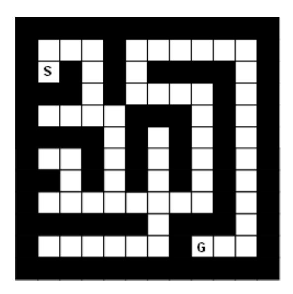
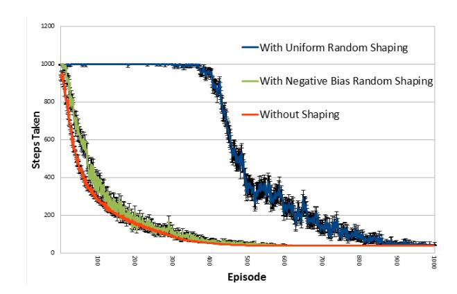
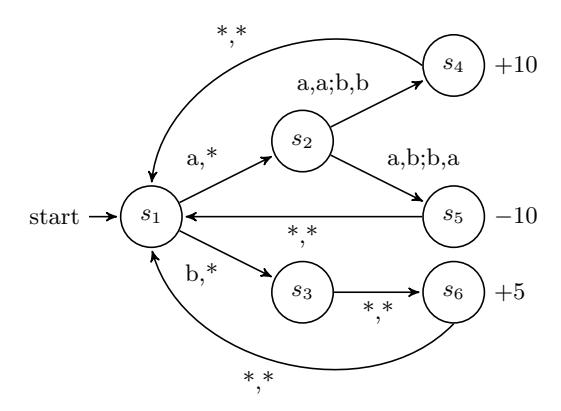
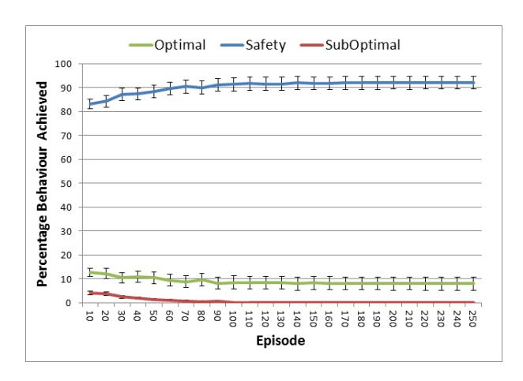
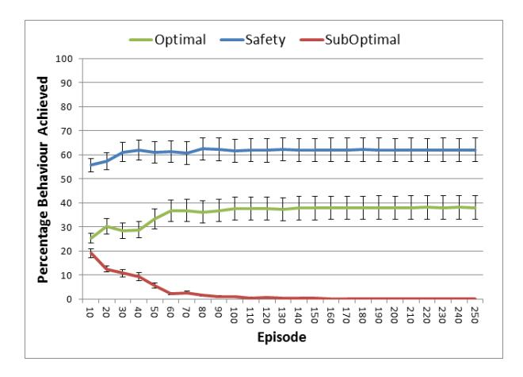
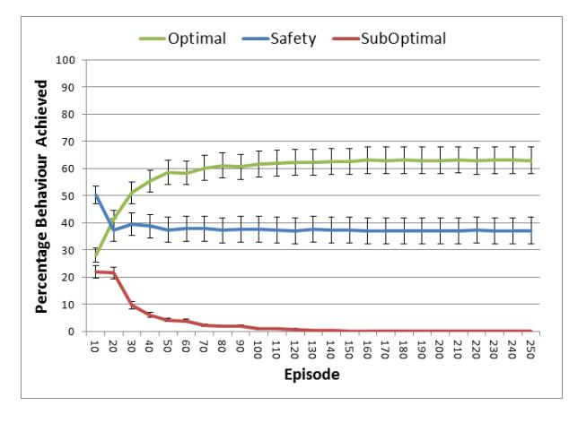

# **Dynamic Potential-Based Reward Shaping**

Sam Devlin
Department of Computer Science,
University of York, UK
devlin@cs.york.ac.uk

Daniel Kudenko
Department of Computer Science,
University of York, UK
kudenko@cs.york.ac.uk

# **ABSTRACT**

Potential-based reward shaping can significantly improve the time needed to learn an optimal policy and, in multiagent systems, the performance of the final joint-policy. It has been proven to not alter the optimal policy of an agent learning alone or the Nash equilibria of multiple agents learning together.

However, a limitation of existing proofs is the assumption that the potential of a state does not change dynamically during the learning. This assumption often is broken, especially if the reward-shaping function is generated automatically.

In this paper we prove and demonstrate a method of extending potential-based reward shaping to allow dynamic shaping and maintain the guarantees of policy invariance in the single-agent case and consistent Nash equilibria in the multi-agent case.

# **Categories and Subject Descriptors**

I.2.6 [Artificial Intelligence]: Learning; I.2.11 [Artificial Intelligence]: Distributed Artificial Intelligence—Multiagent Systems

#### **General Terms**

Theory, Experimentation

## **Keywords**

Reinforcement Learning, Reward Shaping

#### 1. INTRODUCTION

Reinforcement learning agents are typically implemented with no prior knowledge and yet it has been repeatedly shown that informing the agents of heuristic knowledge can be beneficial [2, 7, 13, 14, 17, 19]. Such prior knowledge can be encoded into the initial Q-values of an agent or the reward function. If done so by a potential function, the two can be equivalent [23].

Originally potential-based reward shaping was proven to not change the optimal policy of a single agent provided a

Appears in: Proceedings of the 11th International Conference on Autonomous Agents and Multiagent Systems (AAMAS 2012), Conitzer, Winikoff, Padgham, and van der Hoek (eds.), 4-8 June 2012, Valencia, Spain.

Copyright © 2012, International Foundation for Autonomous Agents and Multiagent Systems (www.ifaamas.org). All rights reserved.

static potential function based on states alone [15]. Continuing interest in this method has expanded its capabilities to providing similar guarantees when potentials are based on states and actions [24] or the agent is not alone but acting in a common environment with other shaped or unshaped agents [8].

However, all existing proofs presume a static potential function. A static potential function represents static knowledge and, therefore, can not be updated online whilst an agent is learning.

Despite these limitations in the theoretical results, empirical work has demonstrated the usefulness of a dynamic potential function [10, 11, 12, 13]. When applying potential-based reward shaping, a common challenge is how to set the potential function. The existing implementations using dynamic potential functions automate this process making the method more accessible to all.

Some, but not all, pre-existing implementations enforce that their potential function stabilises before the agent. This feature is perhaps based on the intuitive argument that an agent cannot converge until the reward function does so [12]. However, as we will show in this paper, agents can converge despite additional dynamic rewards provided they are of a given form.

Our contribution is to prove how a dynamic potential function does not alter the optimal policy of a single-agent problem domain or the Nash equilibria of a multi-agent system (MAS). This proof justifies the existing uses of dynamic potential functions and explains how, in the case where the additional rewards are never guaranteed to converge [10], the agent can still converge.

Furthermore, we will also prove that, by allowing the potential of state to change over time, dynamic potential-based reward shaping is not equivalent to Q-table initialisation. Instead it is a unique tool, useful for developers wishing to continually influence an agent's exploration whilst guaranteed to not alter the goal(s) of an agent or group.

In the next section we will cover all relevant background material. In Section 3 we present both of our proofs regarding the implications of a dynamic potential function on existing results in potential-based reward shaping. Later, in Section 4, we clarify our point by empirically demonstrating a dynamic potential function in both single-agent and multi-agent problem domains. The paper then closes by summarising the key results of the paper.

# 2. PRELIMINARIES

In this section we introduce all relevant existing work upon which this work is based.

# 2.1 Reinforcement Learning

Reinforcement learning is a paradigm which allows agents to learn by reward and punishment from interactions with the environment [21]. The numeric feedback received from the environment is used to improve the agent's actions. The majority of work in the area of reinforcement learning applies a Markov Decision Process (MDP) as a mathematical model [16].

An MDP is a tuple  $\langle S, A, T, R \rangle$ , where S is the state space, A is the action space, T(s,a,s') = Pr(s'|s,a) is the probability that action a in state s will lead to state s', and R(s,a,s') is the immediate reward r received when action a taken in state s results in a transition to state s'. The problem of solving an MDP is to find a policy (i.e., mapping from states to actions) which maximises the accumulated reward. When the environment dynamics (transition probabilities and reward function) are available, this task can be solved using policy iteration [3].

When the environment dynamics are not available, as with most real problem domains, policy iteration cannot be used. However, the concept of an iterative approach remains the backbone of the majority of reinforcement learning algorithms. These algorithms apply so called temporal-difference updates to propagate information about values of states, V(s), or state-action pairs, Q(s,a) [20]. These updates are based on the difference of the two temporally different estimates of a particular state or state-action value. The Q-learning algorithm is such a method [21]. After each transition,  $(s,a) \to (s',r)$ , in the environment, it updates state-action values by the formula:

$$Q(s,a) \leftarrow Q(s,a) + \alpha [r + \gamma \max_{a'} Q(s',a') - Q(s,a)] \quad (1)$$

where  $\alpha$  is the rate of learning and  $\gamma$  is the discount factor. It modifies the value of taking action a in state s, when after executing this action the environment returned reward r, and moved to a new state s'.

Provided each state-action pair is experienced an infinite number of times, the rewards are bounded and the agent's exploration and learning rate reduce to zero the value table of a Q-learning agent will converge to the optimal values  $Q^*$  [22].

# 2.1.1 Multi-Agent Reinforcement Learning

Applications of reinforcement learning to MAS typically take one of two approaches; multiple individual learners or joint action learners [6]. The latter is a group of multiagent specific algorithms designed to consider the existence of other agents. The former is the deployment of multiple agents each using a single-agent reinforcement learning algorithm.

Multiple individual learners assume any other agents to be a part of the environment and so, as the others simultaneously learn, the environment appears to be dynamic as the probability of transition when taking action a in state s changes over time. To overcome the appearance of a dynamic environment, joint action learners were developed that extend their value function to consider for each state the value of each possible combination of actions by all agents.

Learning by joint action, however, breaks a fundamental concept of MAS in which each agent is self-motivated and so may not consent to the broadcasting of their action choices. Furthermore, the consideration of the joint action causes an exponential increase in the number of values that must be calculated with each additional agent added to the system. For these reasons, this work will focus on multiple individual learners and not joint action learners. However, these proofs can be extended to cover joint action learners.

Unlike single-agent reinforcement learning where the goal is to maximise the individual's reward, when multiple self motivated agents are deployed not all agents can always receive their maximum reward. Instead some compromise must be made, typically the system is designed aiming to converge to a Nash equilibrium [18].

To model a MAS, the single-agent MDP becomes inadequate and instead the more general Stochastic Game (SG) is required [5]. A SG of n agents is a tuple

 $\langle S, A_1, ..., A_n, T, R_1, ..., R_n \rangle$ , where S is the state space,  $A_i$  is the action space of agent  $i, T(s, a_{i...n}, s') = Pr(s'|s, a_{i...n})$  is the probability that joint action  $a_{i...n}$  in state s will lead to state s', and  $R_i(s, a_i, s')$  is the immediate reward received by agent i when taking action  $a_i$  in state s results in a transition to state s' [9].

Typically, reinforcement learning agents, whether alone or sharing an environment, are deployed with no prior knowledge. The assumption is that the developer has no knowledge of how the agent(s) should behave. However, more often than not, this is not the case and the agent(s) can benefit from the developer's understanding of the problem domain.

One common method of imparting knowledge to a reinforcement learning agent is reward shaping, a topic we will discuss in more detail in the next subsection.

## 2.2 Reward Shaping

The idea of reward shaping is to provide an additional reward representative of prior knowledge to reduce the number of suboptimal actions made and so reduce the time needed to learn [15, 17]. This concept can be represented by the following formula for the Q-learning algorithm:

$$Q(s, a) \leftarrow Q(s, a) + \alpha [r + F(s, s') + \gamma \max_{a'} Q(s', a') - Q(s, a)]$$

$$(2)$$

where F(s, s') is the general form of any state-based shaping reward.

Even though reward shaping has been powerful in many experiments it quickly became apparent that, when used improperly, it can change the optimal policy [17]. To deal with such problems, potential-based reward shaping was proposed [15] as the difference of some potential function  $\Phi$  defined over a source s and a destination state s':

$$F(s, s') = \gamma \Phi(s') - \Phi(s) \tag{3}$$

where  $\gamma$  must be the same discount factor as used in the agent's update rule (see Equation 1).

Ng et al. [15] proved that potential-based reward shaping, defined according to Equation 3, guarantees learning a policy which is equivalent to the one learnt without reward shaping in both infinite and finite horizon MDPs.

Wiewiora [23] later proved that an agent learning with potential-based reward shaping and no knowledge-based Qtable initialisation will behave identically to an agent without reward shaping when the latter agent's value function is initialised with the same potential function.

These proofs, and all subsequent proofs regarding potential-based reward shaping including those presented in this paper, require actions to be selected by an advantage-based policy [23]. Advantage-based policies select actions based on their relative differences in value and not their exact value. Common examples include greedy,  $\epsilon$ -greedy and Boltzmann soft-max.

# 2.2.1 Reward Shaping In Multi-Agent Systems

Incorporating heuristic knowledge has been shown to also be beneficial in multi-agent reinforcement learning [2, 13, 14, 19]. However, some of these examples did not use potential-based functions to shape the reward [14, 19] and could, therefore, potentially suffer from introducing beneficial cyclic policies that cause convergence to an unintended behaviour as demonstrated previously in a single-agent problem domain [17].

The remaining applications that were potential-based [2, 13], demonstrated an increased probability of convergence to a higher value Nash equilibrium. However, both of these applications were published with no consideration of whether the proofs of guaranteed policy invariance hold in multiagent reinforcement learning.

Since this time, theoretical results [8] have shown that whilst Wiewiora's proof [23] of equivalence to Q-table initialisation holds also for multi-agent reinforcement learning Ng's proof [15] of policy invariance does not. Multi-agent potential-based reward shaping can alter the final policy a group of agents will learn but, instead, does not alter the Nash equilibria of the system.

#### 2.2.2 Dynamic Reward Shaping

Reward shaping is typically implemented bespoke for each new environment using domain-specific heuristic knowledge [2, 7, 17] but some attempts have been made to automate [10, 11, 12, 13] the encoding of knowledge into a potential function.

All of these existing methods alter the potential of states online whilst the agent is learning. Neither the existing single-agent [15] nor the multi-agent [8] proven theoretical results considered such dynamic shaping.

However, the opinion has been published that the potential function must converge before the agent can [12]. In the majority of implementations this approach has been applied [11, 12, 13] but in other implementations stability is never guaranteed [10]. In this case, despite common intuition, the agent was still seen to converge to an optimal policy.

Therefore, contrary to existing opinion it must be possible for an agent's policy to converge despite a continually changing reward transformation. In the next section we will prove how this is possible.

# 3. THEORY

In this section we will cover the implications of a dynamic potential function on the three most important existing proofs in potential-based reward shaping. Specifically, in subsection 3.1 we address the theoretical guarantees of policy invariance in single-agent problem domains [15] and consistent Nash equilibria in multi-agent problem domains [8]. Later, in subsection 3.2, we will address Wiewiora's proof of equivalence to Q-table initialisation [23].

# 3.1 Dynamic Potential-Based Reward Shaping Can Maintain Existing Guarantees

To extend potential-based reward shaping to allow for a dynamic potential function we extend Equation 3 to include time as a parameter of the potential function  $\Phi$ . Informally, if the difference in potential is calculated from the potentials of the states at the time they were visited the guarantees of policy invariance or consistant Nash equilibria remain. Formally:

$$F(s,t,s',t') = \gamma \Phi(s',t') - \Phi(s,t) \tag{4}$$

where t is the time the agent arrived at previous state s and t' is the current time when arriving at the current state s' (i.e. t < t').

To prove policy invariance in the single-agent case and consistent Nash equilibria in the multi-agent case it suffices to show that the return a shaped agent will receive for following a fixed sequence of states and actions is equal to the return the non-shaped agent would receive when following the same sequence minus the potential of the first state in the sequence [1, 8].

Therefore, let us consider the return  $U_i$  for any arbitrary agent i when experiencing sequence  $\bar{s}$  in a discounted framework without shaping. Formally:

$$U_i(\bar{s}) = \sum_{j=0}^{\infty} \gamma^j r_{j,i} \tag{5}$$

where  $r_{j,i}$  is the reward received at time j by agent i from the environment.

Given this definition of return, the true Q-values can be defined formally by:

$$Q_i^*(s,a) = \sum_{\bar{s}} Pr(\bar{s}|s,a) U_i(\bar{s})$$
 (6)

Now consider the same agent but with a reward function modified by adding a dynamic potential-based reward function of the form given in Equation 4. The return of the shaped agent  $U_{i,\Phi}$  experiencing the same sequence  $\bar{s}$  is:

$$U_{i,\Phi}(\bar{s}) = \sum_{j=0}^{\infty} \gamma^{j} (r_{j,i} + F(s_{j}, t_{j}, s_{j+1}, t_{j+1}))$$

$$= \sum_{j=0}^{\infty} \gamma^{j} (r_{j,i} + \gamma \Phi(s_{j+1}, t_{j+1}) - \Phi(s_{j}, t_{j}))$$

$$= \sum_{j=0}^{\infty} \gamma^{j} r_{j,i} + \sum_{j=0}^{\infty} \gamma^{j+1} \Phi(s_{j+1}, t_{j+1})$$

$$- \sum_{j=0}^{\infty} \gamma^{j} \Phi(s_{j}, t_{j})$$

$$= U_{i}(\bar{s}) + \sum_{j=1}^{\infty} \gamma^{j} \Phi(s_{j}, t_{j})$$

$$- \sum_{j=1}^{\infty} \gamma^{j} \Phi(s_{j}, t_{j}) - \Phi(s_{0}, t_{0})$$

$$= U_{i}(\bar{s}) - \Phi(s_{0}, t_{0})$$
(7)

Then by combining 6 and 7 we know the shaped Q-function in

$$Q_{i,\Phi}^{*}(s,a) = \sum_{\bar{s}} Pr(\bar{s}|s,a)U_{i,\Phi}(\bar{s})$$

$$= \sum_{\bar{s}} Pr(\bar{s}|s,a)(U_{i}(\bar{s}) - \Phi(s,t))$$

$$= \sum_{\bar{s}} Pr(\bar{s}|s,a)U_{i}(\bar{s}) - \sum_{\bar{s}} Pr(\bar{s}|s,a)\Phi(s,t)$$

$$= Q_{i}^{*}(s,a) - \Phi(s,t)$$
(8)

where t is the current time.

As the difference between the original Q-values and the shaped Q-values is not dependent on the action taken, then in any given state the best (or best response) action remains constant regardless of shaping. Therefore, we can conclude that the guarantees of policy invariance and consistent Nash equilibria remain.

# 3.2 Dynamic Potential-Based Reward Shaping Is Not Equivalent To Q-Table Initialisation

In both single-agent [23] and multi-agent [8] reinforcement learning, potential-based reward shaping with a static potential function is equivalent to initialising the agent's Qtable such that:

$$\forall s, a | Q(s, a) = \Phi(s) \tag{9}$$

where  $\Phi(\cdot)$  is the same potential function as used by the shaped agent.

However, with a dynamic potential function this result no longer holds. The proofs require an agent with potential-based reward shaping and an agent with the above Q-table initialisation to have an identical probability distribution over their next action provided the same history of states, actions and rewards.

If the Q-table is initialised with the potential of states prior to experiments  $(\Phi(s,t_0))$ , then any future changes in potential are not accounted for in the initialised agent. Therefore, after the agents experience a state where the shaped agent's potential function has changed they may make different subsequent action choices.

Formally this can be proved by considering agent L that receives dynamic potential-based reward shaping and agent L' that does not but is initialised as in Equation 9. Agent L will update its Q-values by the rule:

$$Q(s,a) \leftarrow Q(s,a) + \alpha \underbrace{\left(r_i + F(s,t,s',t') + \gamma \max_{a'} Q(s',a') - Q(s,a)\right)}_{\delta Q(s,a)}$$

$$(10)$$

where  $\Delta Q(s, a) = \alpha \delta Q(s, a)$  is the amount that the Q value will be updated by.

The current Q-values of Agent L can be represented formally as the initial value plus the change since:

$$Q(s,a) = Q_0(s,a) + \Delta Q(s,a) \tag{11}$$

where  $Q_0(s, a)$  is the initial Q-value of state-action pair (s, a). Similarly, agent L' updates its Q-values by the rule:

$$Q'(s,a) \leftarrow Q'(s,a) + \alpha \underbrace{(r_i + \gamma \max_{a'} Q'(s',a') - Q'(s,a))}_{\delta Q'(s,a)}$$

And its current Q-values can be represented formally as:

$$Q'(s,a) = Q_0(s,a) + \Phi(s,t_0) + \Delta Q'(s,a)$$
 (13)

where  $\Phi(s, t_0)$  is the potential for state s before learning begins.

For the two agents to act the same they must choose their actions by relative difference in Q-values, not absolute magnitude, and the relative ordering of actions must remain the same for both agents. Formally:

$$\forall s, a, a' | Q(s, a) > Q(s, a') \Leftrightarrow Q'(s, a) > Q'(s, a') \tag{14}$$

In the base case this remains true, as both  $\Delta Q(s, a)$  and  $\Delta Q'(s, a)$  equal zero before any actions are taken, but after this the proof falters for dynamic potential functions.

Specifically, when the agents first transition to a state where the potential has changed agent L will update Q(s,a) by:

$$\delta Q(s, a) = r_i + F(s, s') + \gamma \max_{a'} Q(s', a') - Q(s, a) 
= r_i + \gamma \Phi(s', t') - \Phi(s, t) 
+ \gamma \max_{a'} (Q_0(s', a') + \Delta Q(s', a')) 
- Q_0(s, a) - \Delta Q(s, a) 
= r_i + \gamma \Phi(s', t') - \Phi(s, t_0) 
+ \gamma \max_{a'} (Q_0(s', a') + \Delta Q(s', a')) 
- Q_0(s, a) - \Delta Q(s, a)$$
(15)

and agent L' will update Q'(s, a) by:

$$\begin{split} \delta Q'(s,a) &= r_i + \gamma \max_{a'} Q'(s',a') - Q'(s,a) \\ &= r_i + \gamma \max_{a'} (Q_0(s',a') + \Phi(s',t_0) + \Delta Q'(s'a')) \\ &- Q_0(s,a) - \Phi(s,t_0) - \Delta Q'(s,a) \\ &= r_i + \gamma \max_{a'} (Q_0(s',a') + \Phi(s',t_0) + \Delta Q(s'a')) \\ &- Q_0(s,a) - \Phi(s,t_0) - \Delta Q(s,a) \\ &= r_i + \gamma \Phi(s',t_0) - \Phi(s,t_0) \\ &+ \gamma \max_{a'} (Q_0(s',a') + \Delta Q(s',a')) \\ &- Q_0(s,a) - \Delta Q(s,a) \\ &= \delta Q(s,a) - \gamma \Phi(s',t') + \gamma \Phi(s',t_0) \end{split}$$
(16)

But the two are not equal as:

$$\Phi(s',t') \neq \Phi(s',t_0) \tag{17}$$

Therefore, for this state-action pair:

$$Q'(s,a) = Q(s,a) + \Phi(s,t_0) - \alpha \gamma \Phi(s',t') + \alpha \gamma \Phi(s',t_0)$$
 (18)

but for all other actions in state s:

$$Q'(s,a) = Q(s,a) + \Phi(s,t_0)$$
(19)

Once this occurs the differences in Q-values between agent L and agent L' for state s would no longer be constant across all actions. If this difference is sufficient to change the ordering of actions (i.e. Equation 14 is broken), then the policy of any rational agent will have different probability distributions over subsequent action choices in state s.

In single-agent problem domains, provided the standard necessary conditions are met, the difference in ordering will only be temporary as agents initialised with a static-potential function and/or those receiving dynamic potential-based reward shaping will converge to the optimal policy. In these cases the temporary difference will only affect the exploration of the agents not their goal.

In multi-agent cases, as was shown previously [8], altered exploration can alter final joint-policy and, therefore, the different ordering may remain. However, as we have proven in the previous sub-section, this is not indicative of a change in the goals of the agents.

In both cases, we have shown how an agent initialised as in Equation 9 can after the same experiences behave differently to an agent receiving dynamic potential-based reward shaping. This occurs because the initial value given to a state cannot capture subsequent changes in it's potential.

Alternatively, the initialised agent could reset its Q-table on each change in potential to reflect the changes in the shaped agent. However, this approach would lose all history of updates due to experiences had and so again cause differences in behaviour between the shaped agent and the initialised agent.

Furthermore, this method and other similar methods of attempting to integrate change in potential after the agent has begun to learn are also no longer strictly Q-table initialisation.

Therefore, we conclude that there is not a method of initialising an agent's Q-table to guarantee equivalent behaviour to an agent receiving dynamic potential-based reward shaping.

# 4. EMPIRICAL DEMONSTRATION

To clarify our contribution in the following subsections we will demonstrate empirically for both a single-agent and a multi-agent problem domain that their respective guarantees remain despite a dynamic potential function. Specifically in both environments we implement agents without shaping or with a (uniform or negatively biased) random potential function that never stabilises.

# 4.1 Single-Agent Example

To demonstrate policy invariance with and without dynamic potential-based reward shaping, an empirical study of a discrete, deterministic grid world will be presented here.

Specifically we have one agent attempting to move from grid location S to G in the maze illustrated in Figure 1. The optimal policy/route through the maze takes 41 time steps and should be learnt by the agent regardless of whether it does or does not receive the reward shaping.

On each time step the agent receives -1 reward from the environment. Upon reaching the goal the agent receives +100 reward from the environment. If an episode reaches 1000 time steps without reaching the goal, the episode is reset.

At each time step, if the agent is receiving uniform random shaping, the state entered will be given a random potential

Figure 1: Map of Maze

between 0 and 50 and the agent will receive an additional reward equal to the difference between this new potential1 and the potential of the previous state.

Likewise, if the agent is receiving negative bias random shaping, the state entered will be given a random potential between 0 and it's current distance to the goal. This potential function is dynamic, never stabilises and encourages movement away from the agent's goal.

The agent implemented uses Q-learning with  $\epsilon$ -greedy exploration and a tabular representation of the environment. Experimental parameters were set as  $\alpha = 0.05, \gamma = 1.0$  and  $\epsilon$  begins at 0.4 and reduces linearly over the first 500 episodes to 0.

#### 4.1.1 Results

All experiments were run for 1000 episodes and repeated 100 times. The results, illustrated in Figure 2, plot the mean number of steps taken to complete that episode. All figures include error bars illustrating the standard error from the mean.

Figure 2: Single-Agent Maze Results

 $^{1}$  If  $\gamma$  was less than 1 then this value would be discounted by  $\gamma,$  as we will demonstrate in the multi-agent example.

As we expected, regardless of shaping, the agent learns the optimal policy and can complete the maze within 41 time steps. This is the first published example of a reinforcement learning agent converging despite a reward shaping function that is known not to converge. This example counters the previously accepted intuition [12] and supports our claim that the guarantee of policy invariance remains provided the additional reward is of the form:

$$F(s, s') = \gamma \Phi(s', t') - \Phi(s, t)$$

In this example, the agents with dynamic potential-based reward shaping take longer to learn the optimal policy. However, this is not characteristic of the method but of our specific potential functions. For this problem domain, a uniform random potential-function, has been shown to be the worst possible case. This is because it represents no specific knowledge whilst the negative bias random potential function encourages movement away from the goal which in some parts of the maze is the correct behaviour.

It is common intuition that as reward shaping directs exploration it can be both beneficial and detrimental to an agent's learning performance. If a good heuristic is used, common in previous published examples [7, 15, 24], the agent will learn quicker but the lesser published alternative is that a poor heuristic is used and the agent learns slower.2

However, the more important result of this example is to demonstrate that despite even the most misleading and never stable potential functions a single agent can still converge to the optimal policy. In the next section we go on to demonstrate a similar result but this time maintaining the guarantee of consistent Nash equilibria despite a never stable dynamic potential-function in a multi-agent problem domain.

# 4.2 Multi-Agent Example

To demonstrate consistent Nash equilibria with and without dynamic potential-based reward shaping, an empirical study of Boutilier's coordination game [4] will be presented here.

The game, illustrated in Figure 3, has six stages and two agents, each capable of two actions (a or b). The first agent's first action choice in each episode decides if the agents will move to a state guaranteed to reward them minimally  $(s_3)$  or to a state where they must co-ordinate to receive the highest reward  $(s_2)$ . However, in state  $s_2$  the agents are at risk of receiving a large negative reward if they do not choose the same action.

In Figure 3, each transition is labeled with one or more action pairs such that the pair a, \* means this transition occurs if agent 1 chooses action a and agent 2 chooses either action. When multiple action pairs result in the same transition the pairs are separated by a semicolon(;).

The game has multiple Nash equilibria; the joint policies opting for the safety state  $s_3$  or the joint policies of moving to state  $s_2$  and coordinating on both choosing a or b. Any joint policy receiving the negative reward is not a Nash equilibrium, as the first agent can choose to change its first action choice and so receive a higher reward by instead reaching

Figure 3: Boutilier's Coordination Game

state  $s_3$ .

As before we will compare the behaviour of agents with and without random dynamic potential-based reward shaping. Each agent will randomly assign its own potential to a new state upon entering it and be rewarded that potential discounted by  $\gamma$  less the potential of the previous state at the time it was entered. Therefore, each agent receives its own dynamic reward shaping unique to its own potential function. These experimental results are intended to show, that regardless of dynamic potential-based reward shaping, the shaped agents will only ever converge to one of the three original joint policy Nash equilibria.

The uniform random function will again choose potentials in the range 0 to 50. It is worthwhile to note here that, in this problem domain, the additional rewards from shaping will often be larger than those received from the environment when following the optimal policy.

The negative bias random function will choose potentials in the range 35 to 50 for state  $s_5$  (the suboptimal state) or 0 to 15 for all other states. This potential function is bias towards the suboptimal policy, as any transition into state  $s_5$  will be rewarded at least as high as the true reward for following the optimal policy.

All agents, both with and without reward shaping, use Q-learning with  $\epsilon$ -greedy exploration and a tabular representation of the environment. Experimental parameters were set as  $\alpha=0.5, \gamma=0.99$  and  $\epsilon$  begins at 0.3 and decays by 0.99 each episode.

# 4.2.1 Results

All experiments were run for 500 episodes (15,000 action choices) and repeated 100 times. The results, illustrated in Figures 4, 5 and 6, plot the mean percentage of the last 100 episodes performing the optimal, safety and sub-optimal joint policies for the non-shaped and shaped agents. All figures include error bars illustrating the standard error from the mean. For clarity, graphs are plotted only up to 250 episodes as by this time all experiments had converged to a stable joint policy.

Figure 4 shows that the agents without reward shaping rarely (less than ten percent of the time) learn to perform the optimal policy. However, as illustrated by Figures 5 and 6, both sets of agents with dynamic reward shaping learn the optimal policy more often.

&lt;sup>2For single-agent examples of dynamic potential-based reward shaping providing beneficial gains in learning time we refer the reader to any existing published implementation [10, 11, 12, 13].

Figure 4: Without Reward Shaping

Figure 5: With Uniform Random Dynamic Reward Shaping

Figure 6: With Negative Bias Random Dynamic Reward Shaping

Therefore, in this domain, unlike the single-agent example, the dynamic reward shaping has been beneficial to final performance. This has occured because the agents' modified exploration has led to convergence to a different Nash equilibrium. However, please note, the agents never converge to

perform the suboptimal joint policy. Instead the agents will only ever converge to the safety or optimal joint policies; the Nash equilibria of the unshaped and shaped systems. Thus demonstrating that even with dynamic reward transformations that never stabilise the Nash equilibria of the system remain the same provided the transformations are potential based.

## 5. CONCLUSION

In conclusion we have proven that a dynamic potential function can be used to shape an agent without altering its optimal policy provided the additional reward given is of the form:

$$F(s, t, s', t') = \gamma \Phi(s', t') - \Phi(s, t)$$

If multiple agents are acting in the same environment then, instead, the result becomes that the Nash equilibria remain consistent regardless of how many agents are receiving dynamic potential-based reward shaping.

Contrary to previous opinion, the dynamic potential function does not need to converge before the agent receiving shaping can as we have both theoretically argued and empirically demonstrated.

We have also proved that, although there is an equivalent Q-table initialisation to static potential-based reward shaping, it is not equivalent to dynamic potential-based reward shaping. We claim that no prior-initialisation can capture the behaviour of an agent acting due to a dynamic potential-based reward shaping as the changes that may occur are not necessarily known before learning begins.

Therefore, the use of dynamic potential-based reward shaping to inform agents of knowledge that has changed whilst they are learning is a feature unique to this method.

These results justify a number of pre-existing implementations of dynamic reward shaping [10, 11, 12, 13] and enable ongoing research into automated processes of generating potential functions.

#### 6. ACKNOWLEDGMENTS

We would like to thank the anonymous reviewers for their significant feedback and subsequent input to this paper.

## 7. REFERENCES

- J. Asmuth, M. Littman, and R. Zinkov. Potential-based shaping in model-based reinforcement learning. In *Proceedings of the Twenty-Third AAAI* Conference on Artificial Intelligence, pages 604–609, 2008.
- [2] M. Babes, E. de Cote, and M. Littman. Social reward shaping in the prisoner's dilemma. In Proceedings of The Seventh Annual International Conference on Autonomous Agents and Multiagent Systems, volume 3, pages 1389–1392, 2008.
- [3] D. P. Bertsekas. Dynamic Programming and Optimal Control (2 Vol Set). Athena Scientific, 3rd edition, 2007.
- [4] C. Boutilier. Sequential optimality and coordination in multiagent systems. In *International Joint Conference* on *Artificial Intelligence*, volume 16, pages 478–485, 1999.

- [5] L. Busoniu, R. Babuska, and B. De Schutter. A Comprehensive Survey of MultiAgent Reinforcement Learning. IEEE Transactions on Systems Man & Cybernetics Part C Applications and Reviews, 38(2):156, 2008.
- [6] C. Claus and C. Boutilier. The dynamics of reinforcement learning in cooperative multiagent systems. In *Proceedings of the National Conference on Artificial Intelligence*, pages 746–752, 1998.
- [7] S. Devlin, M. Grześ, and D. Kudenko. An empirical study of potential-based reward shaping and advice in complex, multi-agent systems. Advances in Complex Systems, 2011.
- [8] S. Devlin and D. Kudenko. Theoretical considerations of potential-based reward shaping for multi-agent systems. In Proceedings of The Tenth Annual International Conference on Autonomous Agents and Multiagent Systems, 2011.
- [9] J. Filar and K. Vrieze. Competitive Markov decision processes. Springer Verlag, 1997.
- [10] M. Grześ and D. Kudenko. Plan-based reward shaping for reinforcement learning. In *Proceedings of the 4th IEEE International Conference on Intelligent Systems* (IS'08), pages 22–29. IEEE, 2008.
- [11] M. Grześ and D. Kudenko. Online learning of shaping rewards in reinforcement learning. Artificial Neural Networks-ICANN 2010, pages 541–550, 2010.
- [12] A. Laud. Theory and application of reward shaping in reinforcement learning. PhD thesis, University of Illinois at Urbana-Champaign, 2004.
- [13] B. Marthi. Automatic shaping and decomposition of reward functions. In *Proceedings of the 24th International Conference on Machine learning*, page 608. ACM, 2007.
- [14] M. Matarić. Reinforcement learning in the multi-robot domain. Autonomous Robots, 4(1):73–83, 1997.
- [15] A. Y. Ng, D. Harada, and S. J. Russell. Policy invariance under reward transformations: Theory and application to reward shaping. In *Proceedings of the* 16th International Conference on Machine Learning, pages 278–287, 1999.
- [16] M. L. Puterman. Markov Decision Processes: Discrete Stochastic Dynamic Programming. John Wiley & Sons, Inc., New York, NY, USA, 1994.
- [17] J. Randløv and P. Alstrom. Learning to drive a bicycle using reinforcement learning and shaping. In Proceedings of the 15th International Conference on Machine Learning, pages 463–471, 1998.
- [18] Y. Shoham, R. Powers, and T. Grenager. If multi-agent learning is the answer, what is the question? *Artificial Intelligence*, 171(7):365–377, 2007.
- [19] P. Stone and M. Veloso. Team-partitioned, opaque-transition reinforcement learning. In Proceedings of the third annual conference on Autonomous Agents, pages 206–212. ACM, 1999.
- [20] R. S. Sutton. Temporal credit assignment in reinforcement learning. PhD thesis, Department of Computer Science, University of Massachusetts, Amherst, 1984.
- [21] R. S. Sutton and A. G. Barto. Reinforcement Learning: An Introduction. MIT Press, 1998.

- [22] C. Watkins and P. Dayan. Q-learning. *Machine learning*, 8(3):279–292, 1992.
- [23] E. Wiewiora. Potential-based shaping and Q-value initialization are equivalent. *Journal of Artificial Intelligence Research*, 19(1):205–208, 2003.
- [24] E. Wiewiora, G. Cottrell, and C. Elkan. Principled methods for advising reinforcement learning agents. In *Proceedings of the Twentieth International Conference on Machine Learning*, 2003.