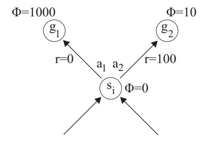
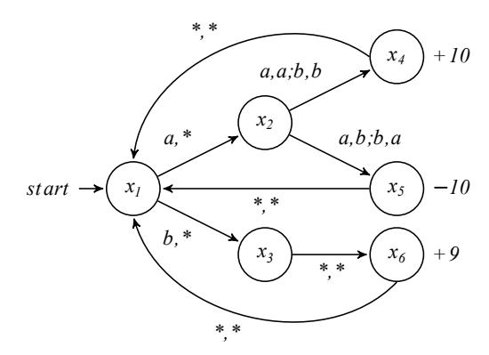

## Reward Shaping in Episodic Reinforcement Learning

Marek Grześ School of Computing University of Kent Canterbury, UK m.grzes@kent.ac.uk

#### **ABSTRACT**

Recent advancements in reinforcement learning confirm that reinforcement learning techniques can solve large scale problems leading to high quality autonomous decision making. It is a matter of time until we will see large scale applications of reinforcement learning in various sectors, such as healthcare and cyber-security, among others. However, reinforcement learning can be time-consuming because the learning algorithms have to determine the long term consequences of their actions using delayed feedback or rewards. Reward shaping is a method of incorporating domain knowledge into reinforcement learning so that the algorithms are guided faster towards more promising solutions. Under an overarching theme of episodic reinforcement learning, this paper shows a unifying analysis of potential-based reward shaping which leads to new theoretical insights into reward shaping in both model-free and model-based algorithms, as well as in multi-agent reinforcement learning.

#### **CCS Concepts**

 $\bullet$  Theory of computation  $\to$  Reinforcement learning; Sequential decision making; Multi-agent reinforcement learning;  $\bullet$  Computing methodologies  $\to$  Reinforcement learning; Q-learning;

#### **Keywords**

Reward structures for learning; Multiagent learning; Reward shaping; Reinforcement learning

#### 1. INTRODUCTION

Recent research has shown that reinforcement learning [12] combined with deep learning [15] can solve highly complex problems, such as Atari games [20]. The ability of deep learning to learn hierarchies of features from data allows reinforcement learning to operate on raw sensory input, e.g. image pixels in Atari games. So far, the methods that have turned out to be the most successful are those that learn a direct mapping from states and actions to their values—an approach that is called model-free learning. In large-scale applications, alternative approaches, known as model-

Appears in: Proc. of the 16th International Conference on Autonomous Agents and Multiagent Systems (AAMAS 2017), S. Das, E. Durfee, K. Larson, M. Winikoff (eds.), May 8–12, 2017, São Paulo, Brazil. Copyright © 2017, International Foundation for Autonomous Agents and Multiagent Systems (www.ifaamas.org). All rights reserved.

based learning, were generally not as successful as modelfree methods, even though they have convenient theoretical guarantees [13, 27], and they learn an explicit model of the environment [23]. Certainly, important exceptions where model-based reinforcement learning worked well can be identified, e.g., Abbeel et al. [1]. While learning, reinforcement learning algorithms try to address the temporal credit assignment problem because they have to determine the long-term consequences of actions. This means that, by its nature, reinforcement learning requires a large amount of data samples. Even if model-free algorithms can use techniques, such as experience reply [16], that reuse samples, deep learning itself requires large numbers of training patterns to be presented to a deep neural network. Thus, speeding up the reinforcement learning component through a more efficient treatment of the temporal-credit assignment problem can help deep learning because state and action pairs will be mapped to more accurate long-term returns early on. Clearly, principled solutions that could speed up the stateof-the-art reinforcement learning algorithms are important. A convenient approach is to alter the reward of the original process so that the algorithm can faster detect longterm consequences of actions. This approach mitigates the negative impact of the temporal credit assignment problem, and it reduces the number of patterns (samples) required by deep learning. An important requirement is that the policy learned with reward shaping should be equivalent to the original policy that would be learned with original rewards. In this paper, we investigate the properties of reward shaping in episodic reinforcement learning tasks (e.g. games) to unify the existing theoretical findings about reward shaping, and in this way we make it clear when it is safe to apply reward shaping.

#### 2. BACKGROUND

The underlying model frequently used in reinforcement learning is a Markov decision process (MDP). An MDP is defined as a tuple  $(S,A,T,R,\gamma)$ , where  $s\in S$  is the state space,  $a\in A$  is the action space,  $T:S\times A\to S$  is the transition function,  $R:S\times A\times S\to R$  is the reward function (which is assumed here to be bounded above by  $R_{max}$ ), and  $0\le\gamma\le 1$  is the discount factor [25]. If  $\gamma=1$ , we assume that the process is executed for a limited number of steps, or that there exists a zero-reward absorbing goal state that can be reached from any state and all other states yield negative rewards. We define  $V_{max}$  to be the largest possible expected return. Solving an MDP means to find a policy that maximises the expected return for every state or for a

particular set of initial states. Thanks to the assumptions stated above, the expected return can be upper bounded as follows:  $V_{max} = R_{max}/(1-\gamma)$  if  $\gamma < 1$  and  $V_{max} = R_{max}$  if  $\gamma = 1$ . We define the Q-function,  $Q^*(s,a)$ , to be the expected return when action a is executed in s and the optimal policy is followed after that.

There exist various techniques for solving MDPs and computing a policy when all the elements of an MDP are available [25]. In reinforcement learning (RL), an algorithm interacts with the MDP, receiving experience tuples, (s, a, s', r), which represent single transitions in the environment, where action a taken in state s leads to state s' and reward r is received. Model-free and model-based algorithms are the two main approaches to RL. Q-learning is a classic example of the model-free approach. It maintains an estimate  $\hat{Q}$  of the Q-function, and it updates the estimate after every experience tuple (s, a, s', r), using the following equation:

$$\hat{Q}(s,a) = (1-\alpha)\hat{Q}(s,a) + \alpha \left(r + \gamma \max_{a'} \hat{Q}(s',a')\right). \tag{1}$$

When the learning rate,  $\alpha$ , is appropriately reduced, the algorithm will converge to optimal Q-values from any initial values [12].

R-max is a model-based algorithm that has convenient theoretical guarantees [5]. It learns an explicit MDP model. In particular, it learns the transition,  $\hat{T}$ , and reward models,  $\hat{R}$ . Then, having a current model, it applies Bellman's equation (Eq. 2) to solve the current model, this way to determine the current policy for further exploration and learning.

$$\hat{Q}(s,a) = \hat{R}(s,a) + \gamma \sum_{s'} \hat{T}(s,a,s') \max_{a'} \hat{Q}(s',a')$$
 (2)

R-max learns  $\hat{T}$  and  $\hat{R}$  from sample tuples. Any state-action pair that has not been sampled sufficiently often is called 'unknown', and it is assumed to lead to an imaginary, high value  $(V_{max})$  state—i.e., the algorithm makes an optimistic assumption. Note that Eq. 2 is applied whenever a new state becomes known. For 'known' states, the estimated dynamics are used instead of the optimistic ones. Due to its optimism, R-max belongs to the class of PAC-MDP algorithms [27] that have convenient theoretical guarantees.

Episodic implementations of Markov decision processes define either a terminal state,  $s_N$ , or a terminal time, N, when each episode ends. Both MDP planning techniques (that are, for example, used in the planning step in R-max) and reinforcement learning algorithms (such as Q-learning) have to set the value  $V(s_N)$  of such terminal states to zero since actions are not executed in  $s_N$ , and there are no rewards in those states.

The idea of reward shaping is to introduce additional rewards into the learning process under the constraint that the final policy should be equivalent to the original one. Ng et al. [22] showed that potential-based reward shaping of the form  $F(s,a,s') = \gamma \Phi(s') - \Phi(s)$  satisfies this requirement. Note that adding reward shaping means that in Eq. 1 and 2, r and R(s,a) are replaced by r+F(s,a,s') and R(s,a)+F(s,a,s'), correspondingly.

After Ng et al. [22] considered policy invariance, the researchers looked for reward shaping that would preserve optimistic exploration. As muth et al. [2] argued that optimistic exploration, which is required by PAC-MDP algorithms such as R-max, is preserved when the potential function is admissible, i.e.  $\forall_s V^*(s) \leq \Phi(s)$ , where  $V^*(s) = \max_a Q^*(s,a)$ . When reward shaping is applied to multi-agent reinforcement learning, the analysis should extend to the set of Nash equilibria, where the Nash equilibrium is a strategy where no agent can do better by changing its behaviour, assuming that all other agents stick to their current Nash equilibrium strategy. It is essential that the shaping reward does not introduce a new Nash equilibrium nor remove any of the original Nash equilibria. This topic was investigated independently by Devlin and Kudenko [7] and Lu et al. [17]. Both groups showed sufficiency of potential-based reward shaping, and Lu et al. [17] also proved the necessity under relaxed conditions that every agent, i, can have its own, private potential function,  $\Phi_i$ .

#### 3. FINITE HORIZON PROBLEMS

MDP policies can be computed for both infinite and finite horizon tasks. We know from Sec. 2 that  $\gamma = 1$  may explicitly require a finite horizon with a terminal time, Nwhen, for example, there is no zero-reward absorbing goal state, such that  $\forall_a R(goal, a, goal) = 1$  and  $\forall_a P(goal, a) = 0$ . When an absorbing goal state exists, such a state can be visited infinitely many times, and infinite horizon planning is also well-defined. However, it is a common practice in reinforcement learning to terminate every sampled trajectory (where a trajectory is a sequence of consecutive experience tuples) when the goal state is entered for the first time. When the process stops upon entering an absorbing goal state or a non-absorbing goal state, which is the case in the classical mountain car problem [21], such a goal state can be named a terminal state. Overall, trajectories simulated in finite horizon problems stop either after a predefined number of steps (terminal time) or after encountering a terminal state, and there is always a state in which the process will terminate when a policy of appropriate quality is executed.

In this paper, we show how the idea of a terminal state in finite horizon planning explains the behaviour of reward shaping in several types of reinforcement learning algorithms. Focusing on an episodic, finite horizon setting, our approach to terminal states generalises the consideration of goal states in Ng et al. [22], where the goal states were predefined terminal states. Furthermore, as long as Ng et al. [22] indicated that with  $\gamma = 1$  the shaping rewards have to be zero in all goal states, the issue of the potential function of the goal states was not considered. Our analysis will show that the potential function of the goal states is imperative because it is used when shaping rewards are computed for the predecessors of the goal states. Note that, assuming that actions could be executed in terminal states, the shaping rewards in those states could be zero even if their potential was not zero. Therefore, the Ng.'s requirement of zero reward can be satisfied with non-zero potential functions that can still be problematic, as we show in our paper.

Finite horizon problems represent an important class of MDP models that can be solved using either explicit planning techniques or learning algorithms, such as reinforcement learning. Furthermore, finite horizon planning can appear in problems that assume infinite horizon. For example, implementations of UCT [14] have to terminate their trajectories at some depth of their search trees. Assuming appropriate initialisation, traditional value iteration for MDPs increases its planning horizon by one with every iteration [25]. This phenomenon is clear in large-scale planning methods, such as those that use factored representations [11,

Figure 1: Part of an MDP with two terminal states where the direct application of potential-based reward shaping leads to a different policy than learning without reward shaping.

4], in which the number of dependencies in the policy usually grows with the planning horizon, and in some cases only short planning horizons are feasible. In such cases, a finite horizon policy approximates an infinite horizon policy. Additionally, when reinforcement learning is concerned, infinite horizon problems in which the initial state is not revisited—which can happen when an MDP is not ergodic [25]—additionally require episodic learning because the algorithm has to execute many trajectories starting in the initial states. As we will see below, in PAC-MDP model-based reinforcement learning algorithms, such as R-max, all the 'unknown' states are terminal states even if the underlying problem is infinite horizon. Clearly, the finite horizon problems are important on their own, and they also appear in various methods for solving infinite horizon problems, where the learning or planning trajectories have to be terminated as well.

#### 4. MAIN ANALYSIS

This section contains our main analysis, where the problem is first introduced on single-agent model-free learning. Subsequently, the consequences of our observations are generalised to multi-agent learning as well as to model-based reinforcement learning.

#### 4.1 Model-free Learning

Potential-based reward shaping was shown to guarantee policy invariance of reinforcement learning algorithms [22]. The intricacy of this paradigm has not been sufficiently investigated in the context of infinite vs. finite horizon domains. Specifically, Grzes [9, pp. 109–120] has shown an example where the policy invariance of the potential-based reward shaping mechanism is violated. The problem occurs when the process stops upon entering a terminal state. We show this example in Fig. 1. Part of an MDP is shown which contains two terminal states. Assuming that all the states that are not shown in this figure yield the reward of zero, the optimal policy should prefer state  $q_2$  to state  $q_1$ because the reward associated with  $q_2$  is r = 100 whereas the reward associated with  $q_1$  is r=0. When the potential function with values shown in the figure is used, the shaped reward for entering  $g_1$  is  $\gamma 1000$ , whereas for entering  $g_2$  it is  $100 + \gamma 10$ . As a result, the policy is altered when  $\gamma > 10/99$ , i.e., an incorrect terminal state is preferred for those values of  $\gamma$ . Certainly, if  $\gamma$  was fixed, one could always find values of the potential function that would alter the final policy.

In order to address the issue shown in Fig. 1, Grzes [9]

indicated that the shaping reward, F(s,goal), for the final transition (i.e. the transition to the goal state) should be zero. Unfortunately, this idea does not solve the problem, because the differences in the potential similar to those in Fig. 1 could be defined for the predecessors of the terminal states, and the issue would remain. Below, we show an analytical solution to this problem, i.e., we show what could be done to guarantee policy invariance in finite horizon domains with several terminal states.

We apply notation used in Asmuth et al. [2], where we consider finite horizon trajectories. Therefore,  $\bar{s}=s_0,a_0,\ldots,s_N$  is a finite sequence of states and actions. Note that there is no action in state  $s_N$  because the trajectory terminates as soon as the process enters the terminal state,  $s_N$ . As a result, the return for the sequence,  $\bar{s}$ , is  $U(\bar{s}) = \sum_{i=0}^{N-1} \gamma^i R(s_i)$ . When reward shaping based on a potential function,  $\Phi$ , is used, a different return,  $U_{\Phi}(\bar{s})$ , is obtained. We are interested in the relationship between  $U(\bar{s})$  and  $U_{\Phi}(\bar{s})$ . Analogously to the infinite horizon case in Asmuth et al. [2] or Eck et al. [8], we can express the finite horizon shaped return as follows:

$$U_{\Phi}(\bar{s}) = \sum_{i=0}^{N-1} \gamma^{i} \Big( R(s_{i}) + F(s_{i}, s_{i+1}) \Big)$$

$$= \sum_{i=0}^{N-1} \gamma^{i} \Big( R(s_{i}) + \gamma \Phi(s_{i+1}) - \Phi(s_{i}) \Big)$$

$$= \underbrace{\sum_{i=0}^{N-1} \gamma^{i} R(s_{i})}_{U(\bar{s})} + \sum_{i=0}^{N-1} \gamma^{i+1} \Phi(s_{i+1}) - \sum_{i=0}^{N-1} \gamma^{i} \Phi(s_{i})$$

$$= U(\bar{s}) + \sum_{i=1}^{N-1} \gamma^{i} \Phi(s_{i}) + \gamma^{N} \Phi(s_{N})$$

$$- \Phi(s_{0}) - \sum_{i=1}^{N-1} \gamma^{i} \Phi(s_{i})$$

$$= U(\bar{s}) + \gamma^{N} \Phi(s_{N}) - \Phi(s_{0})$$
(3)

Note that actions are executed in states  $s_0$  to  $s_{N-1}$  because  $s_N$  is a terminal state where the execution stops; thus, the sum in the above equation has to be indexed from i = 0to N-1. In the last line of Eq. 3, one can see that there are two quantities,  $\Phi(s_0)$  and  $\gamma^N \Phi(s_N)$ , that make  $U_{\Phi}(\bar{s})$ different from  $U_{\Phi}(s)$ . The first term,  $\Phi(s_0)$ , cannot alter the policy because it does not depend on any action in the sequence,  $\bar{s}$ . However, the second term,  $\gamma^N \bar{\Phi}(s_N)$ , depends on actions (because the terminal states depend on actions executed earlier in the trajectory), and, as a result, this term can modify the policy. This is the reason why it was possible to use Fig. 1 to show that potential-based reward shaping can modify the final policy in domains with multiple goals or terminal states. Note that multiple terminal states arise naturally in tasks where the trajectories are stopped after a fixed number of steps, because whenever a trajectory is terminated, the state at which the termination happens is a terminal state in the sense of Eq. 3. Clearly, Eq. 3 applies to both discounted and undiscounted MDPs, where reinforcement learning or planning trajectories can be terminated in an arbitrary state. In the undiscounted case, the discount factor,  $\gamma = 1$ , simply disappears from Eq. 3.

At this point, we know that reward shaping in finite hori-

zon problems can alter the policy (Fig. 1) and after the analysis of Eq. 3 we know why that happens. A simple solution to this problem is to require  $\Phi(s_N) = 0$  whenever the reinforcement learning trajectory is terminated at state  $S_N$ . When potential-based reward shaping is applied in a real scenario, a specific function is provided (or learned from data [18, 10]) that defines the shaping potential  $\Phi$  for every state in the state space. In many cases,  $\Phi$  will be non-zero for all states. The main consequence of our analysis is the fact that in finite horizon reinforcement learning, the potential function has to be set to zero for a state,  $s_N$ , at which a particular learning trajectory stops. Note that  $\Phi(s_N) = 0$ only when  $s_N$  is a terminal state for the trajectory. If the same state is a non-terminal state in a different trajectory, its original potential can be used. We do not require that the original potential has to be used because we know from the existing literature that learning with non-stationary potential functions is also possible under some rather mild conditions [6]. In fact, the results of our analysis apply equally to learning with non-stationary potential functions.

Before we move to other consequences of our findings, we will provide further explanation as to why we require  $\Phi(s_N)$ to be zero for states at which our reinforcement learning trajectories terminate. The researchers who experimented with reward shaping prior to the development of potential-based reward shaping quickly realised that reward shaping can be misleading, and that it can substantially change the optimal policy [19, 26]. One of the reasons why the algorithms were converging to alternative optima was the fact that whenever a positive reward was given in one area of the state space, it was profitable to revisit the same area many times when departures were not penalised. In general, the concept of potential-based reward shaping provides a balance between positive and negative shaping rewards so that the original policy is left unchanged. The need for this balance is exactly what is achieved when  $\Phi(s_N)$  is set to zero. Note that if the predecessors of  $s_N$  had monotonically growing values of their potential, then prior to visiting  $s_N$  the sum of shaping rewards is high. If  $\Phi(s_N) = 0$  is used, then all the high potentials accumulated before visiting  $s_N$  are 'neutralised'. Conversely, if the predecessors of  $s_N$  had monotonically declining potential, then prior to visiting  $s_N$  the sum of shaping rewards is negative. This time,  $\Phi(s_N) = 0$  causes the overall potential to be increased, and the negative values are 'neutralised'.

It is worth explaining how our results relate to the treatment of terminal states in Ng et al. [22]. In particular, Ng et al. [22] required the shaping rewards, F(s,a,s'), to be undefined for all goal states, i.e., for  $s \in G$ , which is a reasonable assumption considering the fact that actions are not executed in the goal states. However, our results show that the potential function of the goal states is a more important property because it can alter the optimal policy. Consequently, the potential function of those states has to be zero to guarantee policy invariance when multiple goals are present.

The significance of our paper can be emphasised by the fact that, in the recent literature, Eck et al. [8] indicated that potential-based reward shaping does not change the optimal policy in the infinite horizon case only. Consequently, the consideration of reward shaping under a limited horizon in Eck et al. [8, Thm 4] proves that policy invariance is in the limit where the horizon has to approach infinity. This is

Figure 2: Coordination Game.

a useful finding for the situation when  $\Phi(s_N) \neq 0$  which is required when potential-based reward shaping is used in planning; however, we showed that  $\Phi(s_N) = 0$  guarantees policy invariance in finite horizon settings without imposing any requirements on the horizon. Therefore, our arguments are complementary to the work of Eck et al. [8].

After a rather comprehensive treatment of reward shaping in single-agent finite horizon learning, Sec. 4.2 below will generalise our discussion to the multi-agent case.

#### 4.2 Multi-agent Learning

The ideas of policy invariance under reward transformation were transferred to multi-agent learning. Devlin and Kudenko [7] showed that potential-based reward shaping is sufficient to preserve the set of Nash equilibria in stochastic games, when the same potential function is used for all agents. Independently, Lu et al. [17] proved that potential-based reward shaping is both sufficient and necessary to preserve Nash equilibria of a stochastic general-sum game, under more general conditions in which the agents do not need to use the same potential function.

We will show that our discussion in Sec. 4.1 applies to multi-agent learning as well, where the consequences of Eq. 3 can introduce a new Nash equilibrium. We consider Boutelier's coordination game [3] that was used by Devlin and Kudenko [7] to demonstrate learning with reward shaping. The game is shown in Fig. 2. The game has six states,  $x_1, \ldots, x_6$ , and directed arcs represent deterministic transitions between states. There are two agents in the game and state transitions occur when both agents execute their actions. The arcs are labelled with joint actions, where the first action is the action of the first agent. The asterisk means that the agent chooses either action. We are interested in the two joint policy Nash equilibria in this game that lead to states  $x_4$  and  $x_6$ . Any joint policy that visits state  $x_5$  is not a Nash equilibrium because the first agent can change its first action in the first step and go to  $x_3$  instead of  $x_2$ .

If learning is implemented with infinite horizon and  $\gamma < 1$ , then potential-based reward shaping does not alter the set of Nash equilibria, as shown in Devlin and Kudenko [7]. Let us assume a finite horizon implementation, where the game is executed for two time steps, i.e., the terminal time is N=2. This means that the process can terminate at states  $x_4, x_5$ , or  $x_6$  before it will be restarted from state  $x_1$ . Therefore, the use of potential-based reward shaping with  $\Phi(x_5)=M$  and  $\Phi(x_i)=0$  for all other states,  $x_i$ , where M

is a sufficiently large positive number, will introduce a new Nash equilibrium where both agents will be forced to go to state  $x_5$ . Note  $x_5$  is not a Nash equilibrium in the original game for reasons explained above.

Our discussion shows that, in finite horizon problems, the set of Nash equilibria is not guaranteed to remain unaltered when the potential function of the terminal states does not satisfy  $\Phi(s_N) = 0$ . Devlin and Kudenko [7] did not consider this requirement. It was mentioned in Lu et al. [17] but it was left without justification. With our derivation of Eq. 3 and the example above, it becomes clear that the potential of the terminal states requires special treatment. In what follows, we show that the same story leads to new insights in PAC-MDP model-based reinforcement learning.

#### 4.3 Model-based PAC-MDP Learning

Both Ng et al. [22] and Lu et al. [17] indicated that the actual, optimal value function of a particular MDP serves as the best potential for learning. Complementary research on PAC-MDP model-based reinforcement learning with reward shaping in Asmuth et al. [2] shows that the potential function has to be admissible with respect to the actual value function. This means that model-free and model-based reinforcement learning have slightly different requirements. In this section, we will show how our consideration of terminal states explains the intricacies of reward shaping in PAC-MDP algorithms. Our analysis will exploit an observation that, in R-max, the 'unknown' states can be seen as terminal states when the R-max planning step is concerned. For this reason, our discussion is split into an analysis of non-terminal states followed by an analysis of terminal and unknown states.

## 4.3.1 Potential-based Reward Shaping in Model-based Learning

We call this section 'reward shaping in model-based learning' because this part of our analyses is applicable to any type of model-based reinforcement learning, i.e. both PAC-MDP [5, 28] and other approaches [23]. Since we know from Sec. 4.1 how to use potential-based reward shaping in domains with terminal states (or with unknown states in Rmax), we infer that our analysis extends to the model-based case, when  $\Phi(s) = 0$  for all states s that are terminal states or unknown states in R-max. In particular, we know that the policy with reward shaping is equivalent to the original policy, which implies that the exploration of the R-max algorithm is not altered when the shaping reward adheres to our analysis in Sec. 4.1. This means that a straightforward application of potential-based reward shaping from modelfree reinforcement learning would not alter the exploration policy of R-max, and R-max would work with its original, optimistic exploration strategy. As a result, even a very informative potential function would not have any effect. Note that when reward shaping is added, one normally wants to improve exploration of the learning agent. In alternative model-based algorithms that are not PAC-MDP, e.g. the DynaQ algorithm [23], similar behaviour would be observed, but specific properties would depend on the way the MDP model is initialised and the planning step is implemented.

One can conclude that the potential function of known states (known in the R-max sense) is irrelevant, and that in order to implement effective reward shaping in R-max, one has to consider unknown states which can be seen as terminal states until they have become 'known'. This is the reason for the investigation in the next paragraph.

### 4.3.2 Potential-based Reward Shaping and Unknown States

Our arguments above have shown that in order to implement effective reward shaping in R-max, one has to consider the value of the potential function of unknown states. Asmuth et al. [2] argued that in order for the R-max algorithm to preserve admissibility of its exploration policy, the potential function has to be admissible over the entire state space. From our discussion above, we already know that the potential of states that are not 'unknown' is in fact irrelevant because it will not change the exploration policy. We will show next that the potential function does not have to be admissible. In this analysis, we maintain our requirement from Sec. 4.1 that  $\Phi(s_N)$  should be zero for those states that are terminal states in the original, underlying MDP, and are known in the R-max sense.

We follow the notation used in Asmuth et al. [2]. In the R-max algorithm, the trajectories,  $\bar{s}$ , receive the true values of the reward until an unknown state is reached, which can be formally expressed as:

$$U^{Rmax}(\bar{s}) = \sum_{i=0}^{N-1} \gamma^{i} R(s_i) + \gamma^{N} v_{max},$$
 (4)

where state  $s_N$  is the first, unknown state in the sequence  $\bar{s}$ , and  $V(s_N) = V_{\max}$ . Note that  $U^{Rmax}(\bar{s}) = U^{Rmax}_{\Phi}(\bar{s})$  when the trajectory,  $\bar{s}$ , does not reach any unknown states. We can now plug the shaping reward F(s,s') into Eq. 4 to obtain

$$U_{\Phi}^{Rmax}(\bar{s}) = \sum_{i=0}^{N-1} \gamma^i \left( R(s_i) + F(s_i, s_{i+1}) \right) + \gamma^N v_{max}.$$
 (5)

Then, the algebraic transformations similar to those used in Eq. 3 allow us to transform Eq. 5 in the following way:

$$U_{\Phi}^{Rmax}(\bar{s}) = \sum_{i=0}^{N-1} \gamma^{i} \Big( R(s_{i}) + F(s_{i}, s_{i+1}) \Big) + \gamma^{N} v_{max}$$

$$= \sum_{i=0}^{N-1} \gamma^{i} \Big( R(s_{i}) + \gamma \Phi(s_{i+1}) - \Phi(s_{i}) \Big) + \gamma^{N} v_{max}$$

$$= \sum_{i=0}^{N-1} \gamma^{i} R(s_{i}) + \sum_{i=0}^{N-1} \gamma^{i+1} \Phi(s_{i+1})$$

$$- \sum_{i=0}^{N-1} \gamma^{i} \Phi(s_{i}) + \gamma^{N} v_{max}$$

$$= \sum_{i=0}^{N-1} \gamma^{i} R(s_{i}) + \gamma^{N} v_{max} + \sum_{i=1}^{N-1} \gamma^{i} \Phi(s_{i})$$

$$U^{Rmax}(\bar{s})$$

$$+ \gamma^{N} \Phi(s_{N}) - \Phi(s_{0}) - \sum_{i=1}^{N-1} \gamma^{i} \Phi(s_{i})$$

$$= U^{Rmax}(\bar{s}) + \gamma^{N} \Phi(s_{N}) - \Phi(s_{0}).$$
(6)

Our final expression for  $U_{\Phi}^{Rmax}(\bar{s})$  does not include  $\gamma^N v_{max}$ , which was mistakenly added in the corresponding expression

in Asmuth et al. [2]. In fact, this was the reason why Asmuth et al. [2] had to require admissibility of the potential function. Having our corrected version of  $U_{\Phi}^{Rmax}(\bar{s})$ , we can show that reward shaping in R-max preserves PAC-MDP properties (i.e. maintains optimism) under relaxed conditions, i.e., admissibility is not required.

THEOREM 1. In PAC-MDP reinforcement learning, potential-based reward shaping preserves optimism if (1) the potential function of all unknown states is non-negative, i.e.,  $\forall_{s \in Unknown} \Phi(s) \geq 0$ , where Unknown is the set of all states that are unknown in the R-max sense, (2)  $\forall_{s \in G \setminus Unknown} \Phi(s) = 0$ , where G is the set of terminal states, and (3) arbitrary values of the potential function are used for all other states  $s \in S \setminus \{G \cup Unknown\}$ .

PROOF. We have to show that non-negative potential of unknown states cannot reduce Q-values of an arbitrary optimistic policy in R-max. We call such an optimistic policy a reference point policy. Normally, we would need to work with Q- or V-values. However, since V-function is an expectation across trajectories,  $V(s_0) = E[U(\bar{s})]$ , we can work with trajectories,  $\bar{s}$ , and their returns  $U(\bar{s})$  as long as we can show that optimism in U is preserved for every trajectory,  $\bar{s}$ . From the previous sections we know that the shaped policy is not altered when  $\forall_{s \in G \cup \text{Unknown}} \Phi(s) = 0$ , i.e. the policies with and without reward shaping are equivalent, which guarantees optimistic exploration. Note that with such a condition,  $U_{\Phi}^{Rmax}(\bar{s}) = U^{Rmax}(\bar{s}) - \Phi(s_0)$ , where  $U_{\Phi}^{Rmax}(\bar{s})$ may not be admissible in relation to  $U^{Rmax}(\bar{s})$ , but this is still an optimistic R-max policy, and we use it as our reference point policy. Therefore, to show that the optimism of reward shaping with  $\forall_{s \in \text{Unknown}} \Phi(s) \geq 0$  will be preserved, we can show that the shaped returns,  $U_{\Phi}^{Rmax}(\bar{s})$ , will not be smaller than the return of the reference point policy,  $U^{Rmax}(\bar{s}) - \Phi(s_0)$ , which, according to Eq. 6, is satisfied whenever  $\Phi(s) \geq 0$  for all unknown states, s.  $\square$ 

Overall, contrary to Asmuth et al. [2], our result shows that one does not have to use optimistic potential in R-max. Arbitrary potential can be used for states that are known as long as these are not terminal states in the underlying MDP. The potential of terminal states should be zero, and the potential of unknown states should be non-negative. Essentially, a rank order of unknown states is sufficient to give preference to more promising states. With these requirements, the potential function used by Asmuth et al. [2] is still useful because the heuristic functions based on the distance to the goal can be used to define higher potential for those unknown states that are closer to the goal states, and thus are more promising to be explored. However, considering the fact that admissible heuristics are not always easy to define—in fact, learning admissible heuristics is a research problem by itself in the classical planning community [24] avoiding the need for admissible potentials is an important relaxation of the requirements.

Next, we will show alternative proof techniques that expose sufficiency and necessity of potential-based reward shaping.

# 5. POTENTIAL-BASED REWARD SHAPING IN PLANNING

The existing analytical and theoretical research on reward shaping focused on the reinforcement learning case where the policy invariance allows to extend the relationships identified for individual backups [22] or for sequences [2] to Q-values. Since reinforcement learning is modelled by Markov decision processes, we can offer further insights into reward shaping if we consider the problem of solving MDPs using planning methods. In particular, we will base our discussion on methods that formulate the MDP planning problem as a linear program. For convenience, we choose a dual formulation. A linear program for an infinite horizon MDP with  $\gamma < 1$  can be expressed as follows [25, p. 224]:

$$\max_{\lambda} \sum_{s \in S} \sum_{a \in A} \sum_{s' \in S} \lambda(s, a) T(s, a, s') R(s, a, s')$$

$$\text{s.t.} \forall_{s'} \sum_{a'} \lambda(s', a') = \mu(s') + \gamma \sum_{s \in S} \sum_{a \in A} \lambda(s, a) T(s, a, s')$$

$$\forall_{s, a} \quad \lambda(s, a) \ge 0,$$

$$(7)$$

where the optimisation variables  $\lambda(s,a)$  represent the expected number of times action a is executed in state s. Formally,  $\lambda(s,a) = \sum_{i=0}^{\infty} \gamma^i P(s_t = s, a_t = a)$  and is known as occupation measure. Vector  $\mu$  is the initial probability distribution over all states. Optimisation variables that maximise the objective maximise the expected discounted sum of rewards of the MDP. The optimal policy is guaranteed to be deterministic in this case and it can be computed as:  $\pi^*(s) = \arg\max_a \lambda(s,a)$ .

In the first step of our analysis of reward shaping, we are interested in adding potential-based reward shaping to Eq. 7, which means that the following term is added to the objective:

$$\sum_{s \in S} \sum_{a \in A} \sum_{s' \in S} \lambda(s, a) T(s, a, s') F(s, a, s'). \tag{8}$$

With that, the optimisation model maximises both the original and the shaping rewards. We are interested in the impact of the shaping rewards on the final policy. For that, we will reduce Eq. 8 using the following transformations:

$$\sum_{s,a,s'} \lambda(s,a)T(s,a,s')F(s,a,s')$$

$$= \sum_{s,a,s'} \lambda(s,a)T(s,a,s') \Big[ \gamma \Phi(s') - \Phi(s) \Big]$$

$$= \sum_{s'} \Phi(s') \Big[ \gamma \sum_{s,a} \lambda(s,a)T(s,a,s') \Big] - \sum_{s,a} \lambda(s,a)\Phi(s)$$

$$= \sum_{s',a'} \Phi(s')\lambda(s',a') - \sum_{s'} \Phi(s')\mu(s') - \sum_{s,a} \lambda(s,a)\Phi(s)$$

$$= -\sum_{s'} \Phi(s')\mu(s')$$

$$= -\sum_{s'} \Phi(s')\mu(s')$$

The first step applied  $F(s,a,s') = \gamma \Phi(s') - \Phi(s)$ . In the second step, we distributed the expression in the brackets, and observed that  $\forall_{s,a} \sum_{s'} T(s,a,s') = 1$ . In the next step, we applied the constraint from Eq. 7. After that, both sums that involve  $\lambda(s,a)$  cancel out because they lead to the same values. Since the final expression does not contain decision (optimisation) variables, and its value does not depend in any way on decision variables (i.e. the expression is constant regardless what the values of decision variables are), the potential-based reward shaping does not change

the policy. Only the objective value is changed. Eq. 9 shows that the key property that allows removing decision variables from Eq. 9 is  $F(s,a,s') = \gamma \Phi(s') - \Phi(s)$ . Any alternatives, e.g.,  $F(s,a,s') = \Phi(s') - \Phi(s)$  or functions that depend jointly on s and s' mean that in order to preserve policy invariance one would need to optimise the shaping reward F for specific transition probabilities. For example, satisfying  $\forall s, a \sum_{s'} F(s,s')T(s,a,s') = constant$  would not alter the policy. Conversely, given specific transition probabilities, one can find F that will alter the policy, something that was done in Ng et al. [22] and Lu et al. [17] to show the necessity of potential-based reward shaping.

We will now perform the same analysis for the stochastic shortest path problems (i.e. episodic, finite horizon MDPs with terminal states) to gain further insights into reward shaping in finite horizon settings. Following Trevizan et al. [29], the dual linear program for stochastic shortest path problems can be formulated as:

$$\max_{\lambda} \sum_{s \in S \setminus G} \sum_{a \in A} \sum_{s' \in S} \lambda(s, a) T(s, a, s') R(s, a, s')$$
 (10)

s.t. 
$$\forall_{s' \in S} in(s') = \sum_{s \in S} \sum_{a \in A} \lambda(s, a) T(s, a, s')$$
 (11)

$$\forall_{s \in S \setminus G} \ out(s) = \sum_{a} \lambda(s, a) \tag{12}$$

$$\forall_s \in S \setminus (G \cup \{s_0\}) \ out(s) - in(s) = 0$$
 (13)

$$out(s_0) - in(s_0) = 1 \tag{14}$$

$$\sum_{g \in G} in(g) = 1 \tag{15}$$

$$\forall_{s,a} \ \lambda(s,a) \ge 0. \tag{16}$$

The objective of this model is similar to Eq. 7. The main difference between this model and Eq. 7 is the fact that actions are not executed in the goal states, and thus, transitions from the goal states could be removed from the summation. An implicit discount factor is one, and this could also be removed from the model. Maximisation of the objective captures the reward that is obtained for reaching the goal states from the initial state  $s_0$ . When this formulation is seen as a flow problem, constraints Eq. 11 and 12 define flow entering and leaving the state  $s_0$ , respectively. Eq. 13 implements the flow conservation principle that for all states that are not goal and initial states, the sum of all flows reaching  $s_0$  is equal to the flow leaving  $s_0$ . Eq. 14 says that the process starts in state,  $s_0$ , and Eq. 15 requires the sum of flows reaching all the reachable goal states to be one.

In order to incorporate reward shaping into the above dual linear program for stochastic shortest path problems, the following expression would need to be added to the objective.

$$\sum_{s \in S \setminus G} \sum_{a \in A} \sum_{s' \in S} \lambda(s, a) T(s, a, s') F(s, a, s'). \tag{17}$$

Then a reduction analogous to the one presented in Eq. 9 would lead to the following decomposition, where  $\gamma=1$  is omitted.

$$\begin{split} & \sum_{s \in S \backslash G} \sum_{a \in A} \sum_{s' \in S} \lambda(s, a) T(s, a, s') F(s, a, s') \\ &= \sum_{s \in S \backslash G} \sum_{a \in A} \sum_{s' \in S} \lambda(s, a) T(s, a, s') \Big[ \Phi(s') - \Phi(s) \Big] \end{split}$$

$$= \sum_{s' \in S} \Phi(s') \Big[ \sum_{s \in S \setminus G} \sum_{a \in A} \lambda(s, a) T(s, a, s') \Big]$$

$$- \sum_{s \in S \setminus G} \sum_{a \in A} \lambda(s, a) \Phi(s)$$

$$= \sum_{s' \in S \setminus G} \Phi(s') \Big[ \sum_{s \in S \setminus G} \sum_{a \in A} \lambda(s, a) T(s, a, s') \Big]$$

$$+ \sum_{s' \in G} \Phi(s') \Big[ \sum_{s \in S \setminus G} \sum_{a \in A} \lambda(s, a) T(s, a, s') \Big]$$

$$- \sum_{s \in S \setminus G} \sum_{a \in A} \lambda(s, a) \Phi(s)$$

$$= \sum_{s' \in S \setminus G} \Phi(s') \Big[ \sum_{a' \in A} \lambda(s, a) T(s, a, s') \Big]$$

$$+ \sum_{s' \in G} \Phi(s') \Big[ \sum_{s \in S \setminus G} \sum_{a \in A} \lambda(s, a) T(s, a, s') \Big]$$

$$- \sum_{s \in S \setminus G} \sum_{a \in A} \lambda(s, a) T(s, a, s') \Big]$$

$$= \sum_{s' \in G} \Phi(s') \Big[ \sum_{s \in S \setminus G} \sum_{a \in A} \lambda(s, a) T(s, a, s') \Big]$$

The first two steps are the same as those performed in Eq. 9. In the third step, the first sum is decomposed into two sums according to  $s' \in S \setminus G$  and  $s' \in G$ . The first component that is obtained from the decomposition contains an expression in the brackets which can be simplified using the flow conservation constraint in Eq. 13 applied to state s'. This transformation constitutes step four. At this point the first and the third elements of the sum cancel out, and the final expression is left in the last line. This is the part of the original sum where the next state, s', is a goal state. One can see that this expression includes decision variables  $\lambda(s,a)$ , and therefore the potential  $\Phi(s')$  of the goal states  $s' \in G$  could influence the policy. We know from the original model, i.e. from Eq. 12 and 15, that  $\sum_{s' \in G} \sum_{s \in S \setminus G} \sum_{a \in A} \lambda(s, a) T(s, a, s') = 1$ . Therefore, according to our derivation in Eq. 18, the only non-zero potential for goal states that would not alter the policy, is  $\forall_{g \in G} \Phi(g) = C$  which would meant that

$$\sum_{s' \in G} \Phi(s') \Big[ \sum_{s \in S \backslash G} \sum_{a \in A} \lambda(s, a) T(s, a, s') \Big] = C,$$

where C is a constant. Allowing different potentials for goal states (i.e. potentials that are not equal to an arbitrary constant C), the optimisation engine can optimise variables  $\lambda(s,a)$  to prefer goals with higher values of their potential function. As a result, the policy would be altered. This analysis shows that to guarantee policy invariance without introducing additional constraints, the shaping rewards of all goal states would need to be zero. This line of reasoning complements our observations in Sec. 4.1.

#### 6. CONCLUSION

This paper presents a number of insights into potentialbased reward shaping for learning and planning in Markov decision processes. The overarching theme of our analysis was the behaviour of reward shaping in episodic reinforcement learning. First, using proof techniques from Asmuth et al. [2], we showed that the potential function of all terminal states in finite horizon settings has to be zero. This applies also to states at which Q-learning or UCT trajectories are terminated. Note that a state that is nonterminal in its MDP may be terminal for a particular trajectory. In such a case, its potential has to be zero. Then, we extended our results to the multi-agent case, where we showed that potential-based reward shaping can alter the set of equilibria in general-sum stochastic games, and a new equilibrium can be introduced when terminal states have non-zero potential. Afterwards, focusing on an observation that unknown states in PAC-MDP model-based reinforcement learning are related to terminal states in more general reinforcement learning, we showed new insights into reward shaping in PAC-MDP reinforcement learning. In particular, we showed that, contrary to the current belief, the potential function does not have to be admissible. We also proved that the requirement that is sufficient to guarantee optimistic exploration is  $\forall_{s \in Unknown} \Phi(s) \geq 0$ . In the final section, we introduced a new proof technique for potentialbased reward shaping that is based on a dual linear program for solving MDPs. The existing necessity proofs for reward shaping in both single-agent [22] and multi-agent [17] reinforcement learning showed particular MDP models (especially particular transition probabilities) where the lack of potential-based reward shaping alters the learned policy. This means that the authors of those publications had to handcraft those counter-examples. Using planning models based on linear programming, we showed the exact analytical justification for potential-based reward shaping without the need to handcraft the models. In fact, using our results, one could generate an infinite number of examples that would show the necessity of potential-based reward shaping when modifying the reward function.

#### Acknowledgement

We thank the reviewers for their insightful comments.

#### References

- P. Abbeel, M. Quigley, and A. Y. Ng. Using inaccurate models in reinforcement learning. In *Proc. of ICML*. ACM, 2006, pp. 1–8.
- [2] J. Asmuth, M. L. Littman, and R. Zinkov. Potentialbased shaping in model-based reinforcement learning. In *Proceedings of AAAI*, 2008.
- [3] C. Boutilier. Sequential optimality and coordination in multiagent systems. In *Proceedings of the Interna*tional Joint Conference on Artificial Intelligencekue, 1999, pp. 478–485.
- [4] C. Boutilier, T. Dean, and S. Hanks. Decision-theoretic planning: structural assumptions and computational leverage. *Journal of Artificial Intelligence Research*, 11:1–94, 1999.
- [5] R. I. Brafman and M. Tennenholtz. R-max a general polynomial time algorithm for near-optimal reinforcement learning. *JMLR*, 3:213–231, 2002.
- [6] S. Devlin and D. Kudenko. Dynamic potential-based reward shaping. In *Proceedings of AAMAS*, 2012.
- [7] S. Devlin and D. Kudenko. Theoretical considerations of potential-based reward shaping for multi-agent systems. In *Proceedings of AAMAS*, 2011.

- [8] A. Eck, L.-K. Soh, S. Devlin, and D. Kudenko. Potential-based reward shaping for finite horizon online PO-MDP planning. *Journal of Autonomous Agents and Multiagent Systems*, 30(3):403–445, 2016.
- [9] M. Grzes. Improving exploration in reinforcement learning through domain knowledge and parameter analysis. PhD thesis. University of York, 2010.
- [10] M. Grześ and D. Kudenko. Online learning of shaping rewards in reinforcement learning. *Neural Networks*, 23:541–550, 2010.
- [11] J. Hoey, R. St-Aubin, A. Hu, and C. Boutilier. SPUDD: stochastic planning using decision diagrams. In *Proc.* of UAI, 1999, pp. 279–288.
- [12] L. P. Kaelbling, M. L. Littman, and A. P. Moore. Reinforcement learning: a survey. *Journal of Artificial Intelligence Research*, 4:237–285, 1996.
- [13] M. Kearns and S. Singh. Near-optimal reinforcement learning in polynomial time. *Machine Learning*, 49:209– 232, 2002.
- [14] L. Kocsis and C. Szepesvári. Bandit based monte-carlo planning. In *Proc. of ECML*. (4012) in LNCS. Springer, 2006, pp. 282–293.
- [15] A. Krizhevsky, I. Sutskever, and G. E. Hinton. Imagenet classification with deep convolutional neural networks. In, *Proc. of NIPS*, pp. 1097–1105, 2012.
- [16] L.-J. Lin. Self-improving reactive agents based on reinforcement learning, planning and teaching. *Machine Learning*, 8:293–321, 1992.
- [17] X. Lu, H. M. Schwartz, and S. N. Givigi. Policy invariance under reward transformations for general-sum stochastic games. *Journal of Artificial Intelligence Research*, 41(2):397–406, 2011.
- [18] B. Marthi. Automatic shaping and decomposition of reward functions. In *Proceedings of the 24th Interna*tional Conference on Machine Learning, 2007, pp. 601– 608.
- [19] M. J. Mataric. Reward functions for accelerated learning. In Proceedings of the 11th International Conference on Machine Learning, 1994, pp. 181–189.
- [20] V. Mnih, K. Kavukcuoglu, D. Silver, A. A. Rusu, J. Veness, M. G. Bellemare, A. Graves, M. Riedmiller, A. K. Fidjeland, G. Ostrovski, S. Petersen, C. Beattie, A. Sadik, I. Antonoglou, H. King, D. Kumaran, D. Wierstra, S. Legg, and D. Hassabis. Human-level control through deep reinforcement learning. *Nature*, 518(7540):529–533, Feb. 2015.
- [21] A. Moore. Efficient memory-based learning for robot control. PhD thesis. University of Cambridge, 1990.
- [22] A. Y. Ng, D. Harada, and S. J. Russell. Policy invariance under reward transformations: theory and application to reward shaping. In *Proceedings of the 16th International Conference on Machine Learning*, 1999, pp. 278–287.
- [23] J. Peng and R. J. Williams. Efficient learning and planning within the dyna framework. In *Proceedings of the 1993 IEEE International Conference on Neural Networks*, 1993, pp. 168–174.

- [24] F. Pommerening, G. Röger, M. Helmert, and B. Bonet. Heuristics for cost-optimal classical planning based on linear programming. In *Proc. of IJCAI*, 2015, pp. 4303– 4309
- [25] M. L. Puterman. Markov decision processes: discrete stochastic dynamic programming. John Wiley & Sons, Inc., 1994.
- [26] J. Randløv. Solving complex problems with reinforcement learning. PhD thesis. University of Copenhagen, 2001, pp. 767–774.
- [27] A. L. Strehl and M. L. Littman. An analysis of model-based interval estimation for Markov decision processes. *Journal of Computer and System Sciences*, 74:1309–1331, 2008.
- [28] I. Szita and C. Szepesvári. Model-based reinforcement learning with nearly tight exploration complexity bounds. In *Proc. of ICML*, 2010, pp. 1031–1038.
- [29] F. Trevizan, S. Thiébaux, P. Santana, and B. Williams. Heuristic search in dual space for constrained stochastic shortest path problems. In *Proc. of AAAI*, 2016.