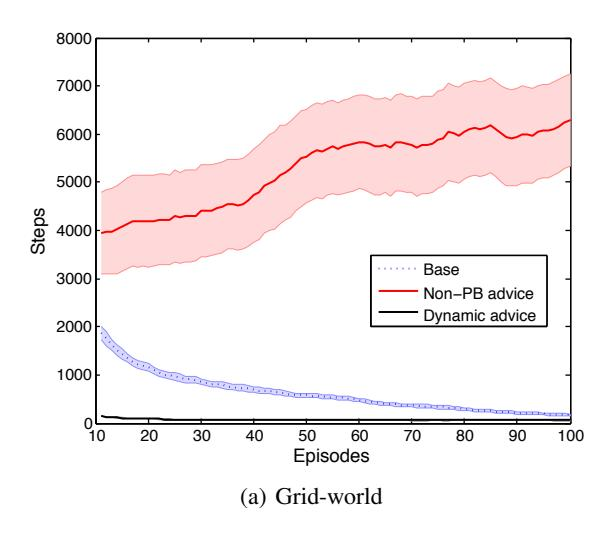
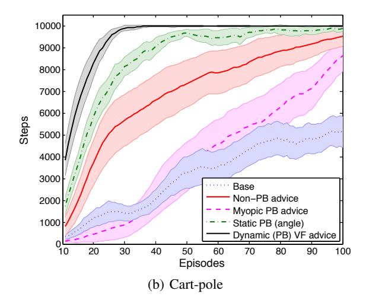

## **Expressing Arbitrary Reward Functions as Potential-Based Advice**

## **Anna Harutyunyan**

# Vrije Universiteit Brussel aharutyu@vub.ac.be

## Sam Devlin

# University of York sam.devlin@york.ac.uk

#### **Peter Vrancx**

# Vrije Universiteit Brussel pvrancx@vub.ac.be

#### Ann Nowé

Vrije Universiteit Brussel anowe@vub.ac.be

#### Abstract

Effectively incorporating external advice is an important problem in reinforcement learning, especially as it moves into the real world. Potential-based reward shaping is a way to provide the agent with a *specific* form of additional reward, with the guarantee of policy invariance. In this work we give a novel way to incorporate an *arbitrary* reward function with the same guarantee, by implicitly translating it into the specific form of dynamic advice potentials, which are maintained as an auxiliary value function learnt at the same time. We show that advice provided in this way captures the input reward function in expectation, and demonstrate its efficacy empirically.

#### Introduction

The term shaping in experimental psychology (dating at least as far back as (Skinner 1938)) refers to the idea of rewarding all behavior leading to the desired behavior, instead of waiting for the subject to exhibit it autonomously (which, for complex tasks, may take prohibitively long). For example, Skinner discovered that, in order to train a rat to push a lever, any movement in the direction of the lever had to be rewarded. Reinforcement learning (RL) is a framework, where an agent learns from interaction with the environment, typically in a tabula rasa manner, guaranteed to learn the desired behavior eventually. As with Skinner's rat, the RL agent may take a very long time to stumble upon the target lever, if the only reinforcement (or reward) it receives is after that fact, and shaping is used to speed up the learning process by providing additional rewards. Shaping in RL has been linked to reward functions from very early on; Mataric (1994) interpreted shaping as designing a more complex reward function, Dorigo and Colombetti (1997) used shaping on a real robot to translate expert instructions into reward for the agent, as it executed a task, and Randløv and Alstrøm (1998) proposed learning a hierarchy of RL signals in an attempt to separate the extra reinforcement function from the base task. It is in the same paper that they uncover the issue of modifying the reward signals in an unconstrained way: when teaching an agent to ride a bicycle, and encouraging progress towards the goal, the agent would get

Copyright © 2015, Association for the Advancement of Artificial Intelligence (www.aaai.org). All rights reserved.

"distracted", and instead learn to ride in a loop and collect the positive reward forever. This issue of *positive reward cy*cles is addressed by Ng, Harada, and Russell (1999), where they devise their *potential-based* reward shaping (PBRS) framework, which constrains the shaping reward to have the form of a difference of a potential function of the transitioning states. In fact, they prove a stronger claim that such a form is *necessary*1 for leaving the original task unchanged. This elegant and implementable framework led to an explosion of reward shaping research and proved to be extremely effective (Asmuth, Littman, and Zinkov 2008), (Devlin, Kudenko, and Grzes 2011), (Brys et al. 2014), (Snel and Whiteson 2014). Wiewiora, Cottrell, and Elkan (2003) extended PBRS to state-action advice potentials, and Devlin and Kudenko (2012) recently generalized PBRS to handle dynamic potentials, allowing potential functions to change online whilst the agent is learning.

Additive reward functions from early RS research, while dangerous to policy preservation, were able to convey *behavioral* knowledge (e.g. expert instructions) directly. Potential functions require an additional abstraction, and restrict the form of the additional *effective* reward, but provide crucial theoretical guarantees. We seek to bridge this gap between the available behavioral knowledge and the effective potential-based rewards.

This paper gives a novel way to specify the effective shaping rewards, directly through an arbitrary reward function, while implicitly maintaining the grounding in potentials, necessary for policy invariance. For this, we first extend Wiewiora's advice framework to dynamic advice potentials. We then propose to in parallel learn a secondary value function w.r.t. a variant of our arbitrary reward function, and use its successive estimates as our dynamic advice potentials. We show that the effective shaping rewards then reflect the input reward function in expectation. Empirically, we first demonstrate our method to avoid the issue of positive reward cycles on a grid-world task, when given the same behavior knowledge that trapped the bicyclist from (Randløv and Alstrøm 1998). We then show an application, where our dynamic (PB) value-function advice outperforms other reward-shaping methods that encode the same knowledge, as well as a shaping w.r.t. a different popular heuristic.

&lt;sup>1Given no knowledge of the MDP dynamics.

## **Background**

We assume the usual reinforcement learning framework (Sutton and Barto 1998), in which the agent interacts with its Markovian *environment* at discrete time steps t =1, 2, .... Formally, a Markov decision process (MDP) (Puterman 1994) is a tuple  $\mathcal{M} = \langle \mathcal{S}, \mathcal{A}, \gamma, \mathcal{T}, \mathcal{R} \rangle$ , where:  $\mathcal{S}$  is a set of states,  $\mathcal{A}$  is a set of actions,  $\gamma \in [0,1]$  is the discounting factor,  $\mathcal{T} = \{P_{sa}(\cdot)|s \in \mathcal{S}, a \in \mathcal{A}\}$  are the next state transition probabilities with  $P_{sa}(s')$  specifying the probability of state s' occurring upon taking action a from state  $s, \mathcal{R}: \mathcal{S} \times \mathcal{A} \rightarrow \mathbb{R}$  is the *expected reward* function with  $\mathcal{R}(s,a)$  giving the expected (w.r.t.  $\mathcal{T}$ ) value of the reward that will be received when a is taken in state s.  $R(s, a, s')^2$ and  $r_{t+1}$  denote the components of  $\mathcal{R}$  at transition (s, a, s')and at time t, respectively.

A (stochastic) Markovian *policy*  $\pi : \mathcal{S} \times \mathcal{A} \to \mathbb{R}$  is a probability distribution over actions at each state, so that  $\pi(s, a)$ gives the probability of action a being taken from state sunder policy  $\pi$ . We will use  $\pi(s, a) = 1$  and  $\pi(s) = a$  interchangeably. Value-based methods encode policies through value functions (VF), which denote expected cumulative reward obtained, while following the policy. We focus on state-action value functions. In a discounted setting:

$$Q^{\pi}(s,a) = \mathbb{E}_{\mathcal{T},\pi} \Big[ \sum_{t=0}^{\infty} \gamma^t r_{t+1} | s_0 = s, a_0 = a \Big]$$
 (1)

We will omit the subscripts on  $\mathbb{E}$  from now on, and imply all expectations to be w.r.t.  $\mathcal{T}, \pi$ . A (deterministic) greedy policy is obtained by picking the action of maximum value at each state:

$$\pi(s) = \mathop{\arg\max}_a Q(s,a) \tag{2}$$
 A policy  $\pi^*$  is  $\mathit{optimal}$  if its value is largest:

$$Q^*(s, a) = \sup_{\pi} Q^{\pi}(s, a), \forall s, a$$

When the Q-values are accurate for a given policy  $\pi$ , they satisfy the following recursive relation (Bellman 1957):

$$Q^{\pi}(s,a) = \mathcal{R}(s,a) + \gamma \mathbb{E}[Q^{\pi}(s',a')] \tag{3}$$

The values can be learned incrementally by the following

$$Q_{t+1}(s_t, a_t) = Q_t(s_t, a_t) + \alpha_t \delta_t \tag{4}$$

where  $Q_t$  denotes an estimate of  $Q^{\pi}$  at time  $t, \alpha_t \in (0,1)$ is the learning rate at time t, and

$$\delta_t = r_{t+1} + \gamma Q_t(s_{t+1}, a_{t+1}) - Q_t(s_t, a_t) \tag{5}$$

is the temporal-difference (TD) error of the transition, in which  $a_t$  and  $a_{t+1}$  are both chosen according to  $\pi$ . This process is shown to converge to the correct value estimates (the TD-fixpoint) in the limit under standard approximation conditions (Jaakkola, Jordan, and Singh 1994).

### **Reward Shaping**

The most general form of reward shaping in RL can be given as modifying the reward function of the underlying MDP:

$$R' = R + F$$

where R is the (transition) reward function of the base problem, and F is the *shaping* reward function, with F(s, a, s') giving the additional reward on the transition (s, a, s'), and  $f_t$  defined analogously to  $r_t$ . We will always refer to the framework as reward shaping, and to the auxiliary reward itself as shaping reward.

PBRS (Ng, Harada, and Russell 1999) maintains a potential function  $\Phi: \mathcal{S} \to \mathbb{R}$ , and constrains the shaping reward function F to the following form:

$$F(s, s') = \gamma \Phi(s') - \Phi(s) \tag{6}$$

where  $\gamma$  is the discounting factor of the MDP. Ng et al (1999) show that this form is both necessary and sufficient for policy invariance.

Wiewiora et al (2003) extend PBRS to advice potential functions defined over the joint state-action space. Note that this extension adds a dependency of F on the policy being followed (in addition to the executed transition). The authors consider two types of advice: look-ahead and lookback, providing the theoretical framework for the former:

$$F(s, a, s', a') = \gamma \Phi(s', a') - \Phi(s, a) \tag{7}$$

Devlin and Kudenko (2012) generalize the form in Eq. (6) to dynamic potentials, by including a time parameter, and show that all theoretical properties of PBRS hold.

$$F(s, t, s', t') = \gamma \Phi(s', t') - \Phi(s, t)$$
 (8)

## From Reward Functions to Dynamic **Potentials**

There are two (inter-related) problems in PBRS: efficacy and specification. The former has to do with designing the best potential functions, i.e. those that offer the quickest and smoothest guidance. The latter refers to capturing the available domain knowledge into a potential form, in the easiest and most effective way. This work primarily deals with that latter question.

Locking knowledge in the form of potentials is a convenient theoretical paradigm, but may be restrictive, when considering all types of domain knowledge, in particular behav*ioral* knowledge, which is likely to be specified in terms of actions. Say, for example, an expert wishes to encourage an action a in a state s. If following the advice framework, she sets  $\Phi(s,a) = 1$ , with  $\Phi$  zero-valued elsewhere, the shaping reward associated with the transition (s, a, s') will be  $F(s, a, s', a') = \Phi(s', a') - \Phi(s, a) = 0 - 1 = -1$ , so long as the pair (s', a') is different from (s, a). The favorable behavior (s, a) will then factually be discouraged. She could avoid this by further specifying  $\Phi$  for state-actions reachable from s via a, but that would require knowledge

 ${}^{2}\mathcal{R}$  is a convention from MDP literature. In reinforcement learning it is more common to stick with R(s, a, s') for specification, but we will refer to the general form in our derivations.

&lt;sup>3Assume the example is undiscounted for clarity.

of the MDP. What she would thus like to do is to be able to specify the desired *effective* shaping reward F directly, but without sacrificing optimality provided by the potential-based framework.

This work formulates a framework to do just that. Given an arbitrary reward function  $R^{\dagger}$ , we wish to achieve  $F \approx R^{\dagger}$ , while maintaining policy invariance. This question is equivalent to seeking a potential function  $\Phi$ , based on  $R^{\dagger}$ , s.t.  $F^{\Phi} \approx R^{\dagger}$ , where (and in the future) we take  $F^{\Phi}$  to mean a potential-based shaping reward w.r.t.  $\Phi$ .

The core idea of our approach is to introduce a secondary (state-action) value function  $\Phi$ , which, concurrently with the main process, learns on the *negation* of the expert-provided  $R^{\dagger}$ , and use the consecutively updated values of  $\Phi_t$  as a dynamic potential function, thus making the translation into potentials *implicit*. Formally:

$$R^{\Phi} = -R^{\dagger} \tag{9}$$

$$\Phi_{t+1}(s,a) = \Phi_t(s,a) + \beta_t \delta_t^{\Phi}$$
 (10)

$$\delta_t^{\Phi} = r_{t+1}^{\Phi} + \gamma \Phi_t(s_{t+1}, a_{t+1}) - \Phi_t(s_t, a_t)$$
 (11)

where  $\beta_t$  is the learning rate at time t, and  $a_{t+1}$  is chosen according to the policy  $\pi$  w.r.t. the value function Q of the main task. The shaping reward is then of the form:

$$f_{t+1} = \gamma \Phi_{t+1}(s_{t+1}, a_{t+1}) - \Phi_t(s_t, a_t)$$
 (12)

The intuition of the correspondence between  $R^{\dagger}$  and F lies in the relation between the Bellman equation (for  $\Phi$ ):

$$\Phi^{\pi}(s, a) = -R^{\dagger}(s, a) + \gamma \Phi^{\pi}(s', a') \tag{13}$$

and shaping rewards from an advice potential function:

$$F(s,a) = \gamma \Phi(s',a') - \Phi(s,a) = R^{\dagger}(s,a) \tag{14}$$

This intuition will be made more precise later.

#### **Theory**

This section is organized at follows. First, we extend the potential-based advice framework to *dynamic* potential-based advice, and ensure that the desired guarantees hold. (Our dynamic (potential-based) *value-function* advice is then an instance of dynamic potential-based advice.) We then turn to the question of correspondence between  $R^{\dagger}$  and F, showing that F captures  $R^{\dagger}$  in expectation. Finally, we ensure that these expectations are meaningful, by arguing convergence.

### **Dynamic Potential-Based Advice**

Analogously to (Devlin and Kudenko 2012), we augment Wiewiora's look-ahead advice function (Eq. (7)) with a time parameter to obtain our dynamic potential-based advice:  $F(s,a,t,s',a',t') = \gamma \Phi(s',a',t') - \Phi(s,a,t)$ , where t/t' is the time of the agent visiting state s/s' and taking action a/a'. For notational compactness we rewrite the form as:

$$F(s, a, s', a') = \gamma \Phi_{t'}(s', a') - \Phi_{t}(s, a)$$
 (15)

where we implicitly associate s with  $s_t$ , s' with  $s_{t'}$ , and F(s,a,s',a') with F(s,a,t,s',a',t'). As with Wiewiora's framework, F is now not only a function of the transition (s,a,s'), but also the *following* action a', which adds a dependence on the policy the agent is currently evaluating.

We examine the change in the optimal Q-values of the original MDP, resulting from adding F to the base reward function R.

$$Q^*(s,a) = \mathbb{E}\left[\sum_{t=0}^{\infty} \gamma^t (r_{t+1} + f_{t+1}) | s_0 = s\right]$$

$$\stackrel{(12)}{=} \mathbb{E}\left[\sum_{t=0}^{\infty} \gamma^t (r_{t+1} + \gamma \Phi_{t+1}(s_{t+1}, a_{t+1}) - \Phi_t(s_t, a_t))\right]$$

$$= \mathbb{E}\left[\sum_{t=0}^{\infty} \gamma^t r_{t+1}\right] + \mathbb{E}\left[\sum_{t=1}^{\infty} \gamma^t \Phi_t(s_t, a_t)\right]$$

$$- \mathbb{E}\left[\sum_{t=0}^{\infty} \gamma^t \Phi_t(s_t, a_t)\right]$$

$$= \mathbb{E}\left[\sum_{t=0}^{\infty} \gamma^t r_{t+1}\right] - \Phi_0(s, a)$$

Thus, once the optimal policy w.r.t. R+F is learnt, to uncover the optimal policy w.r.t. R, one may use the *biased greedy* action-selection (Wiewiora, Cottrell, and Elkan 2003) w.r.t. the *initial* values of the dynamic advice function.

$$\pi(s) = \arg\max_{a} \left( Q(s, a) + \Phi_0(s, a) \right) \tag{17}$$

Notice that when the advice function is initialized to 0, the biased greedy action-selection above reduces to the basic greedy policy (Eq. (2)), allowing one to use dynamic advice equally seamlessly to simple state potentials.

## **Shaping in Expectation**

Let  $R^{\dagger}$  be an arbitrary reward function, and let  $\Phi$  be the state-action value function that learns on  $R^{\Phi}=-R^{\dagger}$ , while following some fixed policy  $\pi$ . The shaping reward at timestep t w.r.t.  $\Phi$  as a dynamic advice function is given by:

$$f_{t+1} = \gamma \Phi_{t+1}(s_{t+1}, a_{t+1}) - \Phi_{t}(s_{t}, a_{t})$$

$$= \gamma \Phi_{t}(s_{t+1}, a_{t+1}) - \Phi_{t}(s_{t}, a_{t})$$

$$+ \gamma \Phi_{t+1}(s_{t+1}, a_{t+1}) - \gamma \Phi_{t}(s_{t+1}, a_{t+1})$$

$$\stackrel{(11)}{=} \delta_{t}^{\Phi} - r_{t+1}^{\Phi} + \gamma \Delta \Phi(s_{t+1}, a_{t+1})$$

$$= r_{t+1}^{\dagger} + \delta_{t}^{\Phi} + \gamma \Delta \Phi(s_{t+1}, a_{t+1})$$
(18)

Now assume the process has converged to the TD-fixpoint  $\Phi^\pi.$  Then:

$$F(s, a, s', a') = \gamma \Phi^{\pi}(s', a') - \Phi^{\pi}(s, a)$$

$$\stackrel{(3)}{=} \gamma \Phi^{\pi}(s', a')$$

$$-\mathcal{R}^{\Phi}(s, a) - \gamma \mathbb{E}[\Phi^{\pi}(s', a')]$$

$$\stackrel{(9)}{=} \mathcal{R}^{\dagger}(s, a)$$

$$+\gamma (\Phi^{\pi}(s', a') - \mathbb{E}[\Phi^{\pi}(s', a')])$$

$$(19)$$

Thus, we obtain that the shaping reward F w.r.t. the converged values  $\Phi^{\pi}$ , reflects the *expected* designer reward  $\mathcal{R}^{\dagger}(s,a)$  plus a bias term, which measures how different the sampled next state-action value is from the expected next state-action value. This bias will at each transition further encourage transitions that are "better than expected" (and vice versa), similarly, e.g., to "better-than-average" (and vice versa) rewards in R-learning (Schwartz 1993).

To obtain the *expected* shaping reward  $\mathcal{F}(s,a)$ , we take the expectation w.r.t. the transition matrix  $\mathcal{T}$ , and the policy  $\pi$  with which a' is chosen.

$$\mathcal{F}(s,a) = \mathbb{E}[F(s,a,s',a')]$$

$$= \mathcal{R}^{\dagger}(s,a) + \gamma \mathbb{E}[\Phi^{\pi}(s',a') - \mathbb{E}[\Phi^{\pi}(s',a')]]$$

$$= \mathcal{R}^{\dagger}(s,a)$$
(20)

Thus, Eq. (18) gives the shaping reward while  $\Phi$ 's are not yet converged, (19) gives the component of the shaping reward on a transition after  $\Phi^{\pi}$  are correct, and (20) establishes the equivalence of  $\mathcal{F}$  and  $\mathcal{R}^{\dagger}$  in expectation.4

## Convergence of $\Phi$

If the policy  $\pi$  is fixed, and the  $Q^{\pi}$ -estimates are correct, the expectations in the previous section are well-defined, and  $\Phi$  converges to the TD-fixpoint. However,  $\Phi$  is learnt at the same time as Q. This process can be shown to converge by formulating the framework on two timescales (Borkar 1997), and using the ODE method of Borkar and Meyn (2000). We thus require5 the step size schedules  $\{\alpha_t\}$  and  $\{\beta_t\}$  satisfy the following:

$$\lim_{t \to \infty} \frac{\alpha_t}{\beta_t} = 0 \tag{21}$$

Q and  $\Phi$  correspond to the slower and faster timescales, respectively. Given that step-size schedule difference, we can rewrite the iterations (for Q and  $\Phi$ ) as one iteration, with a combined parameter vector, and show that the assumptions (A1)-(A2) from Borkar and Meyn (2000) are satisfied, which allows to apply their Theorem 2.2. This analysis is analogous to that of convergence of TD with Gradient Correction (Theorem 2 in (Sutton et al. 2009)), and is left out for clarity of exposition.

Note that this convergence is needed to assure that  $\Phi$  indeed captures the expert reward function  $R^\dagger.$  The form of general dynamic advice from Eq. (15) itself does not pose any requirements on the convergence properties of  $\Phi$  to guarantee policy invariance.

## **Experiments**

We first demonstrate our method correctly solving a gridworld task, as a simplified instance of the bicycle problem. We then assess the practical utility of our framework on a larger cart-pole benchmark, and show that our dynamic (PB) VF advice approach beats other methods that use the same domain knowledge, as well as a popular static shaping w.r.t. a different heuristic.

#### **Grid-World**

The problem described is a minimal working example of the bicycle problem (Randløv and Alstrøm 1998), illustrating the issue of positive reward cycles.

Given a  $20 \times 20$  grid, the goal is located at the bottom right corner (20,20). The agent must reach it from its initial position (0,0) at the top left corner, upon which event it will receive a positive reward. The reward on the rest of the transitions is 0. The actions correspond to the 4 cardinal directions, and the state is the agent's position coordinates (x,y) in the grid. The episode terminates when the goal was found, or when 10000 steps have elapsed.

Given approximate knowledge of the problem, a natural heuristic to encourage is transitions that move the agent to the right, or down, as they are to advance the agent closer to the goal. A reward function  $R^{\dagger}$  encoding this heuristic can be defined as

$$R^{\dagger}(s, right) = R^{\dagger}(s, down) = c, c \in \mathbb{R}^+, \forall s$$

When provided naïvely (i.e. with  $F=R^\dagger$ ), the agent is at a risk of getting "distracted": getting stuck in a positive reward cycle, and never reaching the goal. We apply our framework, and learn the corresponding  $\Phi$  w.r.t.  $R^\Phi=-R^\dagger$ , setting F accordingly (Eq. (12)). We compare that setting with the base learner and with the non-potential-based naïve learner.

Learning was done via Sarsa with  $\epsilon$ -greedy action selection,  $\epsilon=0.1$ . The learning parameters were tuned to the following values:  $\gamma=0.99,\ c=1,\ \alpha_{t+1}=\tau\alpha_t$  decaying exponentially (so as to satisfy the condition in Eq. (21)), with  $\alpha_0=0.05,\ \tau=0.999$  and  $\beta_t=0.1$ .

We performed 50 independent runs, 100 episodes each (Fig. 1(a)). Observe that the performance of the (non-PB) agent learning with  $F=R^\dagger$  actually got *worse* with time, as it discovered a positive reward cycle, and got more and more disinterested in finding the goal. Our agent, armed with the same knowledge, used it properly (in a true potential-based manner) and the learning was accelerated significantly, compared to the base agent.

#### **Cart-Pole**

We now evaluate our approach on a more difficult cart-pole benchmark (Michie and Chambers 1968). The task is to balance a pole on top a moving cart for as long as possible. The (continuous) state contains the angle  $\xi$  and angular velocity  $\dot{\xi}$  of the pole, and the position x and velocity  $\dot{x}$  of the cart.

&lt;sup>4Note that function approximation will introduce an (unavoidable) approximation-error term in these equations.

&lt;sup>5In addition to the standard stochastic approximation assumptions, common to all TD algorithms.

&lt;sup>6To illustrate our point more clearly in the limited space, we omit the *static* PB variant with (state-only) potentials  $\Phi(x,y)=x+y$ . It depends on a different type of knowledge (about the state), while this experiment compares two ways to utilize the behavioral reward function  $R^{\dagger}$ . The static variant does not require learning, and hence performs better in the beginning.

Figure 1: Mean learning curves. Shaded areas correspond to the 95% confidence intervals. The plot is smoothed by taking a running average of 10 episodes. (a) The same reward function added directly to the base reward function (non-PB advice) diverges from the optimal policy, whereas our automatic translation to dynamic-PB advice accelerates learning significantly. (b) Our dynamic (PB) VF advice learns to balance the pole the soonest, and has the lowest variance.

There are two actions: a small positive and a small negative force applied to the cart. A pole falls if  $|\xi| > \frac{\pi}{4}$ , which terminates the episode. The track is bounded within [-4,4], but the sides are "soft"; the cart does not crash upon hitting them. The reward function penalizes a pole drop, and is 0 elsewhere. An episode terminates successfully, if the pole was balanced for 10000 steps.

An intuitive behavior to encourage is moving the cart to the right (or left) when the pole is leaning rightward (or leftward). Let  $o: \mathcal{S} \times \mathcal{A} \to \{0,1\}$  be the indicator function denoting such orientation of state s and action a. A reward function to encompass the rule can then be defined as:

$$R^{\dagger}(s,a) = o(s,a) \times c, c \in \mathbb{R}^+$$

We compare the performance of our agent to the base learner and two other reward shaping schemes that reflect the same knowledge about the desired behavior, and one that uses different knowledge (about the angle of the pole).7 The variants are described more specifically below:

- 1. (**Base**) The base learner,  $F_1 := 0$ .
- 2. (Non-PB advice) Advice is received simply by adding  $R^{\dagger}$  to the main reward function,  $F_2 := R^{\dagger}$ . This method will lose some optimal policies.
- 3. (Myopic PB advice) Potentials are initialized and maintained with  $R^{\dagger}$ , i.e.  $F_3:=F^{\Phi}$  with  $\Phi=R^{\dagger}$ . This is closest to Wiewiora's look-ahead advice framework.
- 4. (Static PB shaping with angle) The agent is penalized proportionally to the angle with which it deviates from equilibrium.  $F_4 := F^{\Phi}$  with  $\Phi \sim -|\xi|^2$ .

5. (**Dynamic (PB) VF advice**) We learn  $\Phi$  as a value function w.r.t.  $R^{\Phi} = -R^{\dagger}$ , and set  $F_5 = F^{\Phi}$  accordingly (Eq. (12)).

We used tile coding (Sutton and Barto 1998) with 10 tilings of  $10 \times 10$  to represent the continuous state. Learning was done via Sarsa( $\lambda$ ) with eligibility traces and  $\epsilon$ -greedy action selection,  $\epsilon=0.1$ . The learning parameters were tuned to the following:  $\lambda=0.9,\ c=0.1,\ \alpha_{t+1}=\tau\alpha_t$  decaying exponentially (so as to satisfy the condition in Eq. (21)), with  $\alpha_0=0.05,\ \tau=0.999,$  and  $\beta_t=0.2$ . We found  $\gamma$  to affect the results differently across variants, with the following best values:  $\gamma_1=0.8,\ \gamma_2=\gamma_3=\gamma_4=0.99,\ \gamma_5=0.4.\ \mathcal{M}_i$  is then the MDP  $\langle\mathcal{S},\mathcal{A},\gamma_i,\mathcal{T},\mathcal{R}+F_i\rangle$ . Fig. 1(b) gives the comparison across  $\mathcal{M}_i$  (i.e. the best  $\gamma$  values for each variant), whereas Table 1 also contains the comparison w.r.t. the base value  $\gamma=\gamma_1$ .

We performed 50 independent runs of 100 episodes each (Table 1). Our method beats the alternatives in both fixed and tuned  $\gamma$  scenarios, converging to the optimal policy reliably after 30 episodes in the latter (Fig. 1(b)). Paired t-tests on the sums of steps of all episodes per run for each pair of variants confirm all variants as significantly different with p < 0.05. Notice that the non-potential-based variant for this problem does not perform as poorly as on the grid-world task. The reason for this is that getting stuck in a positive reward cycle can be good in cart-pole, as the goal is to continue the episode for as long as possible. However, consider the policy that achieves keeping the pole at an equilibrium (at  $\xi = 0$ ). While clearly optimal in the original task, this policy will not be optimal in  $\mathcal{M}_2$ , as it will yield 0 additional rewards.

#### Discussion

**Choice of**  $R^{\dagger}$  The given framework is general enough to capture any form of the reward function  $R^{\dagger}$ . Recall, however, that  $\mathcal{F}=\mathcal{R}^{\dagger}$  holds *after*  $\Phi$  values have converged.

&lt;sup>7Note that unlike our behavioral encouragement, the angle shaping requires *precise* information about the state, which is more demanding in a realistic setup, where the advice comes from an external observer.

Table 1: Cart-pole results. Performance is indicated with standard error. The final performance refers to the last 10% of the run. Dynamic (PB) VF advice has the highest mean, and lowest variance both in tuned and fixed  $\gamma$  scenarios, and is the most robust, whereas myopic shaping proved to be especially sensitive to the choice of  $\gamma$ .

|                        | Best $\gamma$ values |                    | Base $\gamma = 0.8$ |                    |
|------------------------|----------------------|--------------------|---------------------|--------------------|
| Variant                | Final                | Overall            | Final               | Overall            |
| Base                   | 5114.7±188.7         | 3121.8±173.6       | 5114.7±165.4        | 3121.8±481.3       |
| Non-PB advice          | 9511.0±37.2          | $6820.6 \pm 265.3$ | $6357.1\pm89.1$     | $3405.2 \pm 245.2$ |
| Myopic PB shaping      | 8618.4±107.3         | $3962.5 \pm 287.2$ | $80.1 \pm 0.3$      | $65.8 \pm 0.9$     |
| Static PB              | 9860.0±56.1          | $8292.3 \pm 261.6$ | $3744.6 \pm 136.2$  | $2117.5 \pm 102.0$ |
| Dynamic (PB) VF advice | 9982.4±18.4          | $9180.5 \pm 209.8$ | $8662.2 \pm 60.9$   | $5228.0 \pm 274.0$ |

Thus, the simpler the provided reward function  $R^{\dagger}$ , the sooner will the effective shaping reward capture it. In this work, we have considered reward functions  $R^{\dagger}$  of the form  $R^{\dagger}(B) = c, c > 0$ , where B is the set of encouraged behavior transitions. This follows the convention of shaping in psychology, where punishment is *implicit* as absence of positive encouragement. Due to the expectation terms in F, we expect such form (of all-positive, or all-negative  $R^{\dagger}$ ) to be more robust. Another assumption is that all encouraged behaviors are encouraged equally; one may easily extend this to varying preferences  $c_1 < \ldots < c_k$ , and consider a choice between expressing them within a single reward function, or learning a separate value function for each signal  $c_i$ .

**Role of discounting** Discounting factors  $\gamma$  in RL determine how heavily the future rewards are discounted, i.e. the reward horizon. Smaller  $\gamma$ 's (i.e. heavier discounting) yield quicker convergence, but may be insufficient to convey longterm goals. In our framework, the value of  $\gamma$  plays two separate roles in the learning process, as it is shared between  $\Phi$ and Q. Firstly, it determines how quickly  $\Phi$  values converge. Since we are only interested in the difference of consecutive  $\Phi$ -values, smaller  $\gamma$ 's provide a more stable estimate, without losses. On the other hand, if the value is too small, Q will lose sight of the long-term rewards, which is detrimental to performance, if the rewards are for the base task alone. We, however, are considering the shaped rewards. Since shaped rewards provide informative immediate feedback, it becomes less important to look far ahead into the future. This notion is formalized by Ng (2003), who proves (in Theorem 3) that a "good" potential function shortens the reward horizon of the original problem. Thus  $\gamma$ , in a sense, balances the stability of learning  $\Phi$  with the length of the shaped reward horizon of Q.

## **Related Work**

The correspondence between value and potential functions has been known since the conceivement of the latter. Ng et al (1999) point out that the optimal potential function is the true value function itself (as in that case the problem reduces to learning the trivial zero value function). With this insight, there have been attempts to simultaneously learn the base value function at coarser and finer granularities (of function approximation), and use the (quicker-to-converge) former as a potential function for the latter (Grzes and Kudenko 2008). Our approach is different in that our value functions learn on

different rewards with the same state representation, and it tackles the question of specification rather than efficacy.

On the other hand, there has been a lot of research in human-provided advice (Thomaz and Breazeal 2006), (Knox et al. 2012). This line of research (*interactive shaping*) typically uses the human advice component heuristically as a (sometimes annealed) additive component in the reward function, which does not follow the potential-based framework (and thus does not preserve policies). Knox and Stone (2012) do consider PBRS as one of their methods, but (a) stay strictly myopic (similar to the third variant in the cart-pole experiment), and (b) limit to state potentials. Our approach is different in that it incorporates the external advice through a *value function*, and stays entirely sound in the PBRS framework.

#### **Conclusions and Outlook**

In this work, we formulated a framework which allows to specify the *effective* shaping reward directly. Given an arbitrary reward function, we learned a secondary value function, w.r.t. a variant of that reward function, concurrently to the main task, and used the consecutive estimates of that value function as dynamic advice potentials. We showed that the shaping reward resulting from this process captures the input reward function in expectation. We presented empirical evidence that the method behaves in a true potentialbased manner, and that such encoding of the behavioral domain knowledge speeds up learning significantly more, compared to its alternatives. The framework induces little added complexity: the maintenance of the auxiliary value function is linear in time and space (Modayil et al. 2012), and, when initialized to 0, the optimal base value function is unaffected.

We intend to further consider inconsistent reward functions, with an application to humans directly providing advice. The challenges are then to analyze the expected effective rewards, as the convergence of a TD-process w.r.t. inconsistent rewards is less straightforward. In this work we identified the secondary discounting factor  $\gamma^\Phi$  with the primary  $\gamma$ . This need not be the case, in general:  $\gamma^\Phi = \nu \gamma$ . Such modification adds an extra term  $\Phi$ -term into Eq. (20), potentially offering gradient guidance, which is useful if the expert reward is sparse.

## Acknowledgments

Anna Harutyunyan is supported by the IWT-SBO project MIRAD (grant nr. 120057).

### References

- Asmuth, J.; Littman, M. L.; and Zinkov, R. 2008. Potential-based shaping in model-based reinforcement learning. In *Proceedings of 23rd AAAI Conference on Artificial Intelligence (AAAI-08)*, 604–609. AAAI Press.
- Bellman, R. 1957. *Dynamic Programming*. Princeton, NJ, USA: Princeton University Press, 1st edition.
- Borkar, V. S., and Meyn, S. P. 2000. The ODE method for convergence of stochastic approximation and reinforcement learning. *SIAM Journal on Control and Optimization* 38(2):447–469.
- Borkar, V. S. 1997. Stochastic approximation with two time scales. *Systems and Control Letters* 29(5):291 294.
- Brys, T.; Nowé, A.; Kudenko, D.; and Taylor, M. E. 2014. Combining multiple correlated reward and shaping signals by measuring confidence. In *Proceedings of 28th AAAI Conference on Artificial Intelligence (AAAI-14)*, 1687–1693. AAAI Press.
- Devlin, S., and Kudenko, D. 2012. Dynamic potential-based reward shaping. In *Proceedings of the 11th International Conference on Autonomous Agents and Multiagent Systems (AAMAS-12)*, 433–440. International Foundation for Autonomous Agents and Multiagent Systems.
- Devlin, S.; Kudenko, D.; and Grzes, M. 2011. An empirical study of potential-based reward shaping and advice in complex, multi-agent systems. *Advances in Complex Systems* (ACS) 14(02):251–278.
- Dorigo, M., and Colombetti, M. 1997. *Robot Shaping: Experiment In Behavior Engineering*. MIT Press, 1st edition.
- Grzes, M., and Kudenko, D. 2008. Multigrid reinforcement learning with reward shaping. In Krkov, V.; Neruda, R.; and Koutnk, J., eds., *Artificial Neural Networks ICANN 2008*, volume 5163 of *Lecture Notes in Computer Science*. Springer Berlin Heidelberg. 357–366.
- Jaakkola, T.; Jordan, M. I.; and Singh, S. P. 1994. On the convergence of stochastic iterative dynamic programming algorithms. *Neural computation* 6(6):1185–1201.
- Knox, W. B., and Stone, P. 2012. Reinforcement learning from simultaneous human and MDP reward. In *Proceedings of the 11th International Conference on Autonomous Agents and Multiagent Systems (AAMAS-12)*, 475–482. International Foundation for Autonomous Agents and Multiagent Systems.
- Knox, W. B.; Glass, B. D.; Love, B. C.; Maddox, W. T.; and Stone, P. 2012. How humans teach agents: A new experimental perspective. *International Journal of Social Robotics* 4:409–421.
- Mataric, M. J. 1994. Reward functions for accelerated learning. In *In Proceedings of the Eleventh International Conference on Machine Learning (ICML-94)*, 181–189. Morgan Kaufmann.

- Michie, D., and Chambers, R. A. 1968. Boxes: An experiment in adaptive control. In Dale, E., and Michie, D., eds., *Machine Intelligence*. Edinburgh, UK: Oliver and Boyd.
- Modayil, J.; White, A.; Pilarski, P. M.; and Sutton, R. S. 2012. Acquiring a broad range of empirical knowledge in real time by temporal-difference learning. In *Systems, Man, and Cybernetics (SMC), 2012 IEEE International Conference on*, 1903–1910. IEEE.
- Ng, A. Y.; Harada, D.; and Russell, S. 1999. Policy invariance under reward transformations: Theory and application to reward shaping. In *In Proceedings of the Sixteenth International Conference on Machine Learning (ICML-99)*, 278–287. Morgan Kaufmann.
- Ng, A. Y. 2003. *Shaping and policy search in reinforce-ment learning*. Ph.D. Dissertation, University of California, Berkeley.
- Puterman, M. 1994. *Markov Decision Processes: Discrete Stochastic Dynamic Programming*. New York, NY, USA: John Wiley & Sons, Inc., 1st edition.
- Randløv, J., and Alstrøm, P. 1998. Learning to drive a bicycle using reinforcement learning and shaping. In *Proceedings of the Fifteenth International Conference on Machine Learning*, 463–471. San Francisco, CA, USA: Morgan Kauffman.
- Schwartz, A. 1993. A reinforcement learning method for maximizing undiscounted rewards. In *ICML*, 298–305. Morgan Kaufmann.
- Skinner, B. F. 1938. *The behavior of organisms: An experimental analysis*. Appleton-Century.
- Snel, M., and Whiteson, S. 2014. Learning potential functions and their representations for multi-task reinforcement learning. *Autonomous Agents and Multi-Agent Systems* 28(4):637–681.
- Sutton, R., and Barto, A. 1998. *Reinforcement learning: An introduction*, volume 116. Cambridge Univ Press.
- Sutton, R. S.; Maei, H. R.; Precup, D.; Bhatnagar, S.; Silver, D.; Szepesvári, C.; and Wiewiora, E. 2009. Fast gradient-descent methods for temporal-difference learning with linear function approximation. In *Proceedings of the 26th Annual International Conference on Machine Learning*, ICML '09, 993–1000. New York, NY, USA: ACM.
- Thomaz, A. L., and Breazeal, C. 2006. Reinforcement learning with human teachers: Evidence of feedback and guidance with implications for learning performance. In *Proceedings of the 21st AAAI Conference on Artificial Intelligence (AAAI-06)*, 1000–1005. AAAI Press.
- Wiewiora, E.; Cottrell, G. W.; and Elkan, C. 2003. Principled methods for advising reinforcement learning agents. In *Machine Learning, Proceedings of the Twentieth International Conference (ICML-03)*, 792–799.