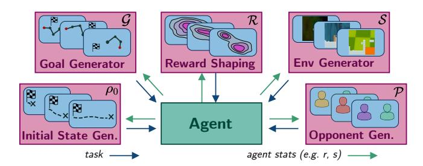

# **Automatic Curriculum Learning For Deep RL: A Short Survey**

Rémy Portelas1, Cédric Colas1, Lilian Weng2, Katja Hofmann3 and Pierre-Yves Oudeyer1

1Inria, France 2OpenAI, USA 3Microsoft Research, UK remy.portelas@inria.fr

#### **Abstract**

Automatic Curriculum Learning (ACL) has become a cornerstone of recent successes in Deep Reinforcement Learning (DRL). These methods shape the learning trajectories of agents by challenging them with tasks adapted to their capacities. In recent years, they have been used to improve sample efficiency and asymptotic performance, to organize exploration, to encourage generalization or to solve sparse reward problems, among others. To do so, ACL mechanisms can act on many aspects of learning problems. They can optimize domain randomization for Sim2Real transfer, organize task presentations in multi-task robotic settings, order sequences of opponents in multi-agent scenarios, etc. The ambition of this work is dual: 1) to present a compact and accessible introduction to the Automatic Curriculum Learning literature and 2) to draw a bigger picture of the current state of the art in ACL to encourage the cross-breeding of existing concepts and the emergence of new ideas.

# 1 Introduction

Human learning is organized into a curriculum of interdependent learning situations of various complexities. For sure, Homer learned to formulate words before he could compose the Iliad. This idea was first transferred to machine learning in Selfridge et al. [1985], where authors designed a learning scheme to train a cart pole controller: first training on long and light poles, then gradually moving towards shorter and heavier poles. A related concept was also developed by Schmidhuber [1991], who proposed to improve world model learning by organizing exploration through artificial curiosity. In the following years, curriculum learning was applied to organize the presentation of training examples or the growth in model capacity in various supervised learning settings [Elman, 1993; Krueger and Dayan, 2009; Bengio et al., 2009]. In parallel, the developmental robotics community proposed learning progress as a way to selforganize open-ended developmental trajectories of learning agents [Oudeyer et al., 2007]. Inspired by these earlier works, the Deep Reinforcement Learning (DRL) community developed a family of mechanisms called *Automatic Curriculum Learning*, which we propose to define as follows:

Automatic Curriculum Learning (ACL) for DRL is a family of mechanisms that automatically adapt the distribution of training data by learning to adjust the selection of learning situations to the capabilities of DRL agents.

**Related fields.** ACL shares many connections with other fields. For example, ACL can be used in the context of *Transfer Learning* where agents are trained on one distribution of tasks and tested on another [Taylor and Stone, 2009]. *Continual Learning* trains agents to be robust to unforeseen changes in the environment while ACL assumes agents to stay in control of learning scenarios [Lesort *et al.*, 2019]. *Policy Distillation* techniques [Czarnecki *et al.*, 2019] form a complementary toolbox to target multi-task RL settings, where knowledge can be transferred from one policy to another (e.g. from task-expert policies to a generalist policy).

**Scope.** This short survey proposes a typology of ACL mechanisms when combined with DRL algorithms and, as such, does not review population-based algorithms implementing ACL (e.g. Forestier *et al.* [2017], Wang *et al.* [2019]). As per our adopted definition, ACL refers to mechanisms *explicitly* optimizing the automatic organization of training data. Hence, they should not be confounded with *emergent curricula*, by-products of distinct mechanisms. For instance, the on-policy training of a DRL algorithm is not considered ACL, because the shift in the distribution of training data *emerges* as a by-product of policy learning. Given this is a short survey, we do not present the details of every particular mechanism. As the current ACL literature lacks theoretical foundations to ground proposed approaches in a formal framework, this survey focuses on empirical results.

# 2 Automatic Curriculum Learning for DRL

This section formalizes the definition of ACL for Deep RL and proposes a classification.

**Deep Reinforcement Learning** is a family of algorithms which leverage deep neural networks for function approximation to tackle reinforcement learning problems. DRL agents learn to perform sequences of actions a given states s in an environment so as to maximize some notion of cumulative reward r [Sutton and Barto, 2018]. Such problems are usually called tasks and formalized as Markov Decision Pro-

cesses (MDPs) of the form  $T = \langle \mathcal{S}, \mathcal{A}, \mathcal{P}, \mathcal{R}, \rho_0 \rangle$  where  $\mathcal{S}$  is the state space,  $\mathcal{A}$  is the action space,  $\mathcal{P}: S \times A \times S \rightarrow [0,1]$  is a transition function characterizing the probability of switching from the current state s to the next state s' given action  $a, \mathcal{R}: S \times A \rightarrow \mathbb{R}$  is a reward function and  $\rho_0$  is a distribution of initial states. To challenge the generalization capacities of agents [Cobbe et~al., 2018], the community introduced multitask DRL problems where agents are trained on tasks sampled from a task space:  $T \sim \mathcal{T}$ . In multi-goal DRL, policies and reward functions are conditioned on goals, which augments the task-MDP with a goal space  $\mathcal{G}$  [Schaul et~al., 2015a].

**Automatic Curriculum Learning** mechanisms propose to learn a task selection function  $\mathcal{D}:\mathcal{H}\to\mathcal{T}$  where  $\mathcal{H}$  can contain any information about past interactions. This is done with the objective of maximizing a metric P computed over a distribution of target tasks  $\mathcal{T}_{target}$  after N training steps:

$$Obj: \max_{\mathcal{D}} \int_{T \sim \mathcal{T}_{target}} P_T^N \, \mathrm{d}T, \tag{1}$$

where  $P_T^N$  quantifies the agent's behavior on task T after N training steps (e.g. cumulative reward, exploration score). In that sense, ACL can be seen as a particular case of metalearning, where  $\mathcal D$  is learned along training to improve further learning.

**ACL Typology.** We propose a classification of ACL mechanisms based on three dimensions:

- 1. Why use ACL? We review the different objectives that ACL has been used for (Section 3).
- 2. What does ACL control? ACL can target different aspects of the learning problem (e.g. environments, goals, reward functions, Section 4)
- 3. What does ACL optimize? ACL mechanisms usually target surrogate objectives (e.g. learning progress, diversity) to alleviate the difficulty to optimize the main objective Obj directly (Section 5).

### 3 Why use ACL?

ACL mechanisms can be used for different purposes that can be seen as particular instantiations of the general objective defined in Eq 1.

Improving performance on a restricted task set. Classical RL problems are about solving a given task, or a restricted task set (e.g. which vary by their initial state). In these simple settings, ACL has been used to improve sample efficiency or asymptotical performance [Schaul *et al.*, 2015b; Horgan *et al.*, 2018; Flet-Berliac and Preux, 2019].

**Solving hard tasks.** Sometimes the target tasks cannot be solved directly (e.g. too hard or sparse rewards). In that case, ACL can be used to pose auxiliary tasks to the agent, gradually guiding its learning trajectory from simple to difficult tasks until the target tasks are solved. In recent works, ACL was used to schedule DRL agents from simple mazes to hard ones [Matiisen *et al.*, 2017], or from close-to-success initial states to challenging ones in robotic control scenarios [Florensa *et al.*, 2017; Ivanovic *et al.*, 2018] and video games [Salimans and Chen, 2018]. Another line of work proposes

to use ACL to organize the exploration of the state space so as to solve sparse reward problems [Bellemare *et al.*, 2016; Pathak *et al.*, 2017; Shyam *et al.*, 2018; Pathak *et al.*, 2019; Burda *et al.*, 2019]. In these works, the performance reward is augmented with an intrinsic reward guiding the agent towards uncertain areas of the state space.

**Training generalist agents.** Generalist agents must be able to solve tasks they have not encountered during training (e.g. continuous task spaces or distinct training and testing set). ACL can shape learning trajectories to improve generalization, e.g. by avoiding unfeasible task subspaces [Portelas *et al.*, 2019]. ACL can also help agents to generalize from simulation settings to the real world (Sim2Real) [OpenAI *et al.*, 2019; Mehta *et al.*, 2019] or to maximize performance and robustness in multi-agent settings via Self-Play [Silver *et al.*, 2017; Pinto *et al.*, 2017; Bansal *et al.*, 2017; Baker *et al.*, 2019; Vinyals *et al.*, 2019].

**Training multi-goal agents.** In multi-goal RL, agents are trained and tested on tasks that vary by their goals. Because agents can control the goals they target, they learn a behavioral repertoire through one or several goal-conditioned policies. The adoption of ACL in this setting can improve performance on a testing set of pre-defined goals. Recent works demonstrated the benefits of using ACL in scenarios such as multi-goal robotic arm manipulation [Andrychowicz *et al.*, 2017; Zhao and Tresp, 2018; Fournier *et al.*, 2018; Eppe *et al.*, 2018; Zhao and Tresp, 2019; Fang *et al.*, 2019; Colas *et al.*, 2019] or multi-goal navigation [Sukhbaatar *et al.*, 2017; Florensa *et al.*, 2018; Racanière *et al.*, 2019; Cideron *et al.*, 2019].

**Organizing open-ended exploration.** In some multi-goal settings, the space of achievable goals is not known in advance. Agents must discover achievable goals as they explore and learn how to represent and reach them. For this problem, ACL can be used to organize the discovery and acquisition of repertoires of robust and diverse behaviors, e.g. from visual observations [Eysenbach *et al.*, 2018; Pong *et al.*, 2019; Jabri *et al.*, 2019] or from natural language interactions with social peers [Lair *et al.*, 2019; Colas *et al.*, 2020].

#### 4 What does ACL control?

While *on-policy* DRL algorithms directly use training data generated by the current behavioral policy, *off-policy* algorithms can use trajectories collected from other sources. This practically decouples *data collection* from *data exploitation*. Hence, we organize this section into two categories: one reviewing ACL for data collection, the other ACL for data exploitation.

# 4.1 ACL for Data Collection

During data collection, ACL organizes the sequential presentation of tasks as a function of the agent's capabilities. To do so, it generates tasks by acting on elements of task MDPs (e.g.  $\mathcal{R}, \mathcal{P}, \rho_0$ , see Fig. 1). The curriculum can be designed on a discrete set of tasks or on a continuous task space. In single-task problems, ACL can define a set of auxiliary tasks to be used as stepping stones towards the resolution of the

Figure 1: ACL for data collection. ACL can control each elements of task MDPs to shape the learning trajectories of agents. Given metrics of the agent's behavior like performance or visited states, ACL methods generate new tasks adapted to the agent's abilities.

main task. The following paragraphs organize the literature according to the nature of the control exerted by ACL:

**Initial state** ( $\rho_0$ ). The distribution of initial states  $\rho_0$  can be controlled to modulate the difficulty of a task. Agents start learning from states close to a given target (i.e. easier tasks), then move towards harder tasks by gradually increasing the distance between the initial states and the target. This approach is especially effective to design auxiliary tasks for complex control scenarios with sparse rewards [Florensa *et al.*, 2017; Ivanovic *et al.*, 2018; Salimans and Chen, 2018].

**Reward functions** ( $\mathcal{R}$ ). ACL can be used for automatic reward shaping: adapting the reward function R as a function of the learning trajectory of the agent. In curiosity-based approaches especially, an internal reward function guides agents towards areas associated with high uncertainty to foster exploration [Bellemare et al., 2016; Pathak et al., 2017; Shyam et al., 2018; Pathak et al., 2019; Burda et al., 2019]. As the agent explores, uncertain areas -and thus the reward function-change, which automatically devises a learning curriculum guiding the exploration of the state space. In Fournier et al. [2018], an ACL mechanism controls the tolerance in a goal reaching task. Starting with a low accuracy requirement, it gradually and automatically shifts towards stronger accuracy requirements as the agent progresses. In Eysenbach et al. [2018] and Jabri et al. [2019], authors propose to learn a skill space in unsupervised settings (from state space and pixels respectively), from which are derived reward functions promoting both behavioral diversity and skill separation.

**Goals** (*G*). In multi-goal DRL, ACL techniques can be applied to order the selection of goals from discrete sets [Lair *et al.*, 2019], continuous goal spaces [Sukhbaatar *et al.*, 2017; Florensa *et al.*, 2018; Pong *et al.*, 2019; Racanière *et al.*, 2019] or even sets of different goal spaces [Eppe *et al.*, 2018; Colas *et al.*, 2019]. Although goal spaces are usually predefined, recent work proposed to apply ACL on a goal space learned from *pixels* using a generative model [Pong *et al.*, 2019].

**Environments**  $(S, \mathcal{P})$ . ACL has been successfully applied to organize the selection of environments from a discrete set, e.g. to choose among Minecraft mazes [Matiisen *et al.*, 2017] or Sonic the Hedgehog levels [Mysore *et al.*, 2018]. A more general –and arguably more powerful– approach is to leverage parametric *Procedural Content Genera*-

tion (PCG) techniques [Risi and Togelius, 2019] to generate rich task spaces. In that case, ACL allows to detect relevant niches of progress [OpenAI *et al.*, 2019; Portelas *et al.*, 2019; Mehta *et al.*, 2019].

**Opponents** (S, P). Self-play algorithms train agents against present or past versions of themselves [Silver *et al.*, 2017; Bansal *et al.*, 2017; Vinyals *et al.*, 2019; Baker *et al.*, 2019]. The set of opponents directly maps to a set of tasks, as different opponents results in different transition functions P and possibly state spaces S. Self-play can thus be seen as a form of ACL, where the sequence of opponents (i.e. tasks) is organized to maximize performance and robustness. In single-agent settings, an adversary policy can be trained to perturb the main agent [Pinto *et al.*, 2017].

### **4.2** ACL for Data Exploitation

ACL can also be used in the data exploitation stage, by acting on training data previously collected and stored in a *replay memory*. It enables the agent to "mentally experience the effects of its actions without actually executing them", a technique known as *experience replay* [Lin, 1992]. At the data exploitation level, ACL can exert two types of control on the distribution of training data: *transition selection* and *transition modification*.

**Transition selection**  $(S \times A)$ . Inspired from the *prioritized sweeping* technique that organized the order of updates in planning methods [Moore and Atkeson, 1993], Schaul *et al.* [2015b] introduced *prioritized experience replay* (PER) for model-free off-policy RL to bias the selection of transitions for policy updates, as some transitions might be *more informative* than others. Different ACL methods propose different metrics to evaluate the importance of each transition [Schaul *et al.*, 2015b; Zhao and Tresp, 2018; Colas *et al.*, 2019; Zhao and Tresp, 2019; Lair *et al.*, 2019; Colas *et al.*, 2020]. Transition selection ACL techniques can also be used for on-policy algorithms to filter online learning batches [Flet-Berliac and Preux, 2019].

**Transition modification** ( $\mathcal{G}$ ). In multi-goal settings, *Hindsight Experience Replay* (HER) proposes to reinterpret trajectories collected with a given target goal with respect to a different goal [Andrychowicz *et al.*, 2017]. In practice, HER modifies transitions by substituting target goals g with one of the outcomes g' achieved later in the trajectory, as well as the corresponding reward  $r' = R_{g'}(s,a)$ . By explicitly biasing goal substitution to increase the probability of sampling rewarded transitions, HER shifts the training data distribution from simpler goals (achieved now) towards more complex goals as the agent makes progress. Substitute goal selection can be guided by other ACL mechanisms (e.g. favoring diversity [Fang *et al.*, 2019; Cideron *et al.*, 2019]).

# **5** What Does ACL Optimize?

Objectives such as the average performance on a set of testing tasks after N training steps can be difficult to optimize directly. To alleviate this difficulty, ACL methods use a variety of surrogate objectives.

| Algorithm                                                                                                                                                                                                                                                                                                                                                                                                                                                                                                                                                                                                                                                                                                                                                                       | Why use ACL?                                                                                                                                                                                                                                                                                                                                                                                                                                                                              | What does ACL control?                                                                                                                                                                                                                                                                                                                                                                                                                                                                                                                                                                                                                                                                                                                          | What does ACL optimize?                                                                                                                                                                                                                                                                                                                                                                                                                                                                                                                                                                                                                                                                                                                                                                                                                                                                                                                                                                                                                                                                                                                                                                                                                                                                                                                                                                                                                                                                                                                                                                                                                                                                                                                                       |
|---------------------------------------------------------------------------------------------------------------------------------------------------------------------------------------------------------------------------------------------------------------------------------------------------------------------------------------------------------------------------------------------------------------------------------------------------------------------------------------------------------------------------------------------------------------------------------------------------------------------------------------------------------------------------------------------------------------------------------------------------------------------------------|-------------------------------------------------------------------------------------------------------------------------------------------------------------------------------------------------------------------------------------------------------------------------------------------------------------------------------------------------------------------------------------------------------------------------------------------------------------------------------------------|-------------------------------------------------------------------------------------------------------------------------------------------------------------------------------------------------------------------------------------------------------------------------------------------------------------------------------------------------------------------------------------------------------------------------------------------------------------------------------------------------------------------------------------------------------------------------------------------------------------------------------------------------------------------------------------------------------------------------------------------------|---------------------------------------------------------------------------------------------------------------------------------------------------------------------------------------------------------------------------------------------------------------------------------------------------------------------------------------------------------------------------------------------------------------------------------------------------------------------------------------------------------------------------------------------------------------------------------------------------------------------------------------------------------------------------------------------------------------------------------------------------------------------------------------------------------------------------------------------------------------------------------------------------------------------------------------------------------------------------------------------------------------------------------------------------------------------------------------------------------------------------------------------------------------------------------------------------------------------------------------------------------------------------------------------------------------------------------------------------------------------------------------------------------------------------------------------------------------------------------------------------------------------------------------------------------------------------------------------------------------------------------------------------------------------------------------------------------------------------------------------------------------|
| ACL for Data Collection (§ 4.1):                                                                                                                                                                                                                                                                                                                                                                                                                                                                                                                                                                                                                                                                                                                                                |                                                                                                                                                                                                                                                                                                                                                                                                                                                                                           |                                                                                                                                                                                                                                                                                                                                                                                                                                                                                                                                                                                                                                                                                                                                                 |                                                                                                                                                                                                                                                                                                                                                                                                                                                                                                                                                                                                                                                                                                                                                                                                                                                                                                                                                                                                                                                                                                                                                                                                                                                                                                                                                                                                                                                                                                                                                                                                                                                                                                                                                               |
| ACE for Bata Concerton (§ 4.1).  ADR (OpenAI) [OpenAI et al., 2019] ADR (Mila) [Mehta et al., 2019] ALP-GMM [Portelas et al., 2019] RARL [Pinto et al., 2017] AlphaGO Zero [Silver et al., 2017] Hide&Seek [Baker et al., 2019] Competitive SP [Bansal et al., 2017] RgC [Mysore et al., 2018] RC [Florensa et al., 2017] 1-demo RC [Salimans and Chen, 2018] Count-based [Bellemare et al., 2016] RND [Burda et al., 2019] ICM [Pathak et al., 2017] Disagreement [Pathak et al., 2019] MAX [Shyam et al., 2018] BaRC [Ivanovic et al., 2018] TSCL [Matiisen et al., 2017] Acc-based CL [Fournier et al., 2018] Asym. SP [Sukhbaatar et al., 2017] GoalGAN [Florensa et al., 2018] Setter-Solver [Racanière et al., 2019] CGM [Eppe et al., 2018] Skew-fit [Pong et al., 2019] | Generalization Generalization Generalization Generalization Generalization Generalization Generalization Generalization Generalization Generalization Hard Task Hard Task Hard Task Hard Task Hard Task Hard Task Hard Task Hard Task Hurd Task Hard Task Hard Task Hurd Task Hard Task Hard Task Hard Task Hard Task Hard Task Hard Task Hard Task Hard Task Hard Task Hard Task Hard Task Hard Task Hulti-Goal Multi-Goal Multi-Goal Multi-Goal Multi-Goal Multi-Goal Open-Ended Explo. | Environments $(S, \mathcal{P})$ (PCG) Environments $(\mathcal{P})$ (PCG) Environments $(S)$ (PCG) Opponents $(P)$ Opponents $(P)$ Opponents $(P)$ Opponents $(P)$ Opponents $(P)$ Opponents $(P)$ Environments $(S)$ (DS) Initial states $(\rho_0)$ Reward functions $(R)$ Reward functions $(R)$ Reward functions $(R)$ Reward functions $(R)$ Reward functions $(R)$ Reward functions $(R)$ Reward functions $(R)$ Reward functions $(R)$ Reward functions $(R)$ Finitial states $(\rho_0)$ Environments $(S)$ (DS) Reward function $(R)$ Goals $(G)$ , initial states $(\rho_0)$ Goals $(G)$ Goals $(G)$ Goals $(G)$ Goals $(G)$ Goals $(G)$ Goals $(G)$ Goals $(G)$ Goals $(G)$ Goals $(G)$ Goals $(G)$ Goals $(G)$ Goals $(G)$ Goals $(G)$ | Intermediate difficulty Intermediate diff. & Diversity LP ARM ARM ARM & Diversity ARM & Diversity LP Intermediate difficulty Intermediate difficulty Diversity Surprise (model error) Surprise (model disagreement) Surprise (model disagreement) Intermediate difficulty LP LP Intermediate difficulty Intermediate difficulty LP LP Intermediate difficulty Intermediate difficulty Intermediate difficulty Intermediate difficulty Intermediate difficulty Intermediate difficulty Intermediate difficulty Intermediate difficulty Intermediate difficulty Intermediate difficulty Intermediate difficulty Intermediate difficulty Intermediate difficulty Intermediate difficulty Intermediate difficulty Intermediate difficulty Intermediate difficulty Intermediate difficulty Intermediate difficulty Intermediate difficulty Intermediate difficulty Intermediate difficulty Intermediate difficulty Intermediate difficulty Intermediate difficulty Intermediate difficulty Intermediate difficulty Intermediate difficulty Intermediate difficulty Intermediate difficulty Intermediate difficulty Intermediate difficulty Intermediate difficulty Intermediate difficulty Intermediate difficulty Intermediate difficulty Intermediate difficulty Intermediate difficulty Intermediate difficulty Intermediate difficulty Intermediate difficulty Intermediate difficulty Intermediate difficulty Intermediate difficulty Intermediate difficulty Intermediate difficulty Intermediate difficulty Intermediate difficulty Intermediate difficulty Intermediate difficulty Intermediate difficulty Intermediate difficulty Intermediate difficulty Intermediate difficulty Intermediate difficulty Intermediate difficulty Intermediate difficulty |
| DIAYN [Eysenbach et al., 2018] CARML [Jabri et al., 2019] LE2 [Lair et al., 2019]                                                                                                                                                                                                                                                                                                                                                                                                                                                                                                                                                                                                                                                                                         | Open-Ended Explo. Open-Ended Explo. Open-Ended Explo.                                                                                                                                                                                                                                                                                                                                                                                                                               | Reward functions $(\mathcal{R})$ Reward functions $(\mathcal{R})$ Goals $(\mathcal{G})$                                                                                                                                                                                                                                                                                                                                                                                                                                                                                                                                                                                                                                                   | Diversity Diversity Reward & Diversity                                                                                                                                                                                                                                                                                                                                                                                                                                                                                                                                                                                                                                                                                                                                                                                                                                                                                                                                                                                                                                                                                                                                                                                                                                                                                                                                                                                                                                                                                                                                                                                                                                                                                                                        |
| ACL for Data Exploitation (§ 4.2):                                                                                                                                                                                                                                                                                                                                                                                                                                                                                                                                                                                                                                                                                                                                              |                                                                                                                                                                                                                                                                                                                                                                                                                                                                                           |                                                                                                                                                                                                                                                                                                                                                                                                                                                                                                                                                                                                                                                                                                                                                 | <u>-</u>                                                                                                                                                                                                                                                                                                                                                                                                                                                                                                                                                                                                                                                                                                                                                                                                                                                                                                                                                                                                                                                                                                                                                                                                                                                                                                                                                                                                                                                                                                                                                                                                                                                                                                                                                      |
| Prioritized ER [Schaul et al., 2015b] SAUNA [Flet-Berliac and Preux, 2019] CURIOUS [Colas et al., 2019] HER [Andrychowicz et al., 2017] HER-curriculum [Fang et al., 2019] Language HER [Cideron et al., 2019] Curiosity Prio. [Zhao and Tresp, 2019] En. Based ER [Zhao and Tresp, 2018] LE2 [Lair et al., 2019] IMAGINE [Colas et al., 2020]                                                                                                                                                                                                                                                                                                                                                                                                                                  | Performance boost Performance boost Multi-goal Multi-goal Multi-goal Multi-goal Multi-goal Multi-goal Multi-goal Open-Ended Explo. Open-Ended Explo.                                                                                                                                                                                                                                                                                                                                      | Transition selection $(S \times A)$ Transition selection $(S \times A)$ Trans. select. & mod. $(S \times A, \mathcal{G})$ Transition modification $(\mathcal{G})$ Transition modification $(\mathcal{G})$ Transition modification $(\mathcal{G})$ Transition selection $(S \times A)$ Transition selection $(S \times A)$ Trans. select. & mod. $(S \times A, \mathcal{G})$ Trans. select. & mod. $(S \times A, \mathcal{G})$                                                                                                                                                                                                                                                                                        | Surprise (TD-error) Surprise (V-error) LP & Energy Reward Diversity Reward Diversity Energy Reward Reward                                                                                                                                                                                                                                                                                                                                                                                                                                                                                                                                                                                                                                                                                                                                                                                                                                                                                                                                                                                                                                                                                                                                                                                                                                                                                                                                                                                                                                                                                                                                                                                                                                                     |

Table 1: Classification of the surveyed papers. The classification is organized along the three dimensions defined in the above text. In *Why use ACL*, we only report the main objective of each work. When ACL controls the selection of environments, we precise whether it is selecting them from a discrete set (*DS*) or through parametric Procedural Content Generation (*PCG*). We abbreviate *adversarial reward maximization* by *ARM* and *learning progress* by *LP*.

**Reward.** As DRL algorithms learn from reward signals, rewarded transitions are usually considered as more informative than others, especially in sparse reward problems. In such problems, ACL methods that act on transition selection may artificially increase the ratio of high versus low rewards in the batches of transitions used for policy updates [Narasimhan *et al.*, 2015; Jaderberg *et al.*, 2016; Colas *et al.*, 2020]. In multigoal RL settings where some goals might be much harder than others, this strategy can be used to balance the proportion of positive rewards for each of the goals [Colas *et al.*, 2019; Lair *et al.*, 2019]. Transition modification methods favor rewards as well, substituting goals to increase the probability of

observing rewarded transitions [Andrychowicz *et al.*, 2017; Cideron *et al.*, 2019; Lair *et al.*, 2019; Colas *et al.*, 2020]. In data collection however, adapting training distributions towards more rewarded experience leads the agent to focus on tasks that are already solved. Because collecting data from already solved tasks hinders learning, data collection ACL methods rather focus on other surrogate objectives.

**Intermediate difficulty.** A more natural surrogate objective for data collection is *intermediate difficulty*. Intuitively, agents should target tasks that are neither too easy (already solved) nor too difficult (unsolvable) to maximize their learning progress. Intermediate difficulty has been used to adapt

the distribution of initial states from which to perform a hard task [Florensa et al., 2017; Salimans and Chen, 2018; Ivanovic et al., 2018]. This objective is also implemented in GoalGAN, where a curriculum generator based on a Generative Adversarial Network is trained to propose goals for which the agent reaches intermediate performance [Florensa et al., 2018]. Racanière et al. [2019] further introduced a judge network trained to predict the feasibility of a given goal for the current learner. Instead of labelling tasks with an intermediate level of difficulty as in GoalGAN, this Setter-Solver model generates goals associated to a random feasibility uniformly sampled from [0,1]. The type of goals varies as the agent progresses, but the agent is always asked to perform goals sampled from a distribution balanced in terms of feasibility. In Sukhbaatar et al. [2017], tasks are generated by an RL policy trained to propose either goals or initial states so that the resulting navigation task is of intermediate difficulty w.r.t. the current agent. Intermediate difficulty ACL has also been driving successes in Sim2Real applications, where it sequences domain randomizations to train policies that are robust enough to generalize from simulators to real-world robots [Mehta et al., 2019; OpenAI et al., 2019]. OpenAI et al. [2019] trains a robotic hand control policy to solve a Rubik's cube by automatically adjusting the task distribution so that the agent achieves decent performance while still being challenged.

Learning progress. The Obj objective of ACL methods can be seen as the maximization of a global learning progress: the difference between the final score  $\int_{T \sim T} P_T^N dT$ and the initial score  $\int_{T\sim\mathcal{T}}P_T^0\,\mathrm{d}T$ . To approximate this complex objective, measures of competence learning progress (LP) localized in space and time were proposed in earlier developmental robotics works [Baranes and Oudeyer, 2013; Forestier et al., 2017]. Like Intermediate difficulty, maximizing LP drives learners to practice tasks that are neither too easy nor too difficult, but LP does not require a threshold to define what is "intermediate" and is robust to tasks with intermediate scores but where the agent cannot improve. LP maximization is usually framed as a multi-armed bandit (MAB) problem where tasks are arms and their LP measures are associated values. Maximizing LP values was shown optimal under the assumption of concave learning profiles [Lopes and Oudeyer, 2012]. Both Matiisen et al. [2017] and Mysore et al. [2018] measure LP as the estimated derivative of the performance for each task in a discrete set (Minecraft mazes and Sonic the Hedgehog levels respectively) and apply a MAB algorithm to automatically build a curriculum for their learning agents. At a higher level, CURIOUS uses absolute LP to select goal spaces to sample from in a simulated robotic arm setup [Colas et al., 2019] (absolute LP enables to redirect learning towards tasks that were forgotten or that changed). There, absolute LP is also used to bias the sampling of transition used for policy updates towards high-LP goals. ALP-GMM uses absolute LP to organize the presentation of procedurally-generated Bipedal-Walker environments sampled from a continuous task space through a stochastic parameterization [Portelas et al., 2019]. They leverage a Gaussian Mixture Model to recover a MAB setup over the continuous task space. LP can also be used to guide the choice of accuracy requirements in a reaching task [Fournier *et al.*, 2018], or to train a *replay policy* via RL to sample transitions for policy updates [Zha *et al.*, 2019].

Diversity. Some ACL methods choose to maximize measures of diversity (also called novelty or low density). In multi-goal settings for example, ACL might favor goals from low-density areas either as targets [Pong et al., 2019] or as substitute goals for data exploitation [Fang et al., 2019]. Similarly, Zhao and Tresp [2019] biases the sampling of trajectories falling into low density areas of the trajectory space. In single-task RL, count-based approaches introduce internal reward functions as decreasing functions of the state visitation count, guiding agent towards rarely visited areas of the state space [Bellemare et al., 2016]. Through a variational expectation-maximization framework, Jabri et al. [2019] propose to alternatively update a latent skill representation from experimental data (as in Eysenbach et al. [2018]) and to metalearn a policy to adapt quickly to tasks constructed by deriving a reward function from sampled skills. Other algorithms do not optimize directly for diversity but use heuristics to maintain it. For instance, Portelas et al. [2019] maintains exploration by using a residual uniform task sampling and Bansal et al. [2017] sample opponents from past versions of different policies to maintain diversity.

Surprise. Some ACL methods train transition models and compute intrinsic rewards based on their prediction errors [Pathak et al., 2017; Burda et al., 2019] or based on the disagreement (variance) between several models from an ensemble [Shyam et al., 2018; Pathak et al., 2019]. The general idea is that models tend to give bad prediction (or disagree) for states rarely visited, thus inducing a bias towards less visited states. However, a model might show high prediction errors on stochastic parts of the environment (TV problem [Pathak et al., 2017]), a phenomenon that does not appear with model disagreement, as all models of the ensemble eventually learn to predict the (same) mean prediction [Pathak et al., 2019]. Other works bias the sampling of transitions for policy update depending on their temporal-difference error (TD-error), i.e. the difference between the transition's value and its next-step bootstrap estimation [Schaul et al., 2015b; Horgan et al., 2018]. Similarly, Flet-Berliac and Preux [2019] adapt transition selection based on the discrepancy between the observed return and the prediction of the value function of a PPO learner (V-error). Whether the error computation involves value models or transition models, ACL mechanisms favor states related to maximal surprise, i.e. a maximal difference between the expected (model prediction) and the truth.

**Energy.** In the data exploitation phase of multi-goal settings, Zhao and Tresp [2018] prioritize transitions from *high-energy* trajectories (e.g. kinetic energy) while Colas *et al.* [2019] prioritize transitions where the object relevant to the goal moved (e.g. cube movement in a cube pushing task).

**Adversarial reward maximization (ARM).** Self-Play is a form of ACL which optimizes agents' performance when opposed to current or past versions of themselves, an objective that we call *adversarial reward maximization (ARM)* [Hernandez *et al.*, 2019]. While agents from Silver *et al.* [2017]

and Baker *et al.* [2019] always oppose copies of themselves, Bansal *et al.* [2017] train several policies in parallel and fill a pool of opponents made of current and past versions of all policies. This maintains a diversity of opponents, which helps to fight catastrophic forgetting and to improve robustness. In the multi-agent game Starcraft II, Vinyals *et al.* [2019] train three main policies in parallel (one for each of the available player types). They maintain a *league* of opponents composed of current and past versions of both the three main policies and additional adversary policies. Opponents are not selected at random but to be challenging (as measured by winning rates).

### 6 Discussion

**The bigger picture.** In this survey, we unify the wide range of ACL mechanisms used in symbiosis with DRL under a common framework. ACL mechanisms are used with a particular goal in mind (e.g. organizing exploration, solving hard tasks, etc. § 3). It controls a particular element of task MDPs (e.g.  $\mathcal{S}, \mathcal{R}, \rho_0$ , § 4) and maximizes a surrogate objective to achieve its goal (e.g. diversity, learning progress, § 5). Table 1 organizes the main works surveyed here along these three dimensions. Both previous sections and Table 1 present what has been implemented in the past, and thus, by contrast, highlight potential new avenues for ACL.

Expanding the set of ACL targets. Inspired by the maturational mechanisms at play in human infants, Elman [1993] proposed to gradually expand the working memory of a recurrent model in a word-to-word natural language processing task. The idea of changing the properties of the agent (here its memory) was also studied in developmental robotics [Baranes and Oudeyer, 2011], policy distillation methods [Czarnecki et al., 2018; Czarnecki et al., 2019] and evolutionary approaches [Ha, 2019] but is absent from the ACL-DRL literature. ACL mechanisms could indeed be used to control the agent's body  $(\mathcal{S}, \mathcal{P})$ , its action space (how it acts in the world,  $\mathcal{A}$ ), its observation space (how it perceives the world,  $\mathcal{S}$ ), its learning capacities (e.g. capacities of the memory, or the controller) or the way it perceives time (controlling discount factors [François-Lavet et al., 2015]).

Combining approaches. Many combinations of previously defined ACL mechanisms remain to be investigated. Could we use LP to optimize the selection of opponents in self-play approaches? To drive goal selection in learned goal spaces (e.g. Laversanne-Finot *et al.* [2018], population-based)? Could we train an adversarial domain generator to robustify policies trained for Sim2Real applications?

On the need of systematic ACL studies. Given the positive impact that ACL mechanisms can have in complex learning scenarios, one can only deplore the lack of comparative studies and standard benchmark environments. Besides, although empirical results advocate for their use, a theoretical understanding of ACL mechanisms is still missing. Although there have been attempts to frame CL in supervised settings [Bengio *et al.*, 2009; Hacohen and Weinshall, 2019], more work is needed to see whether such considerations hold in DRL scenarios.

ACL as a step towards open-ended learning agents. Alan Turing famously wrote "Instead of trying to produce a programme to simulate the adult mind, why not rather try to produce one which simulates the child's?" [Turing, 1950]. The idea of starting with a simple machine and to enable it to learn autonomously is the cornerstone of developmental robotics but is rarely considered in DRL [Colas et al., 2020; Eysenbach et al., 2018; Jabri et al., 2019]. Because they actively organize learning trajectories as a function of the agent's properties, ACL mechanisms could prove extremely useful in this quest. We could imagine a learning architecture leveraging ACL mechanisms to control many aspects of the learning odyssey, guiding agents from their simple original state towards fully capable agents able to reach a multiplicity of goals. As we saw in this survey, these ACL mechanisms could control the development of the agent's body and capabilities (motor actions, sensory apparatus), organize the exploratory behavior towards tasks where agents learn the most (maximization of information gain, competence progress) or guide acquisitions of behavioral repertoires.

#### References

- [Andrychowicz *et al.*, 2017] Marcin Andrychowicz *et al.* Hind-sight experience replay. In *NeurIPS*.
- [Baker et al., 2019] Bowen Baker et al. Emergent tool use from multi-agent autocurricula. arXiv.
- [Bansal et al., 2017] Trapit Bansal et al. Emergent complexity via multi-agent competition. arXiv.
- [Baranes and Oudeyer, 2011] A. Baranes and P. Oudeyer. The interaction of maturational constraints and intrinsic motivations in active motor development. In *ICDL*.
- [Baranes and Oudeyer, 2013] Adrien Baranes and Pierre-Yves Oudeyer. Active learning of inverse models with intrinsically motivated goal exploration in robots. *Robot. Auton. Syst.*
- [Bellemare *et al.*, 2016] Marc Bellemare *et al.* Unifying count-based exploration and intrinsic motivation. In *NeurIPS*.
- [Bengio *et al.*, 2009] Yoshua Bengio et al. Curriculum learning. In *ICML*.
- [Burda et al., 2019] Yuri Burda et al. Exploration by random network distillation. *ICLR*.
- [Cideron *et al.*, 2019] Geoffrey Cideron et al. Self-educated language agent with hindsight experience replay for instruction following. *arXiv*.
- [Cobbe *et al.*, 2018] Karl Cobbe et al. Quantifying generalization in reinforcement learning. *arXiv*.
- [Colas *et al.*, 2019] Cédric Colas et al. CURIOUS: Intrinsically motivated modular multi-goal reinforcement learning. In *ICML*.
- [Colas *et al.*, 2020] Cédric Colas et al. Language as a cognitive tool to imagine goals in curiosity-driven exploration. *arXiv*.
- [Czarnecki *et al.*, 2018] Wojciech Czarnecki et al. Mix & match agent curricula for reinforcement learning. In *ICML*.
- [Czarnecki *et al.*, 2019] Wojciech Marian Czarnecki et al. Distilling policy distillation. *arXiv*.
- [Elman, 1993] Jeffrey L. Elman. Learning and development in neural networks: the importance of starting small. *Cognition*.

- [Eppe *et al.*, 2018] Manfred Eppe et al. Curriculum goal masking for continuous deep reinforcement learning. *CoRR*, abs/1809.06146.
- [Eysenbach *et al.*, 2018] Benjamin Eysenbach et al. Diversity is all you need: Learning skills without a reward function. *arXiv*.
- [Fang et al., 2019] Meng Fang et al. Curriculum-guided hindsight experience replay. In *NeurIPS*.
- [Flet-Berliac and Preux, 2019] Yannis Flet-Berliac and Philippe Preux. Samples are not all useful: Denoising policy gradient updates using variance. *CoRR*, abs/1904.04025.
- [Florensa et al., 2017] Carlos Florensa et al. Reverse curriculum generation for reinforcement learning. *CoRL*.
- [Florensa *et al.*, 2018] Carlos Florensa *et al.* Automatic goal generation for reinforcement learning agents. In *ICML*.
- [Forestier *et al.*, 2017] Sébastien Forestier et al. Intrinsically motivated goal exploration processes with automatic curriculum learning. *arXiv*.
- [Fournier *et al.*, 2018] Pierre Fournier et al. Accuracy-based curriculum learning in deep reinforcement learning. *arXiv*.
- [François-Lavet *et al.*, 2015] Vincent François-Lavet et al. How to discount deep reinforcement learning: Towards new dynamic strategies. *arXiv*.
- [Ha, 2019] David Ha. Reinforcement learning for improving agent design. *Arti. Life*.
- [Hacohen and Weinshall, 2019] Guy Hacohen and Daphna Weinshall. On the power of curriculum learning in training deep networks. In Kamalika Chaudhuri and Ruslan Salakhutdinov, editors, *ICML*.
- [Hernandez *et al.*, 2019] D. Hernandez *et al.* A generalized framework for self-play training. In *IEEE CoG*.
- [Horgan *et al.*, 2018] Dan Horgan et al. Distributed prioritized experience replay. *arXiv*.
- [Ivanovic *et al.*, 2018] Boris Ivanovic et al. Barc: Backward reachability curriculum for robotic reinforcement learning. *ICRA*.
- [Jabri *et al.*, 2019] Allan Jabri *et al.* Unsupervised curricula for visual meta-reinforcement learning. In *NeurIPS*.
- [Jaderberg et al., 2016] Max Jaderberg et al. Reinforcement learning with unsupervised auxiliary tasks. arXiv.
- [Krueger and Dayan, 2009] Kai A. Krueger and Peter Dayan. Flexible shaping: How learning in small steps helps. *Cognition*
- [Lair *et al.*, 2019] Nicolas Lair *et al.* Language grounding through social interactions and curiosity-driven multi-goal learning. *arXiv*.
- [Laversanne-Finot *et al.*, 2018] Adrien Laversanne-Finot et al. Curiosity driven exploration of learned disentangled goal spaces.
- [Lesort *et al.*, 2019] Timothée Lesort et al. Continual learning for robotics. *arXiv*.
- [Lin, 1992] Long-Ji Lin. Self-improving reactive agents based on reinforcement learning, planning and teaching. *Mach. lear.*

- [Lopes and Oudeyer, 2012] Manuel Lopes and Pierre-Yves Oudeyer. The strategic student approach for life-long exploration and learning. In *ICDL*.
- [Matiisen *et al.*, 2017] Tambet Matiisen et al. Teacher-student curriculum learning. *IEEE TNNLS*.
- [Mehta et al., 2019] Bhairav Mehta et al. Active domain randomization. CoRL.
- [Moore and Atkeson, 1993] Andrew W Moore and Christopher G Atkeson. Prioritized sweeping: Reinforcement learning with less data and less time. *Mach. learn.*
- [Mysore *et al.*, 2018] S. Mysore et al. Reward-guided curriculum for robust reinforcement learning. *preprint*.
- [Narasimhan *et al.*, 2015] Karthik Narasimhan et al. Language understanding for text-based games using deep reinforcement learning. *arXiv*.
- [OpenAI *et al.*, 2019] OpenAI et al. Solving rubik's cube with a robot hand. *arXiv*.
- [Oudeyer *et al.*, 2007] Pierre-Yves Oudeyer et al. Intrinsic motivation systems for autonomous mental development. *IEEE trans. on evolutionary comp.*
- [Pathak *et al.*, 2017] Deepak Pathak et al. Curiosity-driven exploration by self-supervised prediction. In *CVPR*.
- [Pathak *et al.*, 2019] Deepak Pathak et al. Self-supervised exploration via disagreement. *arXiv*.
- [Pinto *et al.*, 2017] Lerrel Pinto et al. Robust adversarial reinforcement learning. *arXiv*.
- [Pong *et al.*, 2019] Vitchyr H. Pong et al. Skew-fit: State-covering self-supervised reinforcement learning. *arXiv*.
- [Portelas *et al.*, 2019] Rémy Portelas et al. Teacher algorithms for curriculum learning of deep rl in continuously parameterized environments. *CoRL*.
- [Racanière *et al.*, 2019] Sébastien Racanière et al. Automated curricula through setter-solver interactions. *arXiv*.
- [Risi and Togelius, 2019] Sebastian Risi and Julian Togelius. Procedural content generation: From automatically generating game levels to increasing generality in machine learning. arXiv
- [Salimans and Chen, 2018] Tim Salimans and Richard Chen. Learning montezuma's revenge from a single demonstration. *NeurIPS*.
- [Schaul *et al.*, 2015a] Tom Schaul et al. Universal value function approximators. In *ICML*.
- [Schaul *et al.*, 2015b] Tom Schaul et al. Prioritized experience replay. *arXiv*.
- [Schmidhuber, 1991] Jürgen Schmidhuber. Curious model-building control systems. In *IJCNN*. IEEE.
- [Selfridge *et al.*, 1985] Oliver G Selfridge et al. Training and tracking in robotics. In *IJCAI*.
- [Shyam *et al.*, 2018] Pranav Shyam et al. Model-based active exploration. *arXiv*.
- [Silver et al., 2017] David Silver et al. Mastering the game of go without human knowledge. *Nature*.
- [Sukhbaatar et al., 2017] Sainbayar Sukhbaatar et al. Intrinsic motivation and automatic curricula via asymmetric self-play. arXiv.

- [Sutton and Barto, 2018] Richard S Sutton and Andrew G Barto. Reinforcement learning: An introduction. MIT press.
- [Taylor and Stone, 2009] Matthew E. Taylor and Peter Stone. Transfer learning for reinforcement learning domains: A survey. *JMLR*.
- [Turing, 1950] Alan M Turing. Computing machinery and intelligence.
- [Vinyals et al., 2019] Oriol Vinyals et al. Grandmaster level in StarCraft II using multi-agent reinforcement learning. *Nature*.
- [Wang et al., 2019] Rui Wang et al. Paired open-ended trailblazer (POET): endlessly generating increasingly complex and diverse learning environments and their solutions. arXiv.
- [Zha et al., 2019] Daochen Zha et al. Experience replay optimization. arXiv.
- [Zhao and Tresp, 2018] Rui Zhao and Volker Tresp. Energy-based hindsight experience prioritization. *arXiv*.
- [Zhao and Tresp, 2019] Rui Zhao and Volker Tresp. Curiosity-driven experience prioritization via density estimation. *arXiv*.